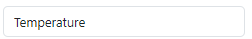
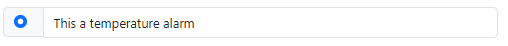
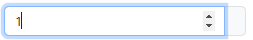

# Alarms

In this module, you will be able to create an alarm associated with a previously created tag. You can assign the following attributes to the alarm:

- Alarm Name: Specify a name for the alarm.
- Description: Provide a brief description of the alarm.
- Alarm Type: Choose the type of alarm.
- Trigger Value: Set the value that will trigger the alarm.

## Tag
We select the tag to which we want to assign an alarm.

## Alarm's Name
We Specify a name for the alarm.

## Alarm's Description
We provide a brief description of the alarm.

## Alarm's Type
We choose the type of alarm.

## Trigger Value
We set the value that will trigger the alarm.

## Create Alarm
We click on the "Create" button to create the alarm.

## Dashboard
We can see the newly created alarm in the dashboard.

  

