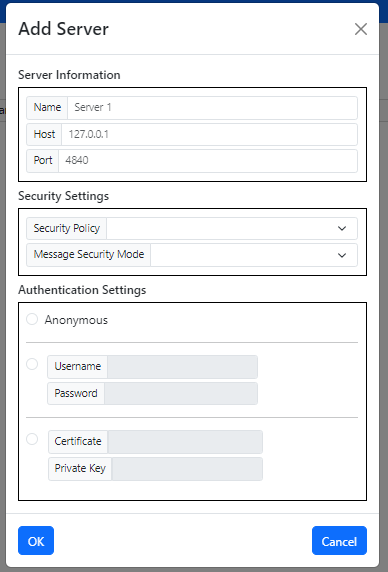
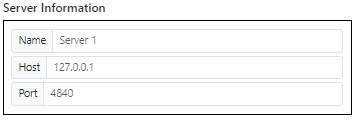
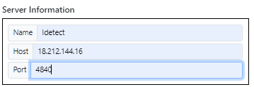

# Communications

This module allows for the creation and management of an OPCUA (Open Platform Communications Unified Architecture) server. OPCUA is an industrial communication standard that facilitates interoperability between different devices and systems in automation environments.

So we can create a new OPCUA sever doing click on the Create button

We configurate  the server with the following parameters:

We fill out the fields

Once  we have filled out the fields, we click on the Ok button to create the OPCUA server and we can see the OPCUA server on the dashboard.

