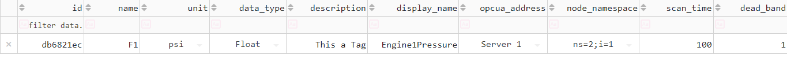
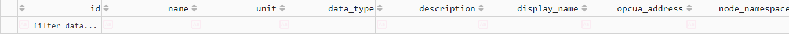

# Delete TAG
To delete a Tag, go to the Dashboard and locate the Tag you want to delete

- On the left side of the Tag cell, we have a red X. Click on it.

- We can see a Confirmation Window

- We click on "Yes" and the Tag will be deleated

