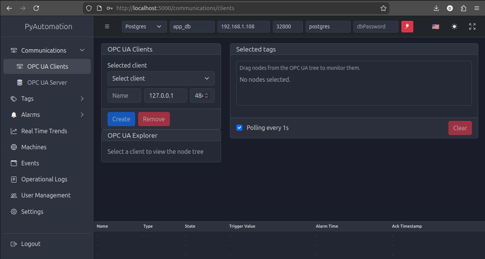
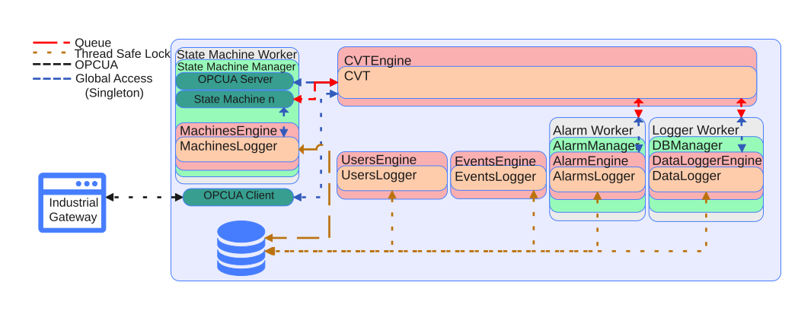

<div align="center">

# PyAutomation 2.0.0

### Industrial Automation Meets Modern Web Technology

[](https://pyautomation.readthedocs.io/en/latest/?badge=latest)
[](https://opensource.org/licenses/MIT)
[](https://www.python.org/downloads/release/python-3100/)
[](https://www.docker.com/)
[](https://opcfoundation.org/)
[](https://www.isa.org/)

**Empowering Industry 4.0 with Python, React, and Open Standards**

[Features](#-features) • [Quick Start](#-quick-start) • [Python Tests](#-running-python-tests) • [Build HMI into Python Package](#-build-hmi-changes-into-the-python-package) • [Documentation](#-documentation) • [Contributing](#-contributing)

</div>

---

## 🚀 What is PyAutomation?

**PyAutomation** is a comprehensive, enterprise-grade Python framework designed for Industrial IoT (IIoT) and Automation projects. Version 2.0.0 introduces a **revolutionary modern React-based web interface** that combines powerful industrial automation capabilities with an exceptional user experience.

PyAutomation serves as the **bridge between Operational Technology (OT) and Information Technology (IT)**, enabling seamless integration of industrial systems with modern web applications and data analytics platforms.



*PyAutomation 2.0.0 - Modern React-based Human Machine Interface (HMI)*

---

## 💥 The Open Source Revolution

<div align="center">

### 🎯 Enterprise-Grade Features. Zero Cost. Open Source.

**PyAutomation delivers the same industrial automation power as traditional SCADA systems**—monitoring, alarm management, data logging, real-time trends, and more—**completely FREE**.

</div>

### Why Open Source Wins

| Traditional SCADA | PyAutomation |
|-------------------|--------------|
| 💰 Expensive licensing (per-seat, per-tag) | ✅ **FREE forever** |
| 🔒 Proprietary, vendor lock-in | ✅ **Open source, full control** |
| 📈 High initial costs (6-figure investments) | ✅ **Zero upfront costs** |
| 💸 Annual maintenance fees | ✅ **No ongoing fees** |
| 🚫 Limited customization | ✅ **Fully customizable** |

**You get the same power. You get the same reliability. You get the same features. But you pay $0. Forever.**

---

## ✨ Features

### 🎨 Modern Web Interface (v2.0.0)

- **React-Based HMI**: Fast, responsive, and intuitive user experience
- **Real-Time Updates**: Live data visualization without page refreshes
- **Mobile-Friendly**: Responsive design that adapts to different screen sizes
- **Dark/Light Themes**: Customizable interface themes
- **Multi-Language Support**: Internationalization ready

### 🔌 Industrial Connectivity

- **OPC UA Client & Server**: Native support for OPC UA protocol
- **Multi-Connection Support**: Connect to multiple OPC UA servers simultaneously
- **Data Acquisition**: 
  - **DAQ**: Polling-based data collection
  - **DAS**: Event-driven data collection by subscription
- **Node Browser**: Visual exploration of OPC UA address spaces

### 📊 Real-Time Monitoring & Visualization

- **Current Value Table (CVT)**: In-memory real-time database for fast access
- **Real-Time Trends**: Configurable strip charts with multiple tags
- **Custom Dashboards**: Drag-and-drop dashboard customization
- **Historical Trends**: Long-term data visualization and analysis

### 🚨 Alarm Management

- **ISA-18.2 Compliant**: Industry-standard alarm management
- **Multiple Alarm Types**: BOOL, HIGH, LOW, HIGH-HIGH, LOW-LOW
- **State Management**: Complete lifecycle tracking
- **Alarm History**: Comprehensive audit trail
- **Export Capabilities**: CSV export for compliance reporting

### 💾 Data Logging & Persistence

- **Multi-Database Support**: SQLite, PostgreSQL, MySQL
- **Historical Data Logging**: Configurable sampling rates
- **Event Logging**: Complete system event tracking
- **Operational Logs**: Manual log entry for documentation
- **Data Export**: Flexible filtering and export capabilities

### 🔐 Security & User Management

- **Role-Based Access Control (RBAC)**: Admin, Operator, Guest roles
- **Secure Authentication**: Password management and policies
- **User Administration**: Complete user lifecycle management
- **Audit Trails**: Comprehensive activity logging

### ⚙️ State Machines & Concurrency

- **Concurrent Execution**: Run multiple state machines in parallel
- **State Machine Framework**: Define complex control logic
- **Machine Monitoring**: Real-time state machine status
- **Interval Configuration**: Performance tuning capabilities

### 🔧 Extensibility

- **Modular Architecture**: Easy to extend with custom logic
- **RESTful API**: Full API access for integration
- **Custom State Machines**: Build your own automation logic
- **Plugin Support**: Extensible driver and logger system

---

## 🎯 What You Can Do

### 🔍 Monitoring System
Comprehensive real-time monitoring with intuitive dashboards and live data visualization.

### 📊 Real-Time Trends
Advanced strip chart visualization with configurable dashboards and multiple chart support.

### 🚨 Alarm Management
Enterprise-grade alarm management following ISA-18.2 standards.

### 💾 Historical Data Logging
Comprehensive historical data logging for trend analysis and compliance.

### 👥 User Management
Robust user management with role-based access control.

### 🔮 Coming Soon
- **Configurable SCADA Diagram Access**: Customizable SCADA diagram access with visual process flows
- **Role-Based View Access Control**: Granular permissions for dashboard and view access
- **Modbus TCP**: Direct integration with Modbus-enabled devices
- **MQTT**: IoT and cloud connectivity support

---

## 🚀 Quick Start

### Prerequisites

- Python 3.10 or higher
- Docker and Docker Compose (recommended)
- pip and virtualenv (for local setup)

### Option 1: Docker Deployment (Recommended)

1. **Clone the repository:**

```bash
git clone https://github.com/know-ai/PyAutomation.git
cd PyAutomation
```

2. **Create an `.env` file:**

```ini
AUTOMATION_PORT=8050
AUTOMATION_HMI_PORT=3000
AUTOMATION_VERSION=latest
AUTOMATION_OPCUA_SERVER_PORT=53530
AUTOMATION_APP_SECRET_KEY="CHANGE_ME_TO_A_SECURE_RANDOM_VALUE"
AUTOMATION_SUPERUSER_PASSWORD="CHANGE_ME_SUPERUSER_PASSWORD"

# Plant timezone (presentation default / reports). Storage remains UTC.
# TIMEZONE in some compose files is only an alias that maps to this variable.
AUTOMATION_TIMEZONE=America/Caracas

# Configuración del HMI (opcional)
# Si usas HTTPS con certificados autofirmados:
VITE_USE_HTTPS=true
VITE_API_HOST=localhost:8050

# O especifica la URL completa:
# VITE_API_BASE_URL=https://localhost:8050/api
# VITE_SOCKET_IO_URL=https://localhost:8050
```

3. **Create a `docker-compose.yml`:**

```yaml
services:
  automation:
    container_name: "Automation"
    image: "knowai/automation:${AUTOMATION_VERSION:-latest}"
    restart: always
    ports:
      - ${AUTOMATION_PORT:-8050}:${AUTOMATION_PORT:-8050}
      - ${AUTOMATION_HMI_PORT:-3000}:3000
    volumes:
      - automation_db:/app/db
      - automation_logs:/app/logs
    environment:
      AUTOMATION_OPCUA_SERVER_PORT: ${AUTOMATION_OPCUA_SERVER_PORT:-53530}
      AUTOMATION_APP_SECRET_KEY: ${AUTOMATION_APP_SECRET_KEY}
      AUTOMATION_SUPERUSER_PASSWORD: ${AUTOMATION_SUPERUSER_PASSWORD}
      # Plant timezone (HMI default / reports). Does not affect historian UTC.
      AUTOMATION_TIMEZONE: ${AUTOMATION_TIMEZONE:-America/Caracas}
      # Variables de entorno para configuración del HMI (HTTP/HTTPS)
      VITE_API_BASE_URL: ${VITE_API_BASE_URL:-}
      VITE_USE_HTTPS: ${VITE_USE_HTTPS:-}
      VITE_API_HOST: ${VITE_API_HOST:-localhost:8050}
      VITE_SOCKET_IO_URL: ${VITE_SOCKET_IO_URL:-}
    healthcheck:
      test: ["CMD", "python", "/app/healthcheck.py"]
      interval: 15s
      timeout: 10s
      retries: 3

volumes:
  automation_db:
  automation_logs:
```

4. **Start the service:**

```bash
docker-compose --env-file .env up -d
```

5. **Access the HMI:**

Open your browser and navigate to `http://localhost:3000` (or your configured HMI port).

### 🔒 Production Configuration: HTTP/HTTPS Setup

For production deployments, you need to configure the HMI to use the correct protocol (HTTP or HTTPS) based on your backend configuration.

#### Configuration Options

**Option 1: Force HTTPS (Recommended for Production with SSL Certificates)**

```ini
# .env file
VITE_USE_HTTPS=true
VITE_API_HOST=your-domain.com:8050
```

**Option 2: Specify Complete URLs**

```ini
# .env file
VITE_API_BASE_URL=https://your-domain.com:8050/api
VITE_SOCKET_IO_URL=https://your-domain.com:8050
```

**Option 3: Automatic Detection (Default)**

If no variables are set, the HMI will automatically detect the protocol:
- If you access the HMI via HTTPS, it will use HTTPS for API calls
- If you access the HMI via HTTP, it will use HTTP for API calls

#### Example Production `.env` File

```ini
# Backend Configuration
AUTOMATION_PORT=8050
AUTOMATION_HMI_PORT=3000
AUTOMATION_VERSION=2.0.5
AUTOMATION_OPCUA_SERVER_PORT=53530
AUTOMATION_APP_SECRET_KEY="your-secure-secret-key-here"
AUTOMATION_SUPERUSER_PASSWORD="your-secure-password-here"

# Plant timezone (presentation only; storage is UTC)
AUTOMATION_TIMEZONE=America/Caracas

# Database Configuration
AUTOMATION_DB_TYPE=postgresql
AUTOMATION_DB_HOST=db.example.com
AUTOMATION_DB_PORT=5432
AUTOMATION_DB_NAME=automation_db
AUTOMATION_DB_USER=automation_user
AUTOMATION_DB_PASSWORD=secure_db_password

# HMI Configuration (HTTPS with Self-Signed Certificates)
VITE_USE_HTTPS=true
VITE_API_HOST=your-domain.com:8050

# Or use complete URLs:
# VITE_API_BASE_URL=https://your-domain.com:8050/api
# VITE_SOCKET_IO_URL=https://your-domain.com:8050
```

#### Important Notes for HTTPS with Self-Signed Certificates

1. **First Access**: When using HTTPS with self-signed certificates, the browser will show a security warning on first access. Users must accept the certificate manually.

2. **Subsequent Access**: After accepting the certificate, the browser will remember the exception and all API calls will work normally.

3. **Development**: For local development with self-signed certificates, use:
   ```ini
   VITE_USE_HTTPS=true
   VITE_API_HOST=localhost:8050
   ```

4. **Production**: For production with valid SSL certificates, the HMI will automatically use HTTPS when accessed via HTTPS.

#### How It Works

- **Runtime Injection**: Variables are injected into the HMI HTML at container startup
- **Automatic Detection**: If variables are not set, the HMI detects the protocol from the current page URL
- **No Rebuild Required**: You can change these variables and restart the container without rebuilding the image

### Option 2: Local Development Setup

1. **Clone the repository:**

```bash
git clone https://github.com/know-ai/PyAutomation.git
cd PyAutomation
```

2. **Create a virtual environment:**

```bash
python3 -m venv venv
source venv/bin/activate  # On Windows: venv\Scripts\activate
```

3. **Install dependencies:**

```bash
pip install --upgrade pip
pip install -r requirements.txt
```

4. **Run the application:**

```bash
./docker-entrypoint.sh
# Or directly:
# python wsgi.py
```

5. **Access the application:**

Open your browser and navigate to `http://localhost:8050`.

---

## Plant Timezone (`AUTOMATION_TIMEZONE`)

`AUTOMATION_TIMEZONE` is the **plant timezone** (operations zone). It does **not** change storage (always UTC) or business logic (alarms, detection, calculations).

| Layer | Policy |
|---|---|
| Acquisition (OPC UA) | UTC |
| Historian / database | UTC (epoch ms or ISO-8601 with `Z`) |
| APIs / Socket.IO | UTC ISO-8601 with offset (`+00:00` or `Z`) |
| HMI presentation | Operator choice: **Plant time** (`AUTOMATION_TIMEZONE`) or **Local time** (browser), with a visible badge |

In compose stacks, `TIMEZONE` is only an alias: `AUTOMATION_TIMEZONE: ${AUTOMATION_TIMEZONE:-${TIMEZONE}}`. The Python process reads **`AUTOMATION_TIMEZONE` only**.

The HMI loads the plant zone from `GET /api/system/timezone` and stores the operator preference in `localStorage` (`display_timezone` = `plant` | `local`).

---

## 🧪 Running Python Tests

Unit tests live under `automation/tests/` and use the standard library **`unittest`** runner. They use **relative imports** (`from ..…`), so they must be executed as package modules from the **repository root**, not as loose files under `automation/tests/`.

### Prerequisites

```bash
cd PyAutomation
python3 -m venv venv
source venv/bin/activate  # On Windows: venv\Scripts\activate
pip install --upgrade pip
pip install -r requirements.txt
# Optional but recommended for an editable install:
pip install -e .
```

Use the venv interpreter explicitly if the shell is not activated:

```bash
./venv/bin/python3 -m unittest …
```

### Run a single test module

```bash
./venv/bin/python3 -m unittest automation.tests.test_connection_alarms -v
```

### Run several modules

```bash
./venv/bin/python3 -m unittest \
  automation.tests.test_connection_alarms \
  automation.tests.test_opcua_connection_audit \
  automation.tests.test_db_connection_audit \
  automation.tests.test_store_and_forward \
  automation.tests.test_timezone_hora_unica \
  -v
```

### Run a single test case / method

```bash
./venv/bin/python3 -m unittest \
  automation.tests.test_connection_alarms.TestConnectionAlarms.test_database_disconnect_ack_and_restore \
  -v
```

### Run the full suite

```bash
./venv/bin/python3 -m unittest discover -s automation/tests -t . -p 'test_*.py' -v
```

The `-t .` (top-level directory = repo root) is required so `automation.tests.*` imports resolve. Prefer naming modules explicitly when debugging a failure.

### Available suites

| Module | Focus |
|--------|--------|
| `automation.tests.test_alarms` | Alarm manager / ISA-18.2 states |
| `automation.tests.test_connection_alarms` | DB / OPC UA connection BOOL alarms |
| `automation.tests.test_core` | Core `PyAutomation` APIs |
| `automation.tests.test_database_health` | DB health helpers |
| `automation.tests.test_db_connection_audit` | Historian connection audit trail |
| `automation.tests.test_log_filters` | Log dedupe / error-rate filters |
| `automation.tests.test_opcua_connection_audit` | OPC UA connect/reconnect audit |
| `automation.tests.test_opcua_serialization` | OPC UA client serialization |
| `automation.tests.test_performance_hotpath` | Hot-path performance checks |
| `automation.tests.test_performance_soak` | Longer soak (slower) |
| `automation.tests.test_store_and_forward` | SAF journal / replicator |
| `automation.tests.test_unit` | Engineering units / variables |
| `automation.tests.test_user` | Users / roles |

### Notes

- Always run commands from the **repository root** (`PyAutomation/`).
- Do **not** use `python automation/tests/test_….py` or `unittest discover -s automation/tests` **without** `-t .`: relative imports will fail with `attempted relative import with no known parent package`.
- Some suites create temporary SQLite files under `./db/` and write to `./logs/`; that is expected.
- `test_performance_soak` and large SAF suites can take longer; run them separately when iterating on a fix.

---

## 🧩 Build HMI Changes into the Python Package

The React HMI lives in `hmi/` (source). The Python package `PyAutomationIO` serves the **compiled** frontend from `automation/hmi/` (copied from `hmi/dist` at packaging time). After changing the HMI, you must rebuild the frontend and then rebuild the Python package so those UI changes are included in the distributable.

### How the packaging flow works

1. `npm run build` in `hmi/` generates production assets in `hmi/dist/`.
2. `setup.py` copies `hmi/dist/` → `automation/hmi/` and registers those files as package data.
3. `python setup.py sdist bdist_wheel` (or `./build_package.sh`) produces installable artifacts under `dist/`.
4. Installing that wheel/sdist (or running from a tree that already includes `automation/hmi/`) exposes the updated UI at `/hmi/`.

### Recommended sequence (after HMI changes)

Run all commands from the **repository root** (`PyAutomation/`).

#### Option A — One-shot script (recommended)

Forces a fresh HMI build and then builds the Python package:

```bash
chmod +x build_package.sh
./build_package.sh --rebuild-hmi
```

Artifacts appear in `dist/` (for example `PyAutomationIO-<version>-py3-none-any.whl` and the corresponding `.tar.gz`).

#### Option B — Manual steps

```bash
# 1) Install / refresh frontend dependencies (first time or after package.json changes)
cd hmi
npm install

# 2) Compile the HMI for production (base path defaults to /hmi/)
npm run build
cd ..

# 3) Clean previous packaging leftovers
rm -rf build/ dist/ *.egg-info/ automation/hmi/

# 4) Build the Python package (setup.py copies hmi/dist -> automation/hmi)
python3 setup.py sdist bdist_wheel
```

### Install / refresh the package so changes are visible

**Editable / local install (development):**

```bash
# From the repository root, after building the HMI and packaging (or after npm run build)
pip install -e .
```

If you already have an editable install, still run `npm run build` and ensure `automation/hmi/` was refreshed (via `setup.py` or `build_package.sh`). Restart the app process so Flask serves the new static files.

**Install from the generated wheel:**

```bash
pip uninstall -y PyAutomationIO
pip install dist/PyAutomationIO-*.whl
```

Then restart your application (Gunicorn/WSGI/Docker) and hard-refresh the browser (`Ctrl+Shift+R`) when opening `/hmi/`.

### Useful notes

| Topic | Detail |
|-------|--------|
| When to use `--rebuild-hmi` | Always after changing files under `hmi/src/` (or HMI styles/locales). Without it, `build_package.sh` reuses an existing `hmi/dist` if present. |
| Vite base path | Package serving expects `VITE_BASE_PATH=/hmi/` (default in `hmi/vite.config.ts`). Do not change this for the Python package build unless you also change how Flask serves `/hmi`. |
| Source of truth | Edit `hmi/src/…`. Do **not** hand-edit `automation/hmi/` or `hmi/dist/`; those are build outputs. |
| Verify inclusion | After packaging, `automation/hmi/index.html` and `automation/hmi/assets/` should exist and match the latest `npm run build`. |
| Docker image | Production Docker builds the HMI in a Node stage (`Dockerfile`) and copies it to `/var/www/hmi`. Rebuilding only the Python wheel does not update an already-built Docker image; rebuild the image if you deploy via Docker. |

### Minimal checklist

```text
[ ] Changes committed in hmi/src
[ ] npm run build  (or ./build_package.sh --rebuild-hmi)
[ ] Python package rebuilt (sdist/wheel)
[ ] Package reinstalled or app restarted
[ ] Browser hard-refresh on /hmi/
```

---

## 📚 Documentation

Comprehensive documentation is available at **[Read the Docs](https://pyautomation.readthedocs.io/)**.

### Documentation Sections

- **[User Guide](https://pyautomation.readthedocs.io/en/latest/Users_Guide/index.html)**: Complete guide for operators and engineers
  - Tags Management
  - Alarm Configuration
  - Database Setup
  - Real-Time Trends
  - User Management
  - And much more...

- **[Developer Guide](https://pyautomation.readthedocs.io/en/latest/Developments_Guide/index.html)**: For developers and integrators
  - Architecture Overview
  - API Reference
  - State Machine Development
  - Custom Extensions

- **[Quick Start Guide](https://pyautomation.readthedocs.io/en/latest/Users_Guide/QuickStart.html)**: Get up and running quickly with Docker

---

## 🏗️ Architecture

PyAutomation is built on a modular, extensible architecture:



### Core Components

- **State Machines**: Concurrent execution engine for automation logic
- **CVT (Current Value Table)**: In-memory real-time database
- **OPC UA Client/Server**: Industrial protocol integration
- **Data Logger**: Historical data persistence
- **Alarm Manager**: ISA-18.2 compliant alarm system
- **Web Server**: React-based HMI with RESTful API

---

## 🎯 Use Cases

### 🏭 Industrial Monitoring
Real-time monitoring of process variables, equipment status, and system health.

### 📊 Process Visualization
Create custom dashboards and strip charts for live process visualization.

### 🚨 Alarm Management
Enterprise-grade alarm handling with complete lifecycle management.

### 📈 Data Analytics
Historical data logging and analysis for process optimization.

### 🔐 Secure Operations
Role-based access control and comprehensive audit trails.

### 🔌 System Integration
OPC UA integration for seamless connectivity with industrial systems.

---

## 🌟 Why Choose PyAutomation?

### Modern Technology Stack
- ✅ React-based interface for exceptional UX
- ✅ Python backend for flexibility and power
- ✅ Open standards (OPC UA, ISA-18.2)
- ✅ Docker-ready for easy deployment

### Enterprise Features
- ✅ Comprehensive monitoring and visualization
- ✅ Industry-standard alarm management
- ✅ Secure user management
- ✅ Reliable data logging
- ✅ Complete audit trails

### Developer Friendly
- ✅ Well-documented with extensive examples
- ✅ Modular architecture for easy extension
- ✅ RESTful API for integration
- ✅ Open source and community-driven

### Cost Effective
- ✅ **FREE forever** - No licensing costs
- ✅ **Open Source** - Full source code access
- ✅ **No Vendor Lock-in** - Complete freedom
- ✅ **Community Support** - Active development

---

## 🤝 Contributing

We welcome contributions! PyAutomation is an open-source project, and we're excited to work with the community.

### How to Contribute

1. **Fork the repository**
2. **Create a feature branch** (`git checkout -b feature/amazing-feature`)
3. **Commit your changes** (`git commit -m 'Add some amazing feature'`)
4. **Push to the branch** (`git push origin feature/amazing-feature`)
5. **Open a Pull Request**

Please see [CONTRIBUTING.md](CONTRIBUTING.md) for detailed guidelines on:
- Code of conduct
- Development setup
- Coding standards
- Pull request process
- Issue reporting

---

## 📄 License

This project is licensed under the **MIT License** - see the [LICENSE](LICENSE) file for details.

The MIT License means you are free to:
- ✅ Use PyAutomation commercially
- ✅ Modify the source code
- ✅ Distribute your modifications
- ✅ Use privately

---

## 🌐 Community & Support

### Resources

- 📖 **[Full Documentation](https://pyautomation.readthedocs.io/)**: Comprehensive guides and API reference
- 🐛 **[Issue Tracker](https://github.com/know-ai/PyAutomation/issues)**: Report bugs and request features
- 💬 **[Discussions](https://github.com/know-ai/PyAutomation/discussions)**: Ask questions and share ideas
- 📧 **Contact**: Reach out through GitHub issues or discussions

### Stay Updated

- ⭐ **Star this repository** to stay updated on new releases
- 🔔 **Watch the repository** for notifications
- 📢 **Follow our releases** for the latest features

---

## 🎉 Acknowledgments

PyAutomation is made possible by:

- The **open-source community** and contributors
- **Industry standards** (OPC UA, ISA-18.2) for interoperability
- **Modern web technologies** (React, Python, Docker) for innovation
- **Users and feedback** that drive continuous improvement

---

<div align="center">

## 🚀 Ready to Transform Your Industrial Automation?

**Start your journey with PyAutomation 2.0.0 today**

*Experience the power of modern industrial automation with a world-class user interface*

[](https://pyautomation.readthedocs.io/)
[](https://pyautomation.readthedocs.io/en/latest/Users_Guide/QuickStart.html)

**Welcome to PyAutomation 2.0.0 - Where Industrial Excellence Meets Modern Innovation!**

Made with ❤️ by the PyAutomation Team

</div>
