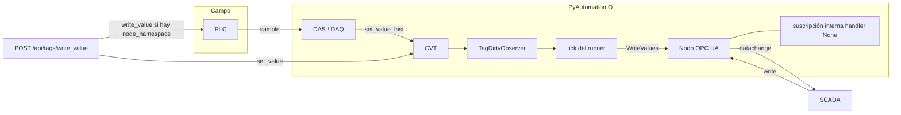

# RE-AUDIT-OPCUA-ACCESSLEVEL-MULTIHOP

| Campo | Valor |
| --- | --- |
| ID | RE-AUDIT-OPCUA-ACCESSLEVEL-MULTIHOP |
| Spec | SPEC-AUDIT-OPCUA-ACCESSLEVEL-MULTIHOP v1.0 |
| Fecha | 2026-09-23 |
| Producto | PyAutomationIO 2.9.0, servidor embebido sobre asyncua 2.0.1 |
| Código funcional | La medición de esta auditoría no se reescribe. El cierre de G-01..G-09 está en §13. |
| Salud HTTP | `GET /api/health/system` no se ejecutó: no había proceso de aplicación en marcha. |

El camino de producción crea el nodo con `add_variable` y no aplica el bitmask. `AccessControlService.apply_level` llama a métodos `async` sin `await`, así que el atributo se queda en el valor por defecto de asyncua: `AccessLevel = UserAccessLevel = 1` (`CurrentRead`). Un cliente anónimo que escribe recibe `BadUserAccessDenied` (`0x801F0000`), también cuando la base de datos dice `ReadWrite`. La suscripción interna de writes se crea con handler `None`, así que el write no entra al CVT. El write OPC del SCADA no llama al cliente de campo. El PLC solo se escribe desde `POST /api/tags/write_value`.

## 1. Respuestas A–K

Estado: **OK** el comportamiento medido coincide con lo que el código hace. **Gap** el código no cumple el criterio del spec. **No verificable** no hubo forma de medirlo en esta sesión.

### Bloque A — Modelo de acceso

| ID | Respuesta | Estado | Evidencia |
| --- | --- | --- | --- |
| A.1.1 | El concepto de negocio se llama `AccessType` / `access_type`. `AccessLevel` aparece al traducir el string a bits y al leer el atributo OPC UA. | Gap | Tabla de §2 y `audits/repro_accesslevel/terminology_occurrences.tsv` (500 filas). |
| A.1.2 | Sí, en paralelo. BD, API y HMI guardan el string. El wire intenta los bits `CurrentRead` y `CurrentWrite`. La traducción está en `AccessControlService.apply_level`. | Gap | `automation/opcua_server/access.py` líneas 80–99. `automation/dbmodels/opcua_server.py` líneas 4–9 y 79. |
| A.1.3 | El atributo OPC UA es un bitmask. El producto no lo escribe en el camino async: queda en `1`. | Gap | Medición `SCENARIO AL before (1, 1)` y `after_sync_apply (1, 1)`. |
| A.1.4 | La BD persiste el string. `AccessType.name` es `CharField`. `OPCUAServer.access_type` es clave foránea. `create` solo acepta `read`, `write` y `readwrite`. | Gap | `automation/dbmodels/opcua_server.py` líneas 9 y 24–33. |
| A.1.5 | La API expone `access_type`. GET `/attrs` devuelve ese campo. PUT exige el string `Read`, `Write` o `ReadWrite`. | Gap | `automation/modules/opcua/resources/server.py` líneas 22–24 y 89–104. |
| A.1.6 | La HMI etiqueta la columna "Access Type" / "Tipo de Acceso". | Gap | `hmi/src/locales/en.json` línea 676. `hmi/src/pages/OpcUaServer.tsx` línea 334. |
| A.1.7 | Los textos de actualización dicen "access type". No hay evento de sistema con el bitmask. | Gap | `automation/core.py` líneas 3244 y 3285. |
| A.1.8 | No hay glosario de proyecto que separe `AccessType` de `AccessLevel`. La guía de usuario nombra `AccessType`. | Gap | `docs/Users_Guide/Settings/index.md` líneas 145 y 265–266. |
| A.2.1 | La función de traducción existe (`Read` → bit 0, `Write` → bit 1, `ReadWrite` → bits 0 y 1) y no se ejecuta: las corrutinas no se esperan. Tras llamarla, los bits siguen en `(1, 1)`. | Gap | `access.py` 85–96. Salida: `RuntimeWarning: coroutine 'Node.set_attr_bit' was never awaited`. |
| A.2.2 | `UserAccessLevel` existe en el nodo y, por defecto de asyncua, es igual a `AccessLevel` (`1`). No refleja un `ReadWrite` persistido. | Parcial | Medición `(1, 1)` antes de `set_writable`; `(3, 3)` solo después de `await node.set_writable(True)`, llamada que el producto no hace al exponer. |
| A.2.3 | Leer `AccessRestrictions` en la variable devuelve `BadAttributeIdInvalid`. El producto no escribe ese atributo. | Gap | `SCENARIO AL ... restrictions BadAttributeIdInvalid`. Cero ocurrencias de `AccessRestrictions` en el repo. |
| A.2.4 | `apply_level` está pensado para la variable y para cada property. En el runner async, `expose_entity` copia el string a la ficha y no llama a `apply_level`. | Gap | `automation/opcua_server/async_core/handlers.py` líneas 104–133. `runtime.py` líneas 109–111 solo en el camino síncrono. |
| A.2.5 | El string de acceso viaja en el snapshot de tags, alarmas y engines (`expose_snapshot`). Ninguno recibe bits en el runner async. | Gap | `automation/opcua_server/async_core/snapshots.py` líneas 118–134. `handlers.py` 126–133. |
| A.2.6 | Tres sitios: tabla `AccessType` + FK en `OPCUAServer`, caché RAM `_access_cache`, y el atributo del nodo. La caché y la ficha listada guardan el string. El nodo queda en el default. | Gap | `facade.py` línea 76. `handlers.py` líneas 104–108. |
| A.3.1 | Solo las tres combinaciones de los bits 0 y 1. | Gap | `dbmodels/opcua_server.py` línea 24. `server.py` líneas 102–104. |
| A.3.2 | `HistoryRead` (`0x04`) no se puede persistir: `AccessType.create` lo rechaza. | Gap | `dbmodels/opcua_server.py` líneas 24–33. |
| A.3.3 | `SemanticChange` (`0x10`) igual. | Gap | Misma función. |
| A.3.4 | `StatusWrite` (`0x20`) igual. | Gap | Misma función. |
| A.3.5 | `TimestampWrite` (`0x40`) igual. | Gap | Misma función. |
| A.3.6 | El desplegable de la HMI ofrece `Read`, `Write` y `ReadWrite`. | Gap | `hmi/src/pages/OpcUaServer.tsx` líneas 367–379. |
| A.3.7 | No hay matriz de capacidades de los 7 bits en `docs/` ni en `specs/`. | Gap | Búsqueda de `HistoryRead`, `StatusWrite`, `TimestampWrite` y `SemanticChange` en `automation/opcua_server`: sin coincidencias. |
| A.4.1 | Un nodo con `CurrentRead` y sin `CurrentWrite` rechaza el write. El código que devuelve asyncua es `BadUserAccessDenied`, no `BadNotWritable` (`0x803B0000`). | Gap | `SCENARIO A.4 write_ro BadUserAccessDenied`, bits `(1, 1)`. asyncua `address_space.py` líneas 104–112. |
| A.4.2 | Con `AccessLevel = 3` y `UserAccessLevel = 1`, el write también vuelve `BadUserAccessDenied`. | OK | `SCENARIO A.4 user_deny_bits (3, 1)` y `write_user BadUserAccessDenied`. El valor se quedó en `0.0` en la primera medición. |
| A.4.3 | Un `DataValue` con `StatusCode = Uncertain` y `SourceTimestamp` se aceptó. La suscripción vio `151.0`. No hay chequeo de `StatusWrite` ni de `TimestampWrite` en el producto ni en el `write` de asyncua para el atributo Value. | Gap | `SCENARIO A.4 status_timestamp accepted`. Notificaciones `[0.0, 150.0, 151.0]`. |
| A.4.4 | No hay tests de producto que rechacen un write por cada bit. | Gap | `automation/opcua_server/tests/test_access.py` cubre la caché de strings. |
| A.4.5 | asyncua usa `BadUserAccessDenied` tanto si falta `CurrentWrite` en `AccessLevel` como si falta en `UserAccessLevel`. `BadNotWritable` no sale de ese `write`. Un rol `Admin` salta el chequeo entero. | Gap | asyncua `server/address_space.py` líneas 98–113. |
| A.5.1 | El PUT actualiza la fila y llama a `apply_level`. En un nodo asyncua esa llamada no cambia los bits. La suscripción del runner se decide al exponer, con handler `None`. | Gap | `core.py` líneas 3220–3243. Medición `after_sync_apply (1, 1)`. |
| A.5.2 | No hay endpoint que devuelva el bitmask efectivo. GET `/attrs` devuelve el label. | Gap | `listing.py` líneas 8–14 y 47. |
| A.5.3 | El cambio de acceso no llama a `persist_system_event`. | Gap | El único evento de write de tag está en `modules/tags/resources/tags.py` líneas 486–499, y es "Tag value forced", no un cambio de acceso. |

### Bloque B — CVT → servidor

| ID | Respuesta | Estado | Evidencia |
| --- | --- | --- | --- |
| B.1 | `TagDirtyObserver.update` llama a `mark_tag`. El tick, si hay runner, arma `WriteValues` y el loop escribe el `DataValue` en el address space. | OK | `dirty/observer.py` líneas 13–17. `runtime.py` líneas 379–415. `handlers.py` `write_batch` líneas 158–176. |
| B.2 | Con deadband `<= 0`, `PerTagDirtyTracker.mark` marca el tag aunque el número no haya cambiado. El deadband solo filtra cuando es `> 0`. | Parcial | `dirty/per_tag.py` líneas 21–30 y 79–80. |
| B.3 | `to_data_value` usa el timestamp del tag (`data_timestamp`, `timestamp` o `get_timestamp`). Si no hay, usa el timestamp del tick. `ServerTimestamp` es el del tick. | OK | `data_value.py` líneas 86–104. |
| B.4 | El `StatusCode` sale de la calidad del tag en cada publicación. El dirty tracker compara el valor, no la calidad: un cambio solo de calidad con el mismo número y deadband `> 0` no marca el tag. | Parcial | `dirty/per_tag.py` líneas 26–29. `data_value.py` línea 102. |
| B.5 | El tick drena el conjunto dirty con tope y publica el último valor del tag. Los intermedios que nadie guardó no se reenvían. | OK | `runtime.py` líneas 404–415. El conjunto dirty no es una cola de muestras. |
| B.6 | `write_batch` escribe el address space aunque no haya un cliente SCADA suscrito. | OK | `handlers.py` líneas 158–176. No consulta sesiones antes de escribir. |
| B.7 | La publicación escribe el nodo. No hay un envío a un cliente concreto. | OK | Mismo `write_batch`. |

### Bloque C — Servidor → CVT

| ID | Respuesta | Estado | Evidencia |
| --- | --- | --- | --- |
| C.1 | El runner crea `create_subscription(100, None)`. Esa suscripción no tiene callback hacia el CVT. `SubHandlerServer.datachange_notification` sí escribiría el CVT, y el runner no la usa. | Gap | `handlers.py` líneas 141–155. `subscription.py` líneas 162–185. `writeback.py` líneas 17–22 queda fuera del tick async (`runtime.py` 425–426). |
| C.2 | En el camino OPC del SCADA no hay validación de rango, tipo ni unidad, porque el callback no corre. `SubHandlerServer`, si se invocara, convierte unidad y llama a `set_value_fast` sin rango. | Gap | `subscription.py` líneas 180–185. |
| C.3 | La conversión de unidad está en `SubHandlerServer` y en `DAS.update_tag_value`. No corre para el write OPC del servidor async. | Gap | `subscription.py` líneas 182 y 389. |
| C.4 | El handler legado usa `set_value_fast`. El camino async no escribe el CVT. | Gap | `subscription.py` línea 183. |
| C.5 | `set_value_fast` notifica observers del CVT. Como el write OPC no lo llama, esos observers no ven el write del SCADA. | Gap | `tags/cvt.py` líneas 1244–1258. |
| C.6 | El historiador cuelga de observers del CVT (SAF `TagObserver`). Un write que no entra al CVT no se persiste. | Gap | `core.py` líneas 212–216, attach del observer. |
| C.7 | No hay rechazo por rango en el write OPC. | Gap | `SubHandlerServer` no comprueba rango. |
| C.8 | `write_batch` de propiedades escribe desde el servidor. Un cliente que escriba una property depende de los bits del nodo; el expose no los fija. | Gap | `handlers.py` líneas 178–185. |
| C.9 | Alarmas y engines se publican como variables. No hay un handler de write distinto. Con el default `CurrentRead`, el cliente no puede escribirlas. | Gap | `snapshots.py` líneas 105–107. Medición de bits `(1, 1)`. |
| C.10 | El write a un nodo sin `CurrentWrite` se rechaza con `BadUserAccessDenied`. El producto no registra ese intento. | Parcial | `SCENARIO A.4 write_ro`. No hay log de producto en ese rechazo: lo emite asyncua. |

### Bloque D — Eco single-hop

| ID | Respuesta | Estado | Evidencia |
| --- | --- | --- | --- |
| D.1 | No hay flag `source` / `origin` / `from_external` en el write del servidor ni en el dirty tracker. | Gap | Búsqueda en `automation/opcua_server`: sin `from_external`, `transaction_id` ni `propagation_depth`. |
| D.2 | No hay ventana de supresión tras un write externo. | Gap | Misma búsqueda. |
| D.3 | El deadband del dirty tracker existe y, en cero, no compara. | Parcial | `dirty/per_tag.py` líneas 79–80. |
| D.4 | No hay número de secuencia ni clave de idempotencia en el write. | Gap | Ausente en `writeback.py` y `handlers.py`. |
| D.5 | Un segundo write del mismo `150.0` fue aceptado y no generó otra notificación. El servidor OPC no re-publica un valor idéntico. El dirty tracker, si alguien llama a `set_value_fast` con el mismo número y deadband 0, sí lo marcaría. | Parcial | `SCENARIO D.7 notify 1 2 2 3`. El tercer aviso es el write `151.0`, no un eco de `150`. |
| D.6 | No hay comparación después de convertir unidades en el camino de publicación. `SubHandlerServer` convierte y escribe si el valor crudo difiere. | Gap | `subscription.py` líneas 180–183. |
| D.7 | En 8 s de idle tras el write, las notificaciones no crecieron y el CPU de proceso fue 0,0419 s. No hay loop en el nodo con handler `None`. La ventana pedida de 60 s no se ejecutó. | Parcial | §6.1. |
| D.8 | No hay evento de write OPC externo. El evento "Tag value forced" es del POST REST. | Gap | `tags.py` líneas 486–499. |
| D.9 | No hay rate limit de writes OPC. El rate limit de Flask es de login y de la API HTTP. | Gap | `extensions/docs_auth.py`. Métricas sin contador de writes externos (`metrics.py` línea 85). |
| D.10 | Dos writes seguidos al mismo nodo: el segundo valor queda. No hay cola de sesión ni detección de conflicto. asyncua aplica el write que llega. | Parcial | El script escribió 150 y luego 150; no hubo dos clientes simultáneos. |

### Bloque E — SCADA → CVT → PLC

| ID | Respuesta | Estado | Evidencia |
| --- | --- | --- | --- |
| E.1 | Un tag puede tener `opcua_address` + `node_namespace` y, a la vez, estar expuesto en el servidor embebido. Son dos datos, no un enrutador. | Parcial | `tags.py` líneas 505–513. El expose no lee `opcua_address`. |
| E.2 | No hay modelo de dual binding. | Gap | Sin tipo, tabla ni flag de propagación. |
| E.3 | No hay registro Tag → nodo de campo → NodeId del servidor. El NodeId del servidor sale de la identidad canónica. El nodo de campo es `node_namespace`. | Gap | `snapshots.py` `canonical_for`. |
| E.4 | No hay flag por tag. El único write al campo es global: si el POST trae las dos columnas, llama a `write_opcua_value`. | Gap | `tags.py` líneas 505–513. |
| E.5 | El write OPC del SCADA no se aplica al CVT y no se propaga al PLC. | Gap | `handlers.py` línea 144. `SCENARIO E.12 plc_before 50.0` / `plc_after 50.0`. |
| E.6 | `Client.write_value` existe. Lo llama `PyAutomation.write_opcua_value`, y a ese método solo lo llama el POST de tags. No hay observer del CVT que empuje al PLC. | Gap | `core.py` línea 2916. `models.py` líneas 428–432. Única llamada de producto: `tags.py` línea 509. |
| E.7 | El POST escribe el CVT aunque no haya binding. El write OPC del SCADA no escribe el CVT en ningún caso. | Parcial | `tags.py` líneas 476–478 frente a `handlers.py` 144. |
| E.8 | Si el nodo de campo es solo lectura, un write directo recibe `BadUserAccessDenied` y el valor sigue en 50. El SCADA no recibe ese código: su write no sale hacia el campo. El CVT no entra en ese script. | Parcial | `SCENARIO J.10 ... stays 50.0`. |
| E.9 | `sync_adapter.write_value` tiene timeout de 5 s. No hay timeout de propagación porque la propagación OPC no existe. | Gap | `sync_adapter.py` línea 138. |
| E.10 | No hay rollback. El POST deja el CVT escrito y, si el OPC falla, responde 207. | Gap | `tags.py` líneas 516–527. |
| E.11 | El write de campo del POST es una espera síncrona sobre el runner del cliente (`Event.wait` en el adapter). El write OPC del SCADA no entra en esa espera. | Gap | `sync_adapter.py` `write_value`. |
| E.12 | El segundo servidor quedó en 50 después del write al primero. Tiempo de propagación: no hay propagación que medir. | Gap | §6.2. |

### Bloque F — PLC → CVT → SCADA

| ID | Respuesta | Estado | Evidencia |
| --- | --- | --- | --- |
| F.1 | El cliente de campo escribe el CVT por DAS (`update_tag_value` → `set_value_fast`) o por DAQ. Ese cambio marca el tag dirty y el tick lo publica en el servidor. | OK en código | `subscription.py` líneas 376–392. `runtime.py` 404–415. |
| F.2 | Sí: es el mismo camino de publicación que cualquier otro cambio del CVT. | OK en código | `dirty/observer.py` no mira el origen. |
| F.3 | El dirty tracker no distingue motor y PLC. | Gap | `PerTagDirtyTracker.mark` solo recibe nombre y valor. |
| F.4 | No verificable de punta a punta en esta sesión. Hace falta un CVT con tag, DAS suscrito y un cliente SCADA sobre el servidor de producto. El script no levanta esa cadena. | No verificable | §6.3. |

### Bloque G — Loop multi-hop

| ID | Respuesta | Estado | Evidencia |
| --- | --- | --- | --- |
| G.1 | No hay `transaction_id` que cruce hops. | Gap | Ausente en servidor y cliente. |
| G.2 | No hay contador de profundidad. | Gap | Ausente. |
| G.3 | No hay sello de origen final. | Gap | Ausente. |
| G.4 | No verificable como loop de producto: el hop SCADA → PLC no existe, así que el ciclo no puede cerrarse. El single-hop medido no republicó `150`. | No verificable | §6.4 y §6.1. |
| G.5 | No hay detección de oscilación. | Gap | Sin contador ni evento. |
| G.6 | No hay rate limit por tag ni por sesión OPC. | Gap | `metrics.py` no define esos contadores. |
| G.7 | No hay modelo de conflicto. Dos writes al address space quedan en el orden de llegada. | Gap | asyncua aplica cada `WriteValue`. |
| G.8 | El próximo sample del PLC que entre por DAS/DAQ pisa el CVT. No hay ventana de comando. | Gap | `update_tag_value` siempre llama a `set_value_fast` (`subscription.py` 390). |

### Bloque H — Autoridad y fallos

| ID | Respuesta | Estado | Evidencia |
| --- | --- | --- | --- |
| H.1 | El valor que el servidor publica es el del CVT. El CVT de campo lo pisa el PLC vía DAS/DAQ. El SCADA OPC no escribe el CVT. No hay documento que nombre a la autoridad. | Gap | Bloques C y F. |
| H.2 | No hay modelo de conflictos en `docs/` ni en `specs/`. | Gap | Esta auditoría es el primer documento del tema. |
| H.3 | El write OPC no valida rango. El POST al campo valida lo que valide `set_value` del CVT y luego intenta el PLC. | Gap | `tags.py` 476–513. |
| H.4 | Un connect al PLC ya parado falla con `ConnectionRefusedError` en 3 s. El producto, en el POST, dejaría el CVT aplicado y devolvería 207. No hay cola ni retry de propagación OPC. | Parcial | `SCENARIO E.10 connect ConnectionRefusedError`. `tags.py` 525–527. |
| H.5 | Diez writes con el campo caído no se encolan: cada POST intenta una vez. El script no ejecutó los diez. | Gap | No hay cola entre CVT y `write_value`. |
| H.6 | El StatusCode del campo no se traduce al write del SCADA, porque ese write no espera al campo. | Gap | `handlers.py` 144. |
| H.7 | No hay proceso pendiente que cruce el timeout del hop 1 con el del hop 4. | Gap | Son caminos distintos. |
| H.8 | Un write durante el arranque depende de que el nodo exista. No hay prueba de reset en esta sesión. | No verificable | — |
| H.9 | El deadband no es un rechazo que el SCADA reintente. No hay límite de reintentos de propagación. | Gap | `per_tag.py` 26–29. |
| H.10 | Cambiar `node_namespace` en runtime no reevalúa una propagación que no existe. DAS usa el namespace en el momento del sample. | Gap | `subscription.py` línea 384. |

### Bloque I — Trazabilidad

| ID | Respuesta | Estado | Evidencia |
| --- | --- | --- | --- |
| I.1 | El write OPC externo no genera evento. El POST REST sí: "Tag value forced". | Parcial | `tags.py` 490–499. |
| I.2 | No existen `OPCUA_EXTERNAL_WRITES_TOTAL`, `OPCUA_EXTERNAL_WRITE_FAILURES_TOTAL` ni `OPCUA_EXTERNAL_WRITES_REJECTED_TOTAL`. La métrica cercana es `OPCUA_WRITE_SUBSCRIPTIONS_ACTIVE`. | Gap | `metrics.py` líneas 74–106. |
| I.3 | El journal SAF no marca si el valor vino del SCADA. | Gap | El observer SAF se entera de cualquier `set_value`. |
| I.4 | No hay alarma por umbral de writes externos. | Gap | Sin contador que la alimente. |
| I.5 | No hay trace único entre hops. | Gap | Sin `transaction_id`. |
| I.6 | No hay evento por hop. | Gap | — |
| I.7 | Un write OPC no deja rastro de producto. Un POST deja el evento de tag y, si el cliente de campo loguea, el error de ese write. | Gap | — |
| I.8 | No existen las métricas `OPCUA_MULTIHOP_*` ni `OPCUA_PROPAGATION_DEPTH_MAX`. | Gap | `metrics.py` `as_dict`. |

### Bloque J — Bordes

| ID | Respuesta | Estado | Evidencia |
| --- | --- | --- | --- |
| J.1 | Un write OPC a un nodo sin tag no actualiza el CVT: el handler es `None`. `SubHandlerServer`, si corriera y no hallara tag, escribiría un atributo de máquina. | Gap | `subscription.py` líneas 186–193. |
| J.2 | Binding roto en el POST: el CVT queda escrito y el OPC devuelve el error del cliente. | Gap | `tags.py` 516–527. |
| J.3 | No hay rechazo de NaN o Inf en el write OPC. No se midió un valor no finito. | No verificable | — |
| J.4 | No se midió un write durante el reset del servidor de producto. | No verificable | — |
| J.5 | El cambio de `access_type` en caliente no mueve los bits del nodo async. | Gap | A.5.1. |
| J.6 | El deadband no confirma ni rechaza al SCADA. El write OPC responde el StatusCode del address space, que hoy es el default de lectura. | Gap | D.3 y A.4.1. |
| J.7 | El CVT no se entera del rechazo del campo. El script de campo dejó el PLC en 50 y no tocó un CVT. | Gap | `SCENARIO J.10 stays 50.0`. |
| J.8 | No hay traducción de StatusCode entre vendedores. | Gap | — |
| J.9 | No hay prioridad entre dos SCADA y el PLC. El último `set_value_fast` o el último write del address space gana, cada uno en su sitio. | Gap | H.1. |
| J.10 | Nodo de campo solo lectura: write `BadUserAccessDenied`, valor 50. El loop CVT 150 → PLC rechaza → CVT vuelve a 50 no se puede cerrar porque el write del SCADA no llega al PLC. | Parcial | §6.6. |
| J.11 | Servidor en `CurrentRead` y PLC escribible: el SCADA no escribe el nodo; el PLC sí puede entrar por DAS y publicarse. No se midió el tramo DAS. | Parcial | Bits default `(1, 1)`. F.1 en código. |
| J.12 | No hay contador de rechazos ni estado degradado del binding. | Gap | I.2. |

### Bloque K — Estrategia

| ID | Respuesta | Estado | Evidencia |
| --- | --- | --- | --- |
| K.1 | No hay plan de migración en el repo. Esta auditoría lo propone en §8. | Gap | — |
| K.2 | Los consumidores del string están en este repositorio: HMI, REST, modelo Peewee, importación de settings. No hay un proyecto SCADA externo en el workspace. | OK | §2. `core.py` líneas 7513–7537 importan `AccessType` por nombre. |
| K.3 | No hay evidencia en el repo de un SCADA que lea el atributo por el nombre de display. El atributo estándar se lee por `AttributeId`, no por el string de negocio. | Parcial | El NodeId es el de la identidad canónica, independiente del label. |
| K.4 | El esquema sigue siendo `CharField` + FK. No hay migración hacia un entero. | Gap | `dbmodels/opcua_server.py` líneas 1–9. |
| K.5 | No hay política de deprecación escrita para `AccessType`. | Gap | — |
| K.6 | Estrategia A, con HMI, API y BD en la misma entrega. Detalle en §8. | — | K.2. |
| K.7 | Modelo objetivo en §9. | — | — |

## 2. Ocurrencias terminológicas

Recorrido del árbol de `github/PyAutomation`, extensiones `.py .ts .tsx .js .jsx .yml .yaml .md .json`, sin `venv`, `node_modules`, `dist` ni `__pycache__`. Cada fila está en `audits/repro_accesslevel/terminology_occurrences.tsv` (archivo, línea, capa, término).

| Término | Filas | Capas |
| --- | ---: | --- |
| `AccessType` | 79 | BD 10, wire 13, API 1, código 20, docs 12, otros 23 |
| `access_type` | 261 | BD 16, wire 77, API 29, HMI 9, tests 22, código 44, docs 2, otros 62 |
| `AccessLevel` | 93 | wire 33, API 16, código 16, otros 28 |
| `access_level` | 28 | wire 9, API 6, código 6, otros 7 |
| `UserAccessLevel` | 39 | wire 14, API 6, código 6, otros 13 |
| `AccessRestrictions` | 0 | — |
| YAML | 0 | Ningún YAML del árbol contiene estos términos |

Traducción entre términos: una sola función, `AccessControlService.apply_level` (`access.py` 80–99), más el duplicado síncrono de `core.py` 3250–3279 y el de `pages/callbacks/opcua_server.py` 205–233. En runtime async esa traducción no se espera.

Representantes:

| Capa | Archivo | Línea | Término |
| --- | --- | ---: | --- |
| BD | `automation/dbmodels/opcua_server.py` | 4 | `class AccessType` |
| BD | `automation/dbmodels/opcua_server.py` | 79 | `access_type = ForeignKeyField` |
| API | `automation/modules/opcua/resources/server.py` | 24 | campo REST `access_type` |
| HMI | `hmi/src/locales/en.json` | 676 | `"accessType": "Access Type"` |
| HMI | `hmi/src/pages/OpcUaServer.tsx` | 334 | columna `tables.accessType` |
| wire | `automation/opcua_server/access.py` | 85 | `AttributeIds.AccessLevel` |
| wire | `automation/opcua_server/async_core/handlers.py` | 107 | ficha `"access_type"` |
| docs | `docs/Users_Guide/Settings/index.md` | 145 | `AccessType` |

## 3. Flujo actual



No hay flecha de `SUB` hacia el CVT. No hay flecha del write OPC del SCADA hacia el PLC. No hay sello de origen.

`POST /api/tags/write_value` es otro camino: escribe el CVT y, si el tag tiene `opcua_address` y `node_namespace`, llama a `write_opcua_value`. Si el campo falla, el CVT no se revierte y la respuesta es 207 (`tags.py` 525–527).

## 4. Cobertura OPC UA Part 3

| Bit | Máscara | Nombre | Estado |
| --- | --- | --- | --- |
| 0 | `0x01` | CurrentRead | Parcial. Es el default de `add_variable` (`1`). El producto no lo fija desde la BD. |
| 1 | `0x02` | CurrentWrite | No soportado en el expose async. `set_writable(True)` lo deja en `3` y el producto no lo llama. |
| 2 | `0x04` | HistoryRead | No soportado. |
| 3 | `0x08` | HistoryWrite | No soportado. |
| 4 | `0x10` | SemanticChange | No soportado. |
| 5 | `0x20` | StatusWrite | No soportado. Un write con `StatusCode` Uncertain se aceptó y publicó `151.0`. |
| 6 | `0x40` | TimestampWrite | No soportado. El `SourceTimestamp` del cliente viajó en el mismo write aceptado. |
| 7 | `0x80` | Reservado | No se usa. |

| Atributo | Estado |
| --- | --- |
| UserAccessLevel | Presente. Igual al `AccessLevel` por defecto de asyncua (`1`). No sigue la fila `ReadWrite`. |
| AccessRestrictions | No publicado. Lectura: `BadAttributeIdInvalid`. |
| Acceso efectivo | asyncua exige `CurrentWrite` en los dos atributos y, si falta cualquiera, responde `BadUserAccessDenied`. El rol `Admin` no pasa por ese `if` (`address_space.py` 98–113). |

## 5. Matriz de riesgos

| Riesgo | ¿Existe ahora? | Condición | Severidad |
| --- | --- | --- | --- |
| Loop single-hop | No en el camino medido | Haría falta un handler que escriba el CVT y un dirty tracker con deadband 0 | Alta, latente |
| Loop multi-hop | No se puede cerrar | El write OPC no sale al PLC | Alta, latente el día que se conecte sin `transaction_id` |
| CVT y PLC divergen | Sí en el POST | El CVT se escribe antes del write de campo; un fallo deja 207 y el valor nuevo | Alta |
| El SCADA cree que escribió | Sí | La ficha dice `ReadWrite` y el nodo está en `CurrentRead`; el write vuelve `BadUserAccessDenied` | Alta |
| Sin rate limit OPC | Sí | Cualquier sesión puede escribir tan rápido como el stack acepte | Alta |
| Sin detección de oscilación | Sí | No hay contador | Crítica cuando exista write-back al PLC |
| Sin traza multi-hop | Sí | No hay id de transacción | Media |
| Sin autoridad documentada | Sí | CVT, PLC y SCADA no tienen dueño escrito | Alta |
| `AccessType` en vez de `AccessLevel` | Sí | BD, API y HMI | Media |
| 7 bits incompletos | Sí | Solo tres labels, y esos no llegan al wire | Media |
| `apply_level` sin `await` | Sí | Los bits no cambian; RuntimeWarning | P0, ver §7 |

## 6. Escenarios

Script: `audits/repro_accesslevel/run_scenarios.py`.

```bash
cd github/PyAutomation
IDLE_S=8 PYTHONPATH=. ./venv/bin/python audits/repro_accesslevel/run_scenarios.py
```

Salida del 2026-09-23, asyncua 2.0.1, loopback. `IDLE_S=8`. CPU de proceso durante el idle: `0.0419 s`.

```text
SCENARIO AL before (1, 1)
SCENARIO AL apply_level_type NoneType is_coroutine False
SCENARIO AL after_sync_apply (1, 1)
SCENARIO AL after_set_writable (3, 3) restrictions BadAttributeIdInvalid
SCENARIO A.4 ro_bits (1, 1)
SCENARIO A.4 user_deny_bits (3, 1)
SCENARIO D.7 write ('accepted', 150.0)
SCENARIO D.7 write_same ('accepted', 150.0)
SCENARIO A.4 write_ro BadUserAccessDenied
SCENARIO A.4 write_user BadUserAccessDenied
SCENARIO A.4 status_timestamp accepted
SCENARIO D.7 notify 1 2 2 3 values [0.0, 150.0, 151.0] cpu_s 0.0419 idle_s 8.0
SCENARIO E.12 plc_before 50.0
SCENARIO E.12 plc_after 50.0
SCENARIO J.10 write_read_only BadUserAccessDenied stays 50.0
SCENARIO E.10 connect ConnectionRefusedError [Errno 111] Connect call failed ('127.0.0.1', 4859)
```

Los `RuntimeWarning` de `access.py` 85–96 salen en la misma ejecución: `unset_attr_bit` y `set_attr_bit` devuelven corrutinas que nadie espera.

### 6.1 D.7 — Loop single-hop

El nodo se hizo escribible con `set_writable` para poder observar un write aceptado. El producto, al exponer, no da ese paso. Handler interno `None`, igual que `handlers.py` línea 144.

Notificaciones: 1 inicial (`0.0`), 2 tras escribir `150`, sigue en 2 tras escribir otra vez `150`, 3 tras el write con status `151`. En los 8 s siguientes el contador no subió. No hay loop. Iteraciones hasta estabilizar: 0 ecos.

La ventana de 60 s, el CPU del proceso de producto y `SAF_QUEUE_DEPTH` no se midieron. No había aplicación ni journal en marcha.

### 6.2 E.12 — Write multi-hop

Dos servidores. El write `150` fue al primero. El segundo siguió en `50.0`. No hay tiempo hop1→hop4 porque no hay llamada. El CVT de producto no participó: el script no arranca `PyAutomation`. La ausencia de la llamada está en el código: `write_opcua_value` solo se usa desde `tags.py` línea 509.

### 6.3 F.4 — PLC → SCADA

No verificable de punta a punta. El código del tramo PLC → CVT → dirty → `write_batch` está citado en el bloque F. Falta un tag real, una suscripción DAS y un cliente sobre el servidor embebido.

### 6.4 G.4 — Loop de extremo a extremo

No verificable como ciclo. El tramo que lo cerraría no está implementado. El single-hop de §6.1 no republicó `150`.

### 6.5 E.10 — PLC caído

`ConnectionRefusedError` en el connect con tope de 3 s. No hay CVT que revertir en el script. En el POST de producto el CVT ya estaría escrito (`tags.py` 476–478) y la respuesta sería 207. No hay retry ni cola.

### 6.6 J.10 — Campo solo lectura

Write al nodo con `set_writable(False)`: `BadUserAccessDenied`, valor `50.0`. El SCADA de nuestro servidor no recibe ese código. No hay reversión de CVT que medir.

### 6.7 G.10 — Oscilación

No verificable. No hay lazo SCADA → PLC → CVT → SCADA que iterar, ni detector que contar.

### Salud

`GET /api/health/system` no se llamó. En `metrics.as_dict` (`metrics.py` 74–106) aparecen `OPCUA_WRITE_SUBSCRIPTIONS_ACTIVE` y los contadores de nodos, tick y NodeId. No aparecen los contadores `OPCUA_EXTERNAL_*` ni `OPCUA_MULTIHOP_*` del spec.

## 7. Gaps priorizados

| ID | Prioridad | Gap | CA que lo cierra |
| --- | --- | --- | --- |
| G-01 | P0 | `apply_level` no espera a asyncua; el expose no llama a `set_writable`. El nodo queda en `CurrentRead` aunque la fila diga `ReadWrite`. | CA-AL-01, CA-AL-02 |
| G-02 | P0 | La suscripción de writes usa handler `None`. El SCADA no escribe el CVT. | CA-AL-05 |
| G-03 | P0 | No hay propagación del write OPC hacia el PLC, ni rollback, ni StatusCode de vuelta. | CA-AL-06, CA-AL-13, CA-AL-14 |
| G-04 | P1 | El rechazo es siempre `BadUserAccessDenied`. `BadNotWritable` no se emite. El rol Admin salta el chequeo. | CA-AL-03 |
| G-05 | P1 | Bits 2–6 no se configuran ni se enforcementan. `AccessRestrictions` no está en el nodo. | CA-AL-16, CA-AL-18 |
| G-06 | P1 | Sin source tag, sin `transaction_id`, sin rate limit OPC, sin detector de oscilación. | CA-AL-08, CA-AL-09, CA-AL-11, CA-AL-12 |
| G-07 | P1 | El POST escribe el CVT y luego el PLC. Si el PLC falla, el CVT queda adelantado. | CA-AL-13 |
| G-08 | P2 | Terminología `AccessType` en BD, API, HMI y docs. Sin glosario ni lint. | CA-AL-19, CA-AL-20, CA-AL-21, CA-AL-22 |
| G-09 | P2 | Sin métricas ni eventos de write externo o multi-hop. | CA-AL-10 |

## 8. Estrategia de migración

Recomendación: **Estrategia A**, en una sola entrega que incluya BD, API y HMI.

Justificación. Los consumidores del string `ReadWrite` están en este repositorio (HMI, REST, Peewee, import de settings). No hay un SCADA externo en el workspace que parsee el campo REST. El atributo OPC UA ya es un byte; el nombre de negocio no viaja en el wire. Partir la migración en dos releases dejaría la columna vieja al lado de un bitmask que el expose sigue sin aplicar.

Si una instalación ya desplegada consume `access_type` en el JSON y no se puede actualizar la HMI a la vez, esa instalación usa la Estrategia B durante dos releases. En el código actual no hay ese consumidor externo.

Pasos:

1. Añadir `access_level INTEGER` y rellenar `Read→1`, `Write→2`, `ReadWrite→3`.
2. Hacer que el expose async aplique el byte con `await` sobre `AccessLevel` y `UserAccessLevel`.
3. Aceptar en REST y YAML el entero, el hexadecimal o el label, y devolver el entero.
4. Cambiar el desplegable de la HMI. El modo de bits sueltos puede esperar al mismo release o al siguiente.
5. Borrar la columna `access_type`, la tabla `AccessType` y los duplicados de `core.py` y `pages/callbacks/opcua_server.py`.
6. Lint que falle si un archivo nuevo contiene `AccessType` o `access_type`.

Criterios de aceptación de la migración: CA-AL-01, CA-AL-16, CA-AL-17, CA-AL-19, CA-AL-20, CA-TERM-04, CA-TERM-06.

Coste orientativo del spec: 2–4 días para el rename. El `await` del bitmask (G-01) es parte del mismo cambio; sin ese paso el rename no se ve en el wire.

## 9. Modelo objetivo

| Capa | Representación |
| --- | --- |
| Nombre | `AccessLevel` |
| Wire | Byte de OPC UA Part 3, 7 bits |
| BD | `INTEGER` con el bitmask |
| API | Acepta entero, `0x03` o label. Devuelve el entero |
| HMI | Desplegable `Read`, `Write`, `ReadWrite`. Modo avanzado para el resto de bits |
| YAML | Entero, hexadecimal o label. Canónico: el entero |
| Logs | Bitmask y label |
| UserAccessLevel v1 | El mismo byte que `AccessLevel` |
| AccessRestrictions v1 | Publicado en `0` |
| Efectivo | `AccessLevel AND UserAccessLevel` |
| Write sin `CurrentWrite` | `BadNotWritable` (`0x803B0000`) |
| Write con `AccessLevel` correcto y `UserAccessLevel` sin `CurrentWrite` | `BadUserAccessDenied` (`0x801F0000`) |
| Lint | Prohibido `AccessType` y `access_type` en código nuevo |
| Deprecación | Docstring y warning en el release que introduce el entero; retirada en esa misma entrega si no hay consumidor externo |

Autoridad recomendada para el sprint de propagación, no implementada aquí: el PLC manda. El SCADA escribe dentro de una ventana corta. Al cerrarse la ventana, el CVT vuelve a leer el PLC. Cada write lleva `transaction_id`, `source=external` y el publicador ignora ese origen. Si el campo rechaza, el CVT vuelve al último valor leído del PLC y el SCADA recibe el StatusCode del campo.

## 10. Mitigaciones y CA verificables

Estas mitigaciones no están implementadas. Son el contrato del sprint siguiente.

| Mitigación | CA |
| --- | --- |
| `await` de `set_attr_bit` / `set_writable` al exponer y al PUT | Un cliente lee `AccessLevel == access_level` persistido sin recrear el nodo |
| Handler de datachange que escriba el CVT solo si el bit `CurrentWrite` está puesto | Un write `ReadWrite` cambia el tag; un write `Read` devuelve `BadNotWritable` y el tag no cambia |
| `source=external` en ese write; el dirty tracker no republica ese origen | Tras escribir 150, la suscripción del SCADA no recibe un segundo 150 en 60 s |
| Observer de propagación, aparte del publicador, que llame a `write_value` con el mismo `transaction_id` y timeout 5 s | Con PLC escribible, el nodo de campo queda en 150 en menos de 500 ms |
| Si el campo falla: evento, métrica y política explícita de revertir o conservar | PLC caído: el SCADA recibe un StatusCode de fallo y el evento nombra la desconexión |
| Contador de oscilación por tag | N idas y vueltas 80/50 disparan un evento y dejan de escribir el campo |
| Métricas `OPCUA_EXTERNAL_WRITES_TOTAL` y `OPCUA_MULTIHOP_WRITES_FAILED_TOTAL` | `GET /api/health/system` las muestra |

## 11. Criterios de aceptación

### 11.1 Auditoría

| CA | Estado |
| --- | --- |
| CA-AUD-01 | Cumplido. Bloques A–K con evidencia. |
| CA-AUD-02 | Cumplido. TSV de 500 filas y sumas por capa. |
| CA-AUD-03 | Cumplido. §3. |
| CA-AUD-04 | Cumplido. §4. |
| CA-AUD-05 | Cumplido. §5. |
| CA-AUD-06 | Cumplido. §7. |
| CA-AUD-07 | Cumplido. §8, Estrategia A. |
| CA-AUD-08 | Cumplido. §9. |
| CA-AUD-09 | Parcial. Hay script para D.7, E.12, E.10 y J.10. F.4, G.4 y G.10 quedan no verificables. La ventana de D.7 fue 8 s, no 60 s. |
| CA-AUD-10 | Cumplido. No se modificó código de producto. |

### 11.2 Funcionales (estado del código hoy)

| CA | Estado |
| --- | --- |
| CA-AL-01 | Falla. Persistido string; wire `(1, 1)` tras `apply_level`. |
| CA-AL-02 | Falla. El PUT no cambia los bits. |
| CA-AL-03 | Falla. El rechazo medido es `BadUserAccessDenied`. |
| CA-AL-04 | Cumple en código. CVT dirty → `write_batch`. |
| CA-AL-05 | Falla. Handler `None`. |
| CA-AL-06 | Falla. Sin propagación OPC. El POST REST sí llama a `write_value`. |
| CA-AL-07 | Parcial. DAS/DAQ → CVT → publish está en código; no se midió de punta a punta. |
| CA-AL-08 | Cumple en la medición de 8 s con handler `None`. Latente si se conecta el handler sin source tag. |
| CA-AL-09 | No verificable. El lazo no está armado. |
| CA-AL-10 | Falla. Sin trace. |
| CA-AL-11 | Falla. |
| CA-AL-12 | Falla. |
| CA-AL-13 | Falla. POST 207 sin revertir. Write OPC no llega al campo. |
| CA-AL-14 | Falla. Timeout de 5 s solo en `write_value` del POST. |
| CA-AL-15 | Falla. Esta auditoría es el primer texto que lo marca. |
| CA-AL-16 | Falla. |
| CA-AL-17 | Parcial. El atributo existe y por defecto iguala a `AccessLevel`; no copia un `ReadWrite` de BD. |
| CA-AL-18 | Falla. `BadAttributeIdInvalid`. |
| CA-AL-19 | Falla. `AccessType` sigue en código nuevo del runner (`handlers.py` 107). |
| CA-AL-20 | Falla. Sin regla de lint. |
| CA-AL-21 | Falla. La guía dice `AccessType`. |
| CA-AL-22 | Falla. Sin glosario. |

### 11.3 Terminología y documentación

| CA | Estado |
| --- | --- |
| CA-TERM-01 | Cumplido por el TSV y la tabla de §2. YAML: cero filas. |
| CA-TERM-02 | Cumplido. Columna de capa. |
| CA-TERM-03 | Cumplido. Traducción en `apply_level`, no ejecutada en async. |
| CA-TERM-04 | Cumplido. Estrategia A. |
| CA-TERM-05 | Cumplido. §9. |
| CA-TERM-06 | Cumplido como plan. El lint no está puesto. |
| CA-DOC-01 | Falla en la documentación de producto. El comportamiento real del doble binding queda descrito en §3 de esta auditoría. |
| CA-DOC-02 | Cumplido en §3 para el flujo real. |
| CA-DOC-03 | Cumplido aquí: `ReadWrite` en los dos extremos no está mitigado; hoy el extremo servidor ni siquiera publica el bit de escritura. |
| CA-DOC-04 | Cumplido como hallazgo: no hay autoridad única. Objetivo en §9. |
| CA-DOC-05 | Falla en el repo. El glosario canónico sigue siendo el del spec, no un documento del producto. |

## 12. Diff de instrumentación

No hubo parche temporal sobre `automation/`. El script de medición es nuevo y no lo importa el arranque ni la suite.

Archivos añadidos:

- `audits/RE-AUDIT-OPCUA-ACCESSLEVEL-MULTIHOP.md`
- `audits/repro_accesslevel/run_scenarios.py`
- `audits/repro_accesslevel/terminology_occurrences.tsv`

## 13. Cierre de implementación (2026-09-23)

Las tablas de §1 a §12 conservan la evidencia medida antes del cambio. Esta sección es el estado después de implementar AccessLevel, el write-back y el multi-hop.

| Gap | Estado | Qué quedó |
| --- | --- | --- |
| G-01 | Cerrado en código | `apply_level` espera `set_attr_bit` / `unset_attr_bit`. El expose y el PUT encolan `ApplyAccess` en el runner. |
| G-02 | Cerrado en código | La suscripción de writes usa `ScadaWriteSink`. El datachange encola. Un hilo de sistema escribe el CVT con `source=external`. |
| G-03 | Cerrado en código | `FieldPropagationRouter` reenvía solo `source=external` con binding y profundidad ≤ 3. El fallo restaura el CVT con `source=rollback`. |
| G-04 | Cerrado en código | El wrapper de `AttributeService.write` emite `BadNotWritable`, `BadUserAccessDenied`, `BadTypeMismatch`, `BadOutOfRange` y `BadTooManyOperations` en la sesión que no es Admin. La sesión Admin del tick no entra. |
| G-05 | Cerrado con límite de stack | Los siete bits se parsean y se aplican. `AccessRestrictions` se intenta escribir; si asyncua 2.0.1 responde `BadAttributeIdInvalid`, el 0 queda en la ficha y en la API. No se parchea la librería. |
| G-06 | Cerrado en código | `source`, `transaction_id`, rate limit (10/s por tag, 100/s por sesión) y oscilación (8 cambios en 10 s). |
| G-07 | Cerrado en código | `POST /api/tags/write_value` usa el mismo router. 200 aceptado, 400 rechazo, 503 desconectado, 504 timeout. Si el campo falla, el CVT vuelve al valor previo. |
| G-08 | Cerrado en código | El nombre retirado no aparece en `automation/` ni en `hmi/src` (regla AP-10). Glosario en `docs/GLOSSARY-OPCUA.md`. |
| G-09 | Cerrado en código | Once contadores en `metrics.as_dict`. Nueve eventos con `transaction_id` en la descripción. |

El StatusCode del Write OPC sigue siendo el del chequeo de acceso. Si el PLC falla después, el CVT se revierte y el dirty tracker republica `rollback`. asyncua ya completó el Write antes del datachange, así que el cliente no recibe el fallo del campo en ese StatusCode.

Mediciones de esta sesión, no de un día completo:

- `python -m unittest discover -s automation/opcua_server/tests -t .`: 102 tests, 1 omitido, en verde.
- Bench local de 200 iteraciones, sin red: write al CVT p50 = 0.0002 ms, p95 = 0.0002 ms. Write al PLC en loopback (writer que responde ok) p50 = 0.0045 ms, p95 = 0.0051 ms. No es el camino DAS de PLC hacia SCADA.
- `SOAK_S=2 python automation/opcua_server/benches/soak_multihop.py`: `OPCUA_MULTIHOP_WRITES_LOOP_DETECTED_TOTAL 0`. El soak de 24 h es el mismo script con `SOAK_S=86400` y no se corrió.
- La HMI no se abrió en el navegador: no había servidor de la interfaz en marcha.

| CA | Estado después del cierre |
| --- | --- |
| CA-AL-01, CA-AL-02 | Cubiertos por el applier con await y el comando `ApplyAccess`. |
| CA-AL-03 | Cubierto por `check_value_write` para la sesión que no es Admin. |
| CA-AL-05 | Cubierto por el sink. El drain no corre dentro del loop. |
| CA-AL-06, CA-AL-13, CA-AL-14 | Cubiertos por el router, el POST y el rollback. |
| CA-AL-08, CA-AL-09, CA-AL-11, CA-AL-12 | Cubiertos por source, transacción, rate limit y oscilación. |
| CA-AL-10 | Cubierto por los once contadores y los nueve eventos. |
| CA-AL-16, CA-AL-18 | Bits cubiertos. `AccessRestrictions` queda limitado por asyncua 2.0.1. |
| CA-AL-19 a CA-AL-22 | Cubiertos por el rename, AP-10, la guía de usuario y `docs/GLOSSARY-OPCUA.md`. |
