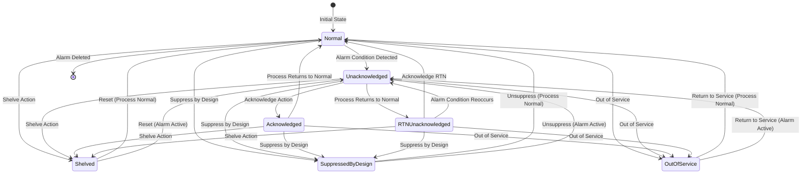

# Alarms API - ISA 18.2 Standard

The Alarms module implements the **ISA 18.2** standard for alarm management in industrial automation systems. ISA 18.2 is an international standard published by the International Society of Automation (ISA) that provides best practices for the design, implementation, and management of alarm systems in process industries.

## ISA 18.2 Overview

ISA 18.2 establishes a framework for effective alarm management throughout the alarm lifecycle, from philosophy development through monitoring and maintenance. The standard addresses common problems in alarm systems such as alarm flooding, nuisance alarms, and poor alarm response.

### Key Principles of ISA 18.2

1. **Alarm Philosophy**: A documented set of principles governing the design, implementation, operation, and management of the alarm system
2. **Alarm Lifecycle**: A structured approach covering philosophy, identification, rationalization, detailed design, implementation, operation, maintenance, management of change, and monitoring/assessment
3. **State Management**: Standardized alarm states and transitions that ensure consistent behavior
4. **Performance Metrics**: Key performance indicators (KPIs) for alarm system effectiveness

## Alarm State Machine Diagram

The following diagram illustrates the complete alarm state machine as defined by ISA 18.2 and implemented in PyAutomation:



## Alarm States and Attributes

According to ISA 18.2, each alarm state has specific attributes that define its behavior:

### 1. Normal (NORM)

**Attributes:**
- **Process Condition**: Normal
- **Alarm Status**: Not Active
- **Annunciate Status**: Not Annunciated
- **Acknowledge Status**: Acknowledged (by default)

**Description:**
The alarm is in its normal state, meaning the process variable is within acceptable limits and no alarm condition exists. This is the initial and default state for all alarms.

**Available Actions:**
- Shelve
- Suppress by Design
- Out of Service
- Disable

### 2. Unacknowledged (UNACK)

**Attributes:**
- **Process Condition**: Abnormal
- **Alarm Status**: Active
- **Annunciate Status**: Annunciated
- **Acknowledge Status**: Unacknowledged

**Description:**
An alarm condition has been detected, but the operator has not yet acknowledged it. The alarm is actively annunciating (sounding, flashing, etc.) to alert the operator.

**Available Actions:**
- Acknowledge
- Shelve
- Suppress by Design
- Out of Service
- Silence
- Disable

**Transition Triggers:**
- Automatically transitions from Normal when alarm condition is detected
- Can transition from RTN Unacknowledged if alarm condition reoccurs

### 3. Acknowledged (ACKED)

**Attributes:**
- **Process Condition**: Abnormal
- **Alarm Status**: Active
- **Annunciate Status**: Annunciated
- **Acknowledge Status**: Acknowledged

**Description:**
The operator has acknowledged the alarm, indicating awareness of the condition. The alarm remains active because the process condition is still abnormal, but the annunciation may be reduced (e.g., flashing instead of sounding).

**Available Actions:**
- Shelve
- Suppress by Design
- Out of Service
- Disable

**Transition Triggers:**
- Transitions from Unacknowledged when operator acknowledges
- Automatically transitions to Normal when process returns to normal

### 4. Return to Normal Unacknowledged (RTNUN)

**Attributes:**
- **Process Condition**: Normal
- **Alarm Status**: Not Active
- **Annunciate Status**: Annunciated
- **Acknowledge Status**: Unacknowledged

**Description:**
The process has returned to normal, but the operator has not yet acknowledged the return to normal condition. This state ensures that operators are aware that an alarm condition existed and has now cleared.

**Available Actions:**
- Shelve
- Suppress by Design
- Out of Service
- Disable

**Transition Triggers:**
- Automatically transitions from Unacknowledged when process returns to normal
- Transitions to Normal when operator acknowledges RTN
- Transitions back to Unacknowledged if alarm condition reoccurs

### 5. Shelved (SHLVD)

**Attributes:**
- **Process Condition**: Normal (typically)
- **Alarm Status**: Active or Not Active
- **Annunciate Status**: Suppressed
- **Acknowledge Status**: Not Applicable

**Description:**
The alarm has been temporarily shelved (archived) by an operator, typically for maintenance or known conditions. Shelved alarms do not annunciate but remain in the system for tracking purposes.

**Available Actions:**
- Reset (returns to Normal or Unacknowledged based on process condition)

**Transition Triggers:**
- Can be entered from any active state (Normal, Unacknowledged, Acknowledged, RTN Unacknowledged)
- Returns to appropriate state when reset based on current process condition

### 6. Suppressed By Design (DSUPR)

**Attributes:**
- **Process Condition**: Normal (typically)
- **Alarm Status**: Active or Not Active
- **Annunciate Status**: Suppressed
- **Acknowledge Status**: Not Applicable

**Description:**
The alarm is suppressed by design, meaning it has been intentionally disabled as part of the system design (e.g., during startup sequences, known process conditions). This is different from shelving, which is a temporary operator action.

**Available Actions:**
- Unsuppress by Design

**Transition Triggers:**
- Can be entered from any state
- Returns to appropriate state when unsuppressed based on current process condition

### 7. Out Of Service (OOSRV)

**Attributes:**
- **Process Condition**: Normal (typically)
- **Alarm Status**: Active or Not Active
- **Annunciate Status**: Suppressed
- **Acknowledge Status**: Not Applicable

**Description:**
The alarm is out of service, typically when the associated equipment or process is not in operation. This state prevents false alarms during shutdown or maintenance periods.

**Available Actions:**
- Return to Service

**Transition Triggers:**
- Can be entered from any state
- Returns to appropriate state when returned to service based on current process condition

## State Transitions and Logic

### Main Operational Flow

1. **Normal → Unacknowledged**: When the monitored process variable exceeds the alarm threshold
2. **Unacknowledged → Acknowledged**: Operator acknowledges the alarm
3. **Acknowledged → Normal**: Process variable returns to normal range
4. **Unacknowledged → RTN Unacknowledged**: Process returns to normal before acknowledgment
5. **RTN Unacknowledged → Normal**: Operator acknowledges the return to normal
6. **RTN Unacknowledged → Unacknowledged**: Alarm condition reoccurs before RTN acknowledgment

### Suppression States Flow

All operational states (Normal, Unacknowledged, Acknowledged, RTN Unacknowledged) can transition to suppression states:
- **Shelved**: Temporary operator action
- **Suppressed By Design**: Design-based suppression
- **Out Of Service**: Equipment/service not available

When reset from suppression states, the alarm returns to the appropriate operational state based on the current process condition:
- If process is normal → **Normal**
- If alarm condition exists → **Unacknowledged**

## ISA 18.2 Compliance in PyAutomation

### ✅ Implemented Features

1. **Standard Alarm States**: All seven standard states from ISA 18.2 are implemented
   - Normal, Unacknowledged, Acknowledged, RTN Unacknowledged, Shelved, Suppressed By Design, Out Of Service

2. **State Attributes**: Each state correctly implements ISA 18.2 attributes:
   - Process Condition (Normal/Abnormal)
   - Alarm Status (Active/Not Active)
   - Annunciate Status (Annunciated/Not Annunciated/Suppressed)
   - Acknowledge Status

3. **State Transitions**: Complete state machine with all standard transitions

4. **Alarm Types**: Support for standard trigger types:
   - HIGH (High alarm)
   - LOW (Low alarm)
   - BOOL (Boolean alarm)

5. **Alarm Configuration**: 
   - Deadband (hysteresis) to prevent chattering
   - On/Off delays for transient filtering
   - Setpoint configuration

6. **Alarm History**: 
   - AlarmSummary model tracks alarm occurrences
   - Timestamp tracking for alarm and acknowledgment times

7. **User Actions**:
   - Acknowledge functionality
   - Shelve/Unshelve operations
   - State transitions with user tracking

### ⚠️ Partially Implemented Features

1. **Alarm Philosophy Documentation**: 
   - Framework exists but may need enhanced documentation tools
   - **Recommendation**: Add API endpoints for alarm philosophy management

2. **Alarm Rationalization**:
   - Basic alarm creation exists
   - **Recommendation**: Add tools for systematic alarm review and rationalization

3. **Performance Metrics**:
   - Alarm history is tracked
   - **Recommendation**: Add KPIs such as:
     - Average alarms per operator per hour
     - Percentage of time in alarm
     - Alarm response time
     - Alarm chattering metrics

### ❌ Not Yet Implemented (Future Development)

1. **Alarm Flooding Prevention**:
   - **Status**: Not implemented
   - **Description**: Mechanisms to prevent overwhelming operators with too many alarms
   - **ISA 18.2 Requirement**: Maximum recommended alarms per operator per 10 minutes

2. **Alarm Priority Management**:
   - **Status**: Basic priority exists in database model
   - **Description**: Enhanced priority-based filtering and display
   - **ISA 18.2 Requirement**: Priority-based alarm handling

3. **Alarm Grouping and Correlation**:
   - **Status**: Not implemented
   - **Description**: Group related alarms to reduce operator cognitive load
   - **ISA 18.2 Recommendation**: Related alarm grouping

4. **Dynamic Alarm Suppression**:
   - **Status**: Basic suppression exists
   - **Description**: Advanced suppression based on process conditions or other alarms
   - **ISA 18.2 Recommendation**: Context-aware suppression

5. **Alarm Response Procedures**:
   - **Status**: Not implemented
   - **Description**: Link alarms to response procedures or operating instructions
   - **ISA 18.2 Recommendation**: Procedure-based alarm response

6. **Alarm System Monitoring Dashboard**:
   - **Status**: Not implemented
   - **Description**: Real-time dashboard showing alarm system health and performance
   - **ISA 18.2 Requirement**: Continuous monitoring and assessment

7. **Alarm Audit Trail**:
   - **Status**: Basic logging exists
   - **Description**: Comprehensive audit trail of all alarm state changes and user actions
   - **ISA 18.2 Requirement**: Complete auditability

8. **Alarm Testing and Validation**:
   - **Status**: Not implemented
   - **Description**: Tools for testing alarm logic and validating alarm system behavior
   - **ISA 18.2 Requirement**: Testing procedures

## Components

*   **[Alarm](alarm.md)**: The main alarm class implementing the ISA 18.2 state machine.
*   **[States](states.md)**: Definitions of standard alarm states with ISA 18.2 attributes.
*   **[Triggers](triggers.md)**: Logic for detecting alarm conditions (High, Low, Boolean).

## Usage

Alarms are typically created via the `PyAutomation` core instance, but they can be interacted with directly for advanced use cases.

```python
# Example of creating an alarm via PyAutomation
app.create_alarm(
    name="HighPressure",
    tag="PressureTag",
    alarm_type="HIGH",
    trigger_value=100.0,
    description="Tank pressure too high"
)

# Acknowledge an alarm
alarm = app.get_alarm_by_name("HighPressure")
alarm.acknowledge(user=current_user)

# Shelve an alarm
alarm.shelve(user=current_user)

# Return from shelved state
alarm.unshelve(user=current_user)
```

## Best Practices

When implementing alarms following ISA 18.2:

1. **Develop an Alarm Philosophy**: Document your alarm management principles before creating alarms
2. **Rationalize Alarms**: Review and justify each alarm - not every process deviation needs an alarm
3. **Set Appropriate Priorities**: Use priority levels to help operators focus on critical issues
4. **Implement Deadbands**: Use deadbands to prevent alarm chattering
5. **Use Delays Appropriately**: On/off delays help filter transient conditions
6. **Monitor Performance**: Regularly review alarm system performance metrics
7. **Maintain Documentation**: Keep alarm documentation up to date
8. **Train Operators**: Ensure operators understand alarm states and appropriate responses

## References

- **ISA 18.2 Standard**: "Management of Alarm Systems for the Process Industries"
- **ISA 18.2 Lifecycle**: Philosophy → Identification → Rationalization → Design → Implementation → Operation → Maintenance → Management of Change → Monitoring
