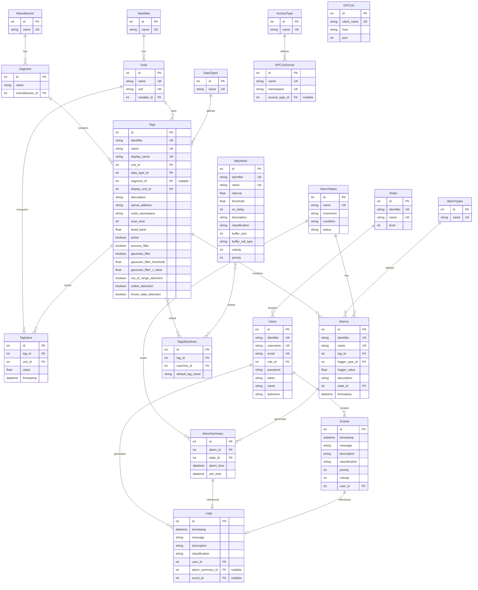

# Database Models API

This section documents the database models used for data persistence in PyAutomation. These models are built using `peewee` ORM and define the schema for SQLite, PostgreSQL, or MySQL databases.

## Entity-Relationship Diagram

The following diagram shows the relationships between all database tables in PyAutomation:

## Models

- **[Core Models](core.md)**: Base classes and common utilities.
- **[Alarms Models](alarms.md)**: Models for alarm definitions and history.
- **[Tags Models](tags.md)**: Models for tag configuration and values.
- **[Users Models](users.md)**: Models for user authentication and roles.
- **[Events Models](events.md)**: Models for system event logging.
- **[Logs Models](logs.md)**: Models for application logs.
- **[Machines Models](machines.md)**: Models for state machine persistence.
- **[OPC UA Models](opcua.md)**: Models for OPC UA client and server configuration.
