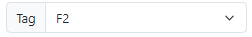
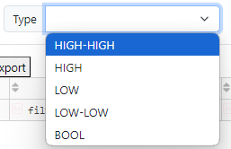
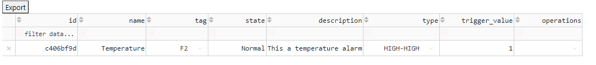

# Alarms Module

The **Alarms Module** enables the system to detect abnormal conditions and notify operators. An alarm is created by defining a trigger condition for a specific tag.

## Alarm Configuration Guide

To create a new alarm, navigate to the Alarms Dashboard and click **Create**. Complete the following steps:

### 1. Tag Selection
Select the **Tag** that the alarm will monitor. The alarm will constantly evaluate the value of this tag against the trigger condition.

### 2. Alarm Name
Assign a unique and descriptive name to the alarm.
*   **Example**: `Boiler_High_Temp_Alarm`

### 3. Description (Optional)
Provide additional details about the alarm, such as the potential cause or recommended operator action.
*   **Example**: "Check cooling water flow if triggered."

### 4. Alarm Type
Select the logic that determines when the alarm triggers.
*   **HIGH**: Triggers when the value exceeds the setpoint.
*   **LOW**: Triggers when the value falls below the setpoint.
*   **BOOL**: Triggers when a boolean tag becomes True (or False, depending on configuration).
*   **HIGH-HIGH / LOW-LOW**: Critical tiers for analog values.

### 5. Trigger Value (Setpoint)
Define the numeric threshold or state that activates the alarm.
*   **Example**: For a "High Temperature" alarm, this might be `100.0`.

### 6. Save and Activation
Once all fields are verified, click **Save**. The alarm configuration is stored in the system.

Finally, click **Create** to activate the alarm. It will now appear in the Alarms Dashboard, displaying its current state (Normal, Active, Acknowledged).

## Exporting Alarms
You can export the configured alarms list to a CSV file for reporting or documentation by using the **Export** function on the dashboard.
