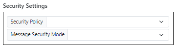
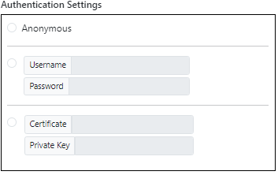

# Communications Module (OPC UA)

The **Communications Module** focuses on the configuration and management of the integrated **OPC UA Server**. OPC UA (Open Platform Communications Unified Architecture) is the industry standard for secure and reliable data exchange in industrial automation.

Enabling the OPC UA server allows external SCADA systems, HMI panels, and other OPC UA clients to read and write data to PyAutomation tags.

## Creating an OPC UA Server

Follow these steps to initialize a new OPC UA server instance.

### 1. Initiate Creation
Click the **Create** button in the Communications Dashboard to open the configuration dialog.

### 2. Server Configuration
You will need to provide the following network and identity parameters:

*   **Endpoint URL**: The address where the server will listen for connections (e.g., `opc.tcp://0.0.0.0:4840`).
*   **Server Name**: A friendly name for the server instance.
*   **Namespace URI**: The unique namespace identifier for your tags.

### 3. Parameter Details

*   **Network Settings**: Ensure the chosen port (default `4840`) is open and not blocked by firewalls.
    

*   **Security Settings**: Configure user tokens and security policies if authentication is required.
    

### 4. Finalization
Fill out all required fields ensuring valid formatting for IPs and Ports.

Click **OK** to launch the server. The new OPC UA server will appear in the dashboard, indicating its status (Running/Stopped) and endpoint information.

