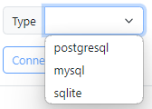

# Database Configuration

The **Database Module** configuration is critical for enabling historical data storage. PyAutomation supports connections to external relational databases, allowing for robust data logging and retrieval.

## Connection Setup

To establish a connection to your database, you must configure the following parameters in the settings panel.

### 1. Database Type
Select the relational database management system (RDBMS) you are using.
*   **Supported Types**: PostgreSQL, MySQL, SQLite.

### 2. Host
Enter the IP address or hostname of the server where the database is hosted.
*   **Localhost**: Use `127.0.0.1` or `localhost` if the database is on the same machine.
*   **Remote**: Enter the specific IP address (e.g., `192.168.1.50`).

### 3. Port
Specify the network port the database service is listening on.
*   **Defaults**:
    *   PostgreSQL: `5432`
    *   MySQL: `3306`

### 4. Credentials
*   **Username**: The database user with read/write permissions.
*   **Password**: The authentication password for the user.

### 5. Database Name
The specific name of the database instance created for PyAutomation data.

Once configured, test the connection to ensure PyAutomation can successfully write and read data.
