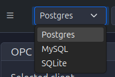

# Database Configuration

The **Database Module** is essential for enabling historical data storage, event logging, and data persistence in PyAutomation. This module allows you to connect to external relational database management systems (RDBMS), providing robust data storage capabilities for tags, alarms, events, and operational logs.

## Overview

The database configuration interface is located in the top navigation bar of the PyAutomation application, providing quick access to database connection settings from any module. This centralized location allows you to manage your database connection without navigating away from your current work.


## Initial Configuration via Environment Variables (.env)

On the **very first startup** of PyAutomation, before any database configuration has been established through the user interface, you can configure the initial database connection using environment variables. This approach is particularly useful for:

*   Automated deployments and CI/CD pipelines
*   Docker container configurations
*   Infrastructure-as-code scenarios
*   Initial setup before accessing the HMI interface

### When Bootstrap Configuration Applies

The bootstrap configuration from environment variables **only works** when:

*   There is **no existing** `db/db_config.json` file in the PyAutomation installation directory
*   The appropriate `AUTOMATION_DB_*` environment variables are defined

Once `db/db_config.json` is created (either from environment variables or through the HMI), it becomes the **single source of truth**. Subsequent changes to environment variables will be ignored, and all configuration updates must be made through the HMI interface or by directly editing `db/db_config.json`.

### Creating the .env File

Create a `.env` file in the root directory of your PyAutomation installation. This file should contain the database configuration variables.

**File Location**: Place the `.env` file in the same directory where PyAutomation is installed (typically the project root).

### Environment Variables for Database Configuration

#### Database Type

**`AUTOMATION_DB_TYPE`** (optional, default: `sqlite`)

Specifies the type of database to connect to. Valid values:
*   `sqlite` - SQLite file-based database (default)
*   `postgresql` - PostgreSQL database
*   `mysql` - MySQL or MariaDB database

#### Configuration for SQLite

When using SQLite (`AUTOMATION_DB_TYPE=sqlite`):

**`AUTOMATION_DB_FILE`** (optional, default: `app.db`)

The filename for the SQLite database file. PyAutomation will create this file if it doesn't exist.

**Example .env for SQLite:**

```ini
AUTOMATION_DB_TYPE=sqlite
AUTOMATION_DB_FILE=pyautomation.db
```

#### Configuration for PostgreSQL/MySQL

When using PostgreSQL or MySQL, the following variables are required:

**`AUTOMATION_DB_HOST`** (optional, default: `127.0.0.1`)

The IP address or hostname of the database server.

**`AUTOMATION_DB_PORT`** (optional, defaults: `5432` for PostgreSQL, `3306` for MySQL)

The network port where the database service is listening.

**`AUTOMATION_DB_USER`** (**required**)

The database username with appropriate permissions to create tables and perform read/write operations.

**`AUTOMATION_DB_PASSWORD`** (**required**)

The authentication password for the specified database user.

**`AUTOMATION_DB_NAME`** (**required**)

The name of the database instance. **Important**: The database must already exist on the server before PyAutomation can connect to it.

### Configuration Examples

#### Example 1: PostgreSQL Configuration

```ini
AUTOMATION_DB_TYPE=postgresql
AUTOMATION_DB_HOST=192.168.1.108
AUTOMATION_DB_PORT=5432
AUTOMATION_DB_USER=postgres
AUTOMATION_DB_PASSWORD=your_secure_password
AUTOMATION_DB_NAME=app_db
```

#### Example 2: PostgreSQL with Custom Port

```ini
AUTOMATION_DB_TYPE=postgresql
AUTOMATION_DB_HOST=db.example.com
AUTOMATION_DB_PORT=32800
AUTOMATION_DB_USER=pyautomation_user
AUTOMATION_DB_PASSWORD=your_secure_password
AUTOMATION_DB_NAME=production_db
```

#### Example 3: MySQL Configuration

```ini
AUTOMATION_DB_TYPE=mysql
AUTOMATION_DB_HOST=127.0.0.1
AUTOMATION_DB_PORT=3306
AUTOMATION_DB_USER=automation_user
AUTOMATION_DB_PASSWORD=your_secure_password
AUTOMATION_DB_NAME=pyautomation_db
```

#### Example 4: SQLite Configuration

```ini
AUTOMATION_DB_TYPE=sqlite
AUTOMATION_DB_FILE=app.db
```

### Bootstrap Process

When PyAutomation starts for the first time with environment variables configured:

1. **Detection**: PyAutomation checks if `db/db_config.json` exists
2. **Environment Read**: If no configuration file exists, it reads the `AUTOMATION_DB_*` environment variables
3. **Configuration Creation**: Creates `db/db_config.json` with the values from environment variables
4. **Connection**: Establishes connection to the database using the new configuration
5. **Database Initialization**: Automatically creates all required database tables, schemas, roles, and the internal `system` user account
6. **Ready**: PyAutomation is now ready to use with persistent data storage

### Important Notes

*   **One-Time Bootstrap**: This bootstrap process only runs once, on the first startup. After `db/db_config.json` is created, environment variables are ignored for database configuration.

*   **HMI Configuration Takes Precedence**: Once you configure the database through the HMI interface, those settings are saved to `db/db_config.json` and will override any future environment variable changes.

*   **Manual Configuration**: If you prefer to configure the database through the HMI interface from the start, you can start PyAutomation without the environment variables and use the configuration bar in the top navigation.

*   **Security**: Never commit `.env` files containing passwords to version control. Add `.env` to your `.gitignore` file.

*   **Database Pre-requisites**: For PostgreSQL and MySQL, ensure the database instance already exists on the server before starting PyAutomation. The bootstrap process will create tables and schemas, but not the database itself.

### After Initial Bootstrap

After the initial bootstrap configuration:

*   All database configuration changes should be made through the **Database Configuration** section in the HMI interface
*   Changes made via the HMI are automatically saved to `db/db_config.json`
*   On application restart, PyAutomation will use the configuration from `db/db_config.json`, not environment variables
*   This ensures that operator-driven configuration changes are preserved across restarts, even if container or environment variables change

This pattern provides a clean "infrastructure-driven" first configuration for automated deployments while allowing operators to adjust database settings later from the HMI interface without being overridden by environment variables.

## Supported Database Types

PyAutomation supports connections to the following relational database management systems:

*   **PostgreSQL**: Recommended for production environments. Offers excellent performance, reliability, and advanced features.
*   **MySQL**: Widely used open-source database with good performance characteristics.
*   **SQLite**: Lightweight file-based database suitable for development and small-scale deployments.

## Connection Configuration

To establish a connection to your database, configure the following parameters in the database configuration bar located at the top of the application interface.

### Step 1: Select Database Type

Click on the first dropdown field in the database configuration bar to select your database type.



Available options:
*   **Postgres**: For PostgreSQL databases
*   **MySQL**: For MySQL/MariaDB databases
*   **SQLite**: For SQLite file-based databases

Select the appropriate option based on your database server type. The selected value will be displayed in the dropdown field.

### Step 2: Configure Database Name

In the second field, enter the name of the database instance that PyAutomation should connect to.

*   **Important**: The database must already exist on your database server before connecting
*   Example: `app_db`, `pyautomation_db`, `production_db`

### Step 3: Configure Host Address

Enter the IP address or hostname of the server where your database is hosted.

*   **Localhost**: Use `127.0.0.1` or `localhost` if the database is running on the same machine as PyAutomation
*   **Remote Server**: Enter the specific IP address (e.g., `192.168.1.108`) or fully qualified domain name (FQDN)
*   **Network Requirements**: Ensure the database server is accessible over the network and that firewalls allow connections on the specified port

### Step 4: Configure Port Number

Specify the network port number where your database service is listening for connections.

**Default Ports:**
*   **PostgreSQL**: `5432`
*   **MySQL**: `3306`
*   **SQLite**: Not applicable (file-based)

**Custom Ports**: If your database server uses a non-standard port, enter the custom port number (e.g., `32800`).

### Step 5: Configure Username

Enter the database username that has the necessary permissions to read from and write to the PyAutomation database.

*   The user must have **CREATE**, **SELECT**, **INSERT**, **UPDATE**, and **DELETE** permissions
*   For PostgreSQL, ensure the user has schema creation privileges if tables need to be created automatically
*   Example usernames: `postgres`, `pyautomation_user`, `admin`

### Step 6: Configure Password

Enter the authentication password for the specified database user.

*   The password field masks the entered characters for security
*   Ensure the password is correct, as incorrect credentials will prevent connection
*   For security best practices, use strong passwords and consider using database-specific credential management

## Establishing Connection

Once all configuration parameters are entered:

1. **Verify All Fields**: Double-check that all fields contain valid values
2. **Check Network Connectivity**: Ensure PyAutomation can reach the database server on the specified host and port
3. **Click Connect**: The connection is typically established automatically when you navigate away from the fields, or you may need to click a connect button if available
4. **Monitor Connection Status**: The connection indicator (plug icon) in the top bar will change state to reflect the connection status


## Connection Status Indicator

The database connection status is indicated by the plug icon button in the top navigation bar:

*   **Connected (Red Button)**: When hovering over the red plug icon, a tooltip displays "Disconnect from database", indicating an active connection
*   **Disconnected**: The button appearance changes when no connection is established

### Disconnecting from Database

To terminate the database connection:

1. Locate the plug icon button in the top navigation bar
2. Click the button to disconnect
3. PyAutomation will stop writing data to the database until a new connection is established

**Important**: Disconnecting from the database will interrupt data logging. Historical data collection will resume once you reconnect.

## Configuration Workflow

Follow this recommended workflow for setting up your database connection:

1. **Prepare Your Database Server**
   *   Install and configure your chosen database system (PostgreSQL, MySQL, or SQLite)
   *   Create the database instance with an appropriate name
   *   Create a database user with the required permissions

2. **Gather Connection Information**
   *   Database type (PostgreSQL, MySQL, or SQLite)
   *   Database name
   *   Host IP address or hostname
   *   Port number (if using non-default)
   *   Username and password

3. **Configure in PyAutomation**
   *   Open PyAutomation and locate the database configuration bar at the top
   *   Fill in all required fields in order
   *   Verify the connection is established (check the connection indicator)

4. **Verify Data Storage**
   *   Perform actions that generate data (tag updates, alarms, events)
   *   Verify that data is being written to the database
   *   Check database tables to confirm data persistence

## Best Practices

*   **Production Environments**: Use PostgreSQL or MySQL for production deployments requiring high availability and performance
*   **Development**: SQLite is convenient for development and testing due to its simplicity
*   **Network Security**: Use VPN or secure network connections when connecting to remote databases
*   **Credentials Management**: Store database credentials securely and avoid hardcoding passwords
*   **Backup Strategy**: Implement regular database backups to protect historical data
*   **Connection Monitoring**: Monitor the connection status regularly to ensure continuous data logging
*   **Firewall Configuration**: Ensure firewall rules allow connections between PyAutomation and the database server
*   **User Permissions**: Create dedicated database users with minimal required permissions rather than using administrative accounts

## Troubleshooting

### Connection Failures

If you cannot establish a connection:

*   **Verify Network Connectivity**: Use network tools (ping, telnet) to verify the database server is reachable
*   **Check Firewall Settings**: Ensure the database port is open in firewall rules
*   **Validate Credentials**: Double-check username and password are correct
*   **Database Server Status**: Verify the database service is running and listening on the specified port
*   **Database Existence**: Confirm the database name exists on the server
*   **User Permissions**: Ensure the database user has the necessary permissions

### Connection Drops

If the connection disconnects unexpectedly:

*   **Check Network Stability**: Investigate network connectivity issues
*   **Database Server Status**: Verify the database server is still running
*   **Connection Timeouts**: Some databases may close idle connections; check timeout settings
*   **Resource Limits**: Ensure the database server has sufficient resources (memory, connections)

## Data Persistence

Once connected, PyAutomation will automatically:

*   Create necessary database tables and schemas (if they don't exist)
*   Store historical tag values based on configured logging intervals
*   Record alarm events and acknowledgments
*   Log operational events and user actions
*   Maintain referential integrity between related data entities

Historical data will be available for reporting, analysis, and visualization through PyAutomation's reporting and trending features.
