# Events Module

The **Events Module** provides comprehensive tracking and analysis of system events, including user actions, system notifications, alarm state changes, and other significant occurrences. This module serves as an audit trail and diagnostic tool for understanding system behavior and operator activities.

## What are Events?

**Events** in PyAutomation are records of significant occurrences in the system, including:

*   **User Actions**: Tag creation, alarm configuration, user management operations
*   **System Changes**: Configuration modifications, state transitions, system updates
*   **Alarm Activities**: Alarm acknowledgments, shelving, state changes
*   **Operational Activities**: Machine state changes, interval updates, access type modifications
*   **Security Events**: Login attempts, permission changes, authentication events

### Key Features

*   **Comprehensive Filtering**: Filter events by user, priority, criticality, classification, date range, and message content
*   **Date Range Presets**: Quick selection of common time ranges (Last Hour, Last Day, Last Week, etc.)
*   **Custom Date Ranges**: Define specific start and end times for detailed analysis
*   **Timezone Support**: View events in your local timezone or UTC
*   **Pagination**: Navigate through large event datasets efficiently
*   **Comments**: Add comments to events for additional context
*   **Export Capabilities**: Export filtered events for external analysis

## Module Overview

The Events Module provides a powerful interface to:

*   View all system events in a chronological table
*   Filter events by multiple criteria
*   Search for specific events by message content
*   Add comments to events for documentation
*   Export event data for reporting and analysis

## Accessing the Events Module

1. Navigate to **Events** from the main menu
2. The dashboard displays events in a table with filtering controls at the top
3. Events are sorted by timestamp (newest first) by default

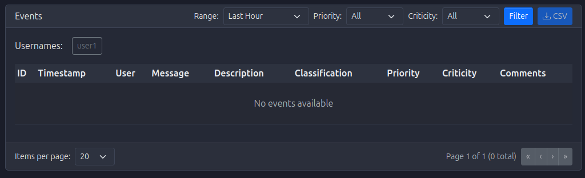

## Understanding Event Information

### Event Table Columns

*   **Timestamp**: When the event occurred (formatted according to selected timezone)
*   **User**: The user who triggered the event (or "System" for automated events)
*   **Message**: Brief description of the event
*   **Description**: Detailed information about the event
*   **Classification**: Category of the event (e.g., "Alarm", "Tag", "User", "Machine")
*   **Priority**: Priority level (1-5, where 1 is highest)
*   **Criticity**: Criticality level (1-5, where 5 is most critical)
*   **Comments**: Number of comments attached to the event
*   **Actions**: Button to view/add comments

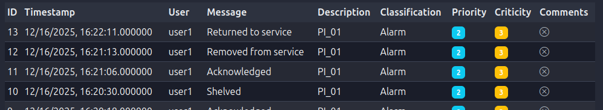

## Filtering Events

The Events Module provides powerful filtering capabilities to help you find specific events:

### Date Range Filters

#### Preset Date Ranges

Quick selection buttons for common time ranges:

*   **Last Hour**: Events from the past hour
*   **Last 6 Hours**: Events from the past 6 hours
*   **Last 12 Hours**: Events from the past 12 hours
*   **Last Day**: Events from the past 24 hours
*   **Last Week**: Events from the past 7 days
*   **Last Month**: Events from the past 30 days
*   **Custom**: Define your own date range

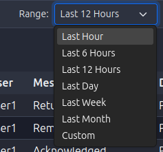

#### Custom Date Range

To define a custom date range:

1. Click the **Custom** preset button
2. Two date/time pickers appear:
   *   **Start Date/Time**: Beginning of the range
   *   **End Date/Time**: End of the range
3. Select dates and times using the pickers
4. The filter automatically applies when dates are selected

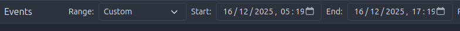

### User Filter

Filter events by specific users:

*   **Selection**: Multi-select dropdown showing all users who have generated events
*   **Multiple Users**: Select multiple users to see events from any of them
*   **Clear Selection**: Deselect all to show events from all users

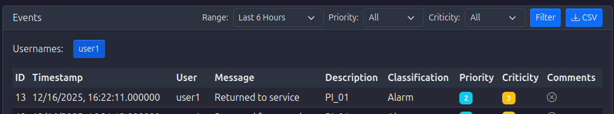

### Priority Filter

Filter events by priority level:

*   **Selection**: Multi-select dropdown with priority levels 1-5
*   **Multiple Priorities**: Select multiple priority levels
*   **Use Case**: Focus on high-priority events (1-2) or review all priorities

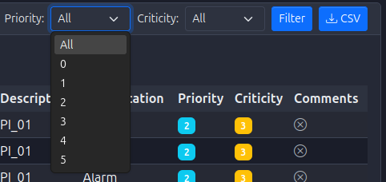

### Criticality Filter

Filter events by criticality level:

*   **Selection**: Multi-select dropdown with criticality levels 1-5
*   **Multiple Criticalities**: Select multiple criticality levels
*   **Use Case**: Focus on critical events (4-5) for safety and security review

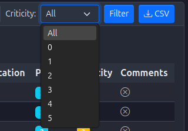

### Applying Filters

*   **Automatic Application**: Filters apply automatically as you change them
*   **Combined Filters**: Multiple filters work together (AND logic)
*   **Filter Count**: May show number of events matching current filters

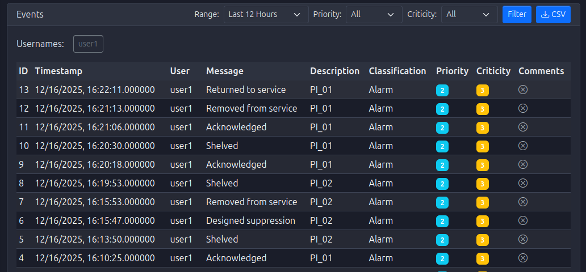

## Viewing Event Details

### Event Information

Click on an event row or use the actions button to view:

*   **Full Timestamp**: Precise time of the event
*   **Complete Message**: Full event message text
*   **Full Description**: Complete description with all details
*   **User Information**: User who triggered the event
*   **Classification Details**: Full classification information
*   **Priority and Criticality**: Numeric values and their meanings

<!-- TODO: Add image Events_EventDetails.png - Screenshot showing detailed event information -->

## Adding Comments to Events

Comments allow you to add context, explanations, or follow-up information to events:

### Adding a Comment

1. Locate the event in the table
2. Click the **Comments** button or action icon
3. A comments dialog or panel opens
4. Enter your comment in the text area
5. Click **Add Comment** or **Save**
6. The comment is attached to the event

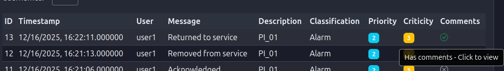

### Viewing Comments

*   **Comment Count**: Events with comments show a count badge
*   **Comment List**: Click to view all comments for an event
*   **Comment Details**: Each comment shows author, timestamp, and content

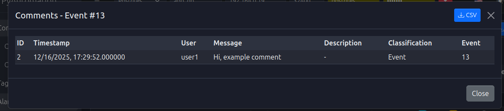

## Pagination

The Events Module uses pagination to handle large datasets:

*   **Items Per Page**: Configurable (typically 20, 50, or 100 events per page)
*   **Page Navigation**: Previous/Next buttons and page numbers
*   **Total Count**: Shows total number of events matching current filters
*   **Page Indicator**: Displays current page and total pages

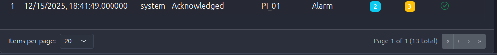

## Exporting Events

Export filtered events for external analysis:

*   **Export Button**: Typically located near the filter controls
*   **Format**: Usually CSV format
*   **Content**: Includes all visible columns and filtered results
*   **Use Case**: Reporting, analysis in external tools, compliance documentation

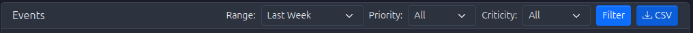
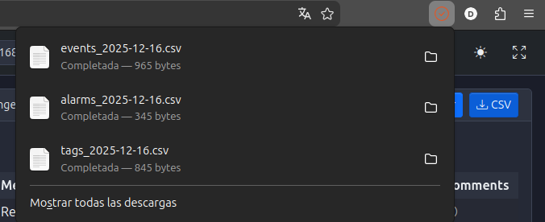

## Common Event Classifications

### Alarm Events

*   **Examples**: "Alarm acknowledged", "Alarm shelved", "Alarm created"
*   **Priority**: Typically 2-3
*   **Criticality**: Varies based on alarm importance

### Tag Events

*   **Examples**: "Tag created", "Tag updated", "Tag deleted"
*   **Priority**: Typically 2-3
*   **Criticality**: Usually 2-3

### User Events

*   **Examples**: "User created", "Password changed", "User deleted"
*   **Priority**: Typically 1-2
*   **Criticality**: Usually 3-5 (security-related)

### Machine Events

*   **Examples**: "Machine state changed", "Interval updated", "Machine reset"
*   **Priority**: Typically 2-3
*   **Criticality**: Usually 2-3

### System Events

*   **Examples**: "Database connected", "OPC UA Server started", "Configuration exported"
*   **Priority**: Typically 3-4
*   **Criticality**: Usually 2-3

## Best Practices

### Event Review

*   **Regular Reviews**: Periodically review events for anomalies
*   **Focus on High Priority**: Regularly check high-priority events (1-2)
*   **Security Monitoring**: Review user and security-related events
*   **Trend Analysis**: Look for patterns in event frequency and types

### Comment Usage

*   **Add Context**: Use comments to explain why actions were taken
*   **Document Decisions**: Record decision-making rationale
*   **Follow-Up Notes**: Add notes about follow-up actions required
*   **Clarifications**: Clarify ambiguous event messages

### Filtering Strategy

*   **Start Broad**: Begin with date range, then narrow with other filters
*   **Use Presets**: Leverage preset date ranges for common queries
*   **Save Common Filters**: Note frequently used filter combinations
*   **Combine Filters**: Use multiple filters together for precise searches

## Troubleshooting

### No Events Displayed

If no events appear:

*   **Check Filters**: Verify filters aren't too restrictive
*   **Date Range**: Ensure date range includes recent events
*   **Clear Filters**: Try clearing all filters to see all events
*   **Check Permissions**: Verify you have permission to view events

### Events Not Updating

If new events don't appear:

*   **Refresh Page**: Reload the Events page
*   **Check Date Range**: Ensure date range includes current time
*   **Verify System**: Check that event logging is enabled
*   **Review Database**: Verify database connection is active

### Filter Not Working

If a filter doesn't work as expected:

*   **Check Selection**: Verify filter values are selected correctly
*   **Clear and Reapply**: Clear the filter and reapply it
*   **Check Format**: Ensure date/time formats are correct
*   **Review Permissions**: Verify you have permission to filter events

## Integration with Other Modules

The Events Module integrates with:

*   **Alarms Module**: Alarm state changes generate events
*   **Tags Module**: Tag operations generate events
*   **Users Module**: User management actions generate events
*   **Machines Module**: Machine state changes generate events
*   **OPC UA Server Module**: Server operations generate events
*   **Database Module**: Events are stored in the database

## Getting Started

To begin using the Events Module:

1.   **Access the Module**: 
     *   Navigate to **Events** from the main menu

2.   **Review Recent Events**: 
     *   Use "Last Hour" or "Last Day" preset to see recent activity
     *   Familiarize yourself with event types and classifications

3.   **Experiment with Filters**: 
     *   Try different filter combinations
     *   Understand how filters work together

4.   **Add Comments**: 
     *   Practice adding comments to important events
     *   Document your actions and decisions

5.   **Establish Review Process**: 
     *   Set up a regular schedule for reviewing events
     *   Focus on high-priority and security-related events

6.   **Export for Analysis**: 
     *   Export events for external analysis when needed
     *   Use exports for compliance and reporting

