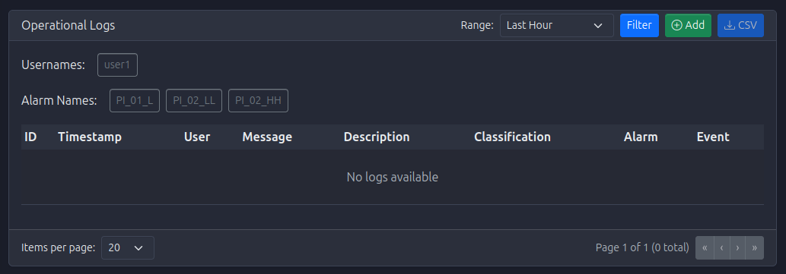
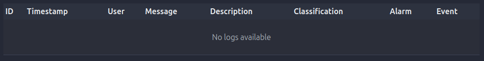
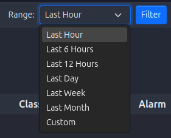
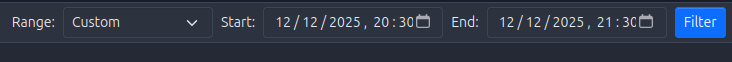
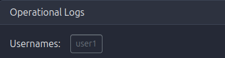
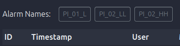
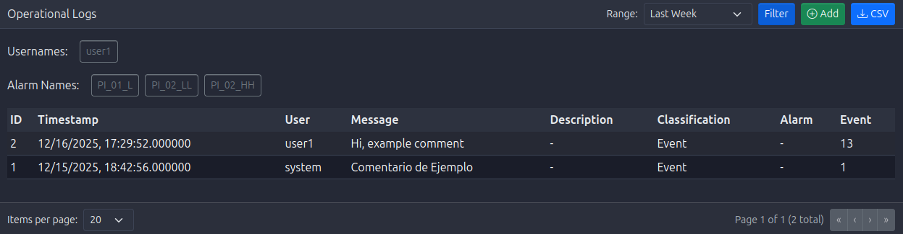
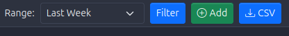
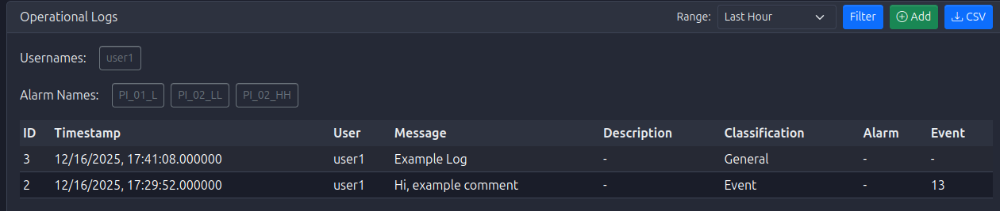

# Operational Logs Module

The **Operational Logs Module** provides a comprehensive audit trail of operational activities, system messages, and application-level logs. Unlike Events which track high-level system occurrences, Operational Logs capture detailed operational information, often linked to specific alarms or events for complete traceability.

## What are Operational Logs?

**Operational Logs** in PyAutomation are detailed records of:

*   **Application Activities**: System operations, configuration changes, data processing activities
*   **Alarm-Related Logs**: Comments and notes attached to alarm occurrences
*   **Event-Related Logs**: Additional context and details for system events
*   **User Operations**: Detailed records of user actions and system interactions
*   **System Messages**: Informational, warning, and error messages from the application

### Key Features

*   **Comprehensive Filtering**: Filter logs by user, alarm, date range, classification, and message content
*   **Alarm Linking**: View logs associated with specific alarm occurrences
*   **Event Linking**: View logs associated with specific events
*   **Date Range Presets**: Quick selection of common time ranges
*   **Custom Date Ranges**: Define specific time periods for analysis
*   **Timezone Support**: View logs in your preferred timezone
*   **Pagination**: Navigate through large log datasets
*   **Log Creation**: Add new operational logs for documentation

## Module Overview

The Operational Logs Module provides a powerful interface to:

*   View all operational logs in a chronological table
*   Filter logs by multiple criteria including linked alarms and events
*   Search for specific logs by message or description content
*   Create new operational logs for documentation
*   Export log data for reporting and analysis

## Accessing the Operational Logs Module

1. Navigate to **Operational Logs** from the main menu
2. The dashboard displays logs in a table with filtering controls at the top
3. Logs are sorted by timestamp (newest first) by default

## Understanding Log Information

### Log Table Columns

*   **Timestamp**: When the log entry was created (formatted according to selected timezone)
*   **User**: The user who created the log (or "System" for automated logs)
*   **Message**: Brief description of the log entry
*   **Description**: Detailed information about the log entry
*   **Classification**: Category of the log (e.g., "Alarm", "Event", "Operational", "System")
*   **Linked Alarm**: Name of the alarm this log is associated with (if applicable)
*   **Linked Event**: Reference to the event this log is associated with (if applicable)
*   **Actions**: Button to view details or create related logs

## Filtering Operational Logs

The Operational Logs Module provides comprehensive filtering capabilities:

### Date Range Filters

#### Preset Date Ranges

Quick selection buttons for common time ranges:

*   **Last Hour**: Logs from the past hour
*   **Last 6 Hours**: Logs from the past 6 hours
*   **Last 12 Hours**: Logs from the past 12 hours
*   **Last Day**: Logs from the past 24 hours
*   **Last Week**: Logs from the past 7 days
*   **Last Month**: Logs from the past 30 days
*   **Custom**: Define your own date range

#### Custom Date Range

To define a custom date range:

1. Click the **Custom** preset button
2. Two date/time pickers appear:
   *   **Start Date/Time**: Beginning of the range
   *   **End Date/Time**: End of the range
3. Select dates and times using the pickers
4. The filter automatically applies when dates are selected

### User Filter

Filter logs by specific users:

*   **Selection**: Multi-select dropdown showing all users who have created logs
*   **Multiple Users**: Select multiple users to see logs from any of them
*   **Clear Selection**: Deselect all to show logs from all users

### Alarm Filter

Filter logs linked to specific alarms:

*   **Selection**: Multi-select dropdown showing all alarms that have associated logs
*   **Multiple Alarms**: Select multiple alarms to see logs for any of them
*   **Use Case**: Review all operational notes and comments for specific alarm occurrences
*   **Clear Selection**: Deselect all to show logs not filtered by alarm

### Applying Filters

*   **Automatic Application**: Filters apply automatically as you change them
*   **Combined Filters**: Multiple filters work together (AND logic)
*   **Filter Count**: May show number of logs matching current filters

## Creating Operational Logs

You can create new operational logs to document activities, decisions, or observations:

### Creating a New Log

1. Click the **Create Log** or **Add Log** button (typically at the top of the page)
2. A dialog or form opens with the following fields:
   *   **Message** (Required): Brief description of the log entry
   *   **Description** (Optional): Detailed information
   *   **Classification** (Optional): Category of the log
   *   **Linked Alarm** (Optional): Associate with a specific alarm
   *   **Linked Event** (Optional): Associate with a specific event
3. Fill in the required and optional fields
4. Click **Create** or **Save** to create the log entry
5. The new log appears in the table

### Linking Logs to Alarms

When creating a log related to an alarm:

1. Select the alarm from the **Linked Alarm** dropdown
2. The log will be associated with that alarm occurrence
3. This creates a traceable link between the alarm and your operational notes
4. Useful for documenting:
   *   Alarm response actions
   *   Root cause analysis
   *   Corrective actions taken
   *   Follow-up requirements

<!-- TODO: Add image OperationalLogs_LinkToAlarm.png - Screenshot showing alarm selection in create log dialog -->

### Linking Logs to Events

When creating a log related to an event:

1. Select the event from the **Linked Event** dropdown (if available)
2. The log will be associated with that event
3. This provides additional context for system events
4. Useful for documenting:
   *   Event investigation results
   *   Event resolution steps
   *   Related operational activities

## Viewing Log Details

### Log Information

Click on a log row or use the actions button to view:

*   **Full Timestamp**: Precise time of the log entry
*   **Complete Message**: Full log message text
*   **Complete Description**: Full description with all details
*   **User Information**: User who created the log
*   **Classification Details**: Full classification information
*   **Linked Resources**: Associated alarm or event information

<!-- TODO: Add image OperationalLogs_LogDetails.png - Screenshot showing detailed log information -->

## Understanding Log Classifications

### Alarm Classification

*   **Purpose**: Logs related to alarm occurrences
*   **Examples**: Alarm response notes, root cause analysis, corrective actions
*   **Linking**: Typically linked to specific alarm occurrences

### Event Classification

*   **Purpose**: Logs related to system events
*   **Examples**: Event investigation notes, resolution documentation
*   **Linking**: May be linked to specific events

### Operational Classification

*   **Purpose**: General operational activities
*   **Examples**: Shift handover notes, maintenance activities, process observations
*   **Linking**: May or may not be linked to alarms/events

### System Classification

*   **Purpose**: System-level messages and activities
*   **Examples**: System maintenance, configuration changes, performance notes
*   **Linking**: Typically not linked to alarms/events

## Pagination

The Operational Logs Module uses pagination to handle large datasets:

*   **Items Per Page**: Configurable (typically 20, 50, or 100 logs per page)
*   **Page Navigation**: Previous/Next buttons and page numbers
*   **Total Count**: Shows total number of logs matching current filters
*   **Page Indicator**: Displays current page and total pages

## Exporting Logs

Export filtered logs for external analysis:

*   **Export Button**: Typically located near the filter controls
*   **Format**: Usually CSV format
*   **Content**: Includes all visible columns and filtered results
*   **Use Case**: Reporting, compliance documentation, external analysis

## Best Practices

### Log Creation

*   **Be Descriptive**: Write clear, descriptive messages and descriptions
*   **Link When Appropriate**: Link logs to alarms or events when relevant
*   **Timely Documentation**: Create logs promptly after activities occur
*   **Consistent Classification**: Use consistent classifications for similar activities

### Log Review

*   **Regular Reviews**: Periodically review logs for patterns and issues
*   **Alarm-Related Logs**: Regularly review logs linked to alarms
*   **Shift Handovers**: Use logs for shift handover documentation
*   **Incident Analysis**: Review logs when investigating incidents

### Filtering Strategy

*   **Start with Date Range**: Begin with a date range, then narrow with other filters
*   **Use Alarm Filter**: Use alarm filter to review all notes for specific alarms
*   **Combine Filters**: Use multiple filters together for precise searches
*   **Save Common Queries**: Note frequently used filter combinations

### Documentation

*   **Document Decisions**: Use logs to document important decisions
*   **Record Actions**: Log actions taken in response to alarms or events
*   **Note Observations**: Record operational observations and findings
*   **Maintain Traceability**: Link logs to alarms/events for complete traceability

## Troubleshooting

### No Logs Displayed

If no logs appear:

*   **Check Filters**: Verify filters aren't too restrictive
*   **Date Range**: Ensure date range includes recent logs
*   **Clear Filters**: Try clearing all filters to see all logs
*   **Check Permissions**: Verify you have permission to view logs

### Logs Not Updating

If new logs don't appear:

*   **Refresh Page**: Reload the Operational Logs page
*   **Check Date Range**: Ensure date range includes current time
*   **Verify System**: Check that log creation is working
*   **Review Database**: Verify database connection is active

### Cannot Create Logs

If you cannot create new logs:

*   **Check Permissions**: Verify you have permission to create logs
*   **Required Fields**: Ensure all required fields are filled
*   **Review Errors**: Check for error messages in the form
*   **Browser Console**: Check browser console for JavaScript errors

## Integration with Other Modules

The Operational Logs Module integrates with:

*   **Alarms Module**: Logs can be linked to alarm occurrences
*   **Events Module**: Logs can be linked to system events
*   **Users Module**: Logs are associated with users who create them
*   **Database Module**: Logs are stored in the database for historical access

## Difference Between Events and Operational Logs

Understanding when to use Events vs. Operational Logs:

### Events

*   **Automatic**: Generated automatically by the system
*   **System Actions**: Track system-level occurrences
*   **Structured**: Follow predefined event types and classifications
*   **Examples**: "Tag created", "Alarm acknowledged", "User logged in"

### Operational Logs

*   **Manual**: Created by users for documentation
*   **Operational Context**: Capture operational notes and observations
*   **Flexible**: Free-form messages and descriptions
*   **Examples**: "Investigated alarm, found sensor calibration issue", "Performed maintenance on pump P-101"

**Best Practice**: Use Events to track what happened, use Operational Logs to document why it happened and what was done about it.

## Getting Started

To begin using the Operational Logs Module:

1.   **Access the Module**: 
     *   Navigate to **Operational Logs** from the main menu

2.   **Review Existing Logs**: 
     *   Use "Last Day" preset to see recent operational activities
     *   Familiarize yourself with log types and classifications

3.   **Experiment with Filters**: 
     *   Try filtering by alarm to see alarm-related logs
     *   Understand how filters work together

4.   **Create Your First Log**: 
     *   Practice creating a log entry
     *   Try linking it to an alarm or event

5.   **Establish Documentation Process**: 
     *   Set up procedures for creating logs
     *   Define when logs should be created
     *   Establish classification standards

6.   **Regular Review**: 
     *   Set up a schedule for reviewing logs
     *   Focus on alarm-related logs for incident analysis
     *   Use logs for shift handovers and documentation

