# Quick Start: Running PyAutomation with HMI using Docker

This Quick Start guide walks you through bringing up a fully functional PyAutomation instance (backend + HMI) using Docker, and performing the minimum configuration needed to operate the system end‑to‑end.

It is aimed at engineers and operators who want to go from zero to a working system as quickly as possible, while still following production‑grade practices.

> **Note:** Throughout this guide we assume you are working on a single host (your laptop or a server) and have Docker and Docker Compose installed.

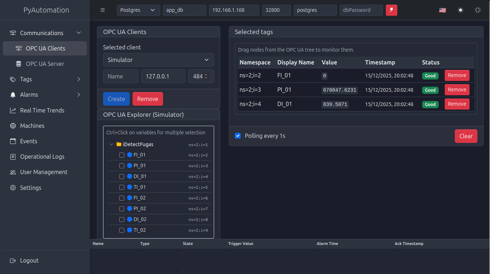

*Figure 0: PyAutomation HMI showing OPC UA client connections and database integration*

---

## 1. Deploy PyAutomation with Docker Compose

The recommended way to run PyAutomation (including the HMI) is to use the provided `docker-compose.yml` in the project root:

```yaml
services:
  automation:
    container_name: "Automation"
    image: "knowai/automation:${AUTOMATION_VERSION:-latest}"
    restart: always
    ports:
      # Backend API (Flask/Gunicorn)
      - ${AUTOMATION_PORT:-8050}:${AUTOMATION_PORT:-8050}
      # HMI frontend served by Nginx inside the container (listen 3000)
      - ${AUTOMATION_HMI_PORT:-3000}:3000
    volumes:
      - automation_db:/app/db
      - automation_logs:/app/logs
    logging:
      driver: "json-file"
      options:
        max-size: "10m" # Rota cuando llega a 10MB
        max-file: "3"   # Guarda máximo 3 archivos (30MB total)
    environment:
      AUTOMATION_OPCUA_SERVER_PORT: ${AUTOMATION_OPCUA_SERVER_PORT:-53530}
      AUTOMATION_APP_SECRET_KEY: ${AUTOMATION_APP_SECRET_KEY:-073821603fcc483f9afee3f1500782a4}
      AUTOMATION_SUPERUSER_PASSWORD: ${AUTOMATION_SUPERUSER_PASSWORD:-super_ultra_secret_password}
    tmpfs:
      - /tmp:size=500k
    deploy:
      resources:
        limits:
          cpus: "0.5"
          memory: 256M
    healthcheck:
      test: ["CMD", "python", "/app/healthcheck.py"]
      interval: 15s
      timeout: 10s
      retries: 3

volumes:
  automation_db:
  automation_logs:
```

### 1.1. Environment variables and superuser password

Create a `.env` file next to `docker-compose.yml`:

```ini
AUTOMATION_PORT=8050
AUTOMATION_HMI_PORT=3000
AUTOMATION_VERSION=latest
AUTOMATION_OPCUA_SERVER_PORT=53530
AUTOMATION_APP_SECRET_KEY="CHANGE_ME_TO_A_SECURE_RANDOM_VALUE"
AUTOMATION_SUPERUSER_PASSWORD="CHANGE_ME_SUPERUSER_PASSWORD"
```

- **`AUTOMATION_SUPERUSER_PASSWORD`** defines the password of the **superuser** account shipped with PyAutomation.
  - This superuser is intended for **initial bootstrap**:
    - Creating your first admin user.
    - Recovering access if all admin users are lost or locked out.
  - For security, change this value from the default before exposing the system.
- If you completely lose all passwords (including all admin users), the recovery path is:
  1. Stop the container.
  2. Edit `.env` and set a **new** `AUTOMATION_SUPERUSER_PASSWORD`.
  3. Start the container again (the superuser will use the new password).
  4. Log in as superuser and reset user passwords / roles.

> **Security tip:** Treat the superuser password like a root password. Use it only for bootstrap and recovery, and store it securely.

### 1.2. Starting the service

From the project root:

```bash
sudo docker compose up -d
```

Check the logs to verify that PyAutomation is healthy:

```bash
sudo docker compose logs -f automation
```

Once the container is healthy, the HMI will be available at:

- `http://localhost:${AUTOMATION_HMI_PORT:-3000}` (default `http://localhost:3000`)

The backend API will be listening on:

- `http://localhost:${AUTOMATION_PORT:-8050}` (default `http://localhost:8050`)

> In a typical setup, the HMI (React + Nginx) talks to the backend API over the internal Docker network; you usually only expose the HMI port publicly.

### 1.3. Inspecting backend logs

The automation container runs **nginx** (HMI) and the **backend** under `supervisord`. Logs can be inspected at two levels:

1. **Container-level logs (stdout/stderr):**

   ```bash
   docker logs automation
   # Or follow in real time:
   docker logs -f automation
   ```

2. **Backend-specific logs inside the container (managed by supervisord):**

   ```bash
   # Standard output of the backend (Gunicorn/Flask)
   docker exec -it automation tail -n 100 /var/log/supervisor/backend.out.log

   # Error log of the backend
   docker exec -it automation tail -n 100 /var/log/supervisor/backend.err.log

   # Follow backend logs in real time
   docker exec -it automation tail -f /var/log/supervisor/backend.out.log
   ```

These logs are the primary place to look when:

- Health checks fail.
- The API is not responding as expected.
- You need to debug authentication, database connections, or OPC UA issues.

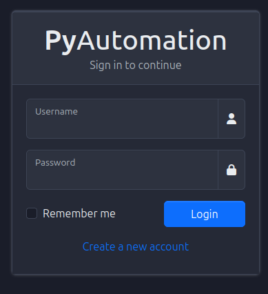

*Figure 1: PyAutomation login screen after Docker startup*

---

## 2. Deploy a PostgreSQL Database with Docker

For production or serious testing, PostgreSQL is the recommended backend database. You can run it as a separate service in Docker Compose or as a standalone container.

### 2.1. Minimal PostgreSQL container

Example standalone container:

```bash
docker run -d \
  --name postgres-automation \
  -e POSTGRES_DB=automation_db \
  -e POSTGRES_USER=automation_user \
  -e POSTGRES_PASSWORD=your_password \
  -p 5432:5432 \
  -v postgres_data:/var/lib/postgresql/data \
  postgres:15
```

Key points:

- `POSTGRES_DB`, `POSTGRES_USER`, and `POSTGRES_PASSWORD` define the initial database and credentials.
- The `postgres_data` volume ensures data persistence across container restarts.

### 2.2. PostgreSQL alongside PyAutomation in Docker Compose

A typical multi‑service `docker-compose.yml`:

```yaml
services:
  postgres:
    image: postgres:15
    container_name: "PostgreSQL"
    restart: always
    environment:
      POSTGRES_DB: automation_db
      POSTGRES_USER: automation_user
      POSTGRES_PASSWORD: your_password
    volumes:
      - postgres_data:/var/lib/postgresql/data
    ports:
      - "5432:5432"

  automation:
    image: "knowai/automation:${AUTOMATION_VERSION:-latest}"
    restart: always
    depends_on:
      - postgres
    # ...rest of the automation service as in section 1...

volumes:
  automation_db:
  automation_logs:
  postgres_data:
```

> **Important:** PyAutomation will create all its tables automatically the first time you configure the DB connection from the HMI (see section 6). You only need to ensure that PostgreSQL is up and reachable.

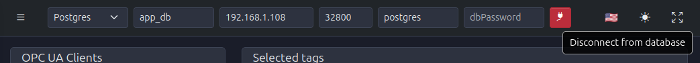

*Figure 2.1: Database configuration interface for connecting PyAutomation to PostgreSQL*

---

### 2.3. Bootstrapping the initial database connection via environment variables

On the **very first startup**, before any database has been configured through the HMI, you can instruct PyAutomation to automatically create a primary connection configuration (and then create the `system` user and default data) using environment variables.

This bootstrap happens only if:

- There is **no** existing `db/db_config.json` file, and
- The appropriate `AUTOMATION_DB_*` environment variables are defined.

Once `db/db_config.json` exists, it becomes the **single source of truth** and **overrides any future changes in environment variables**. If you later change the DB connection from the HMI, the new configuration is written to `db/db_config.json` and will be used on subsequent restarts.

Supported variables:

- **`AUTOMATION_DB_TYPE`**:
  - `sqlite` (default), `postgresql`, or `mysql`.
- For **SQLite**:
  - `AUTOMATION_DB_FILE`: database filename (default: `app.db`).
- For **PostgreSQL/MySQL**:
  - `AUTOMATION_DB_HOST`: database host (default: `127.0.0.1`).
  - `AUTOMATION_DB_PORT`: database port (default: `5432` for PostgreSQL, `3306` for MySQL if not provided).
  - `AUTOMATION_DB_USER`: database user (**required**).
  - `AUTOMATION_DB_PASSWORD`: database password (**required**).
  - `AUTOMATION_DB_NAME`: database name (**required**).

Example `.env` snippet for a PostgreSQL bootstrap:

```ini
AUTOMATION_DB_TYPE=postgresql
AUTOMATION_DB_HOST=app_db
AUTOMATION_DB_PORT=5432
AUTOMATION_DB_USER=postgres
AUTOMATION_DB_PASSWORD=postgres
AUTOMATION_DB_NAME=app_db
```

On first startup with these variables:

1. PyAutomation detects that `db/db_config.json` does not exist.
2. It writes a new `db/db_config.json` using the `AUTOMATION_DB_*` values.
3. It connects to the database, creates all tables, roles, and the internal `system` user.

After this initial bootstrap:

- Any subsequent changes made via the **Database** section in the HMI update `db/db_config.json`.
- On restart, **`db/db_config.json` always wins** over environment variables, ensuring that UI‑driven configuration is preserved.

> This pattern allows you to have a clean “infrastructure‑driven” first configuration for CI/CD and ops, while still giving operators a convenient way to adjust DB settings later from the HMI without being overridden by container env vars.

---

## 3. End-to-End Demo Stack with Docker (DB + OPC UA Simulator + PyAutomation)

For a complete test environment, PyAutomation provides a `docker-compose.test.yml` file that starts:

- A **PostgreSQL database** (`db` service).
- An **OPC UA simulation server** (`opcua_server_simulator` service).
- The **PyAutomation automation + HMI** container (`automation` service).

This is the fastest way to try PyAutomation with realistic field data, database, and HMI in a single command.

### 3.1. docker-compose.test.yml: Services Overview

The `docker-compose.test.yml` file defines three services:

```yaml
services:

  db:
    container_name: app_db
    image: "postgres:17-bullseye"
    restart: always
    ports:
      - 32800:5432
    environment:
      POSTGRES_PASSWORD: postgres
      POSTGRES_USER: postgres
      POSTGRES_DB: app_db
    # ...

  opcua_server_simulator:
    container_name: opcua_server_simulator
    image: "knowai/opcua_server_simulator:2.2.1"
    restart: always
    ports:
      - 0.0.0.0:5015:5015
      - 0.0.0.0:4840:4840
    environment:
      - APP_THREADS=5
      - APP_PORT=5015
      - ASYNC_APP=0
    volumes:
      - ./opcua_server_simulator.yml:/app/app/config.yml
      - ./data_for_tests.csv:/app/app/data/data_for_tests.csv
    # ...

  automation:
    container_name: "Automation"
    image: "knowai/automation:${AUTOMATION_VERSION:-latest}"
    restart: always
    ports:
      # Backend API (Flask/Gunicorn)
      - ${AUTOMATION_PORT:-8050}:${AUTOMATION_PORT:-8050}
      # HMI frontend served by Nginx inside the container (listen 3000)
      - ${AUTOMATION_HMI_PORT:-3000}:3000
    volumes:
      - automation_db:/app/db
      - automation_logs:/app/logs
    environment:
      AUTOMATION_OPCUA_SERVER_PORT: ${AUTOMATION_OPCUA_SERVER_PORT:-53530}
      AUTOMATION_APP_SECRET_KEY: ${AUTOMATION_APP_SECRET_KEY:-073821603fcc483f9afee3f1500782a4}
      AUTOMATION_SUPERUSER_PASSWORD: ${AUTOMATION_SUPERUSER_PASSWORD:-super_ultra_secret_password}
    # ...

volumes:
  automation_db:
  automation_logs:
```

At a glance:

- `db` exposes PostgreSQL on `localhost:32800` with database `app_db` and user `postgres`.
- `opcua_server_simulator` runs an industrial‑oriented OPC UA simulator with:
  - HTTP API (`APP_PORT=5015`) and healthcheck.
  - OPC UA endpoint on port `4840`.
  - Configuration and data injected via `opcua_server_simulator.yml` and `data_for_tests.csv`.
- `automation` is the same PyAutomation service described in section 1, wired to the simulator and DB.

> **Tip:** This stack is ideal for demos, automated tests, and onboarding workshops.


*Figure 3.1: OPC UA client screen showing integration with database and simulator services*

### 3.2. OPC UA Simulator Configuration: opcua_server_simulator.yml

The OPC UA simulator uses a YAML configuration file mounted into the container:

```yaml
version: "3.3"

filename: "data_for_tests"
separator: ","
header: [0]
interval: 1.0
variables:
  FI_01:
    name: "FIRST_TRANSMITTER_MASS_FLOW"
    uncertainty: 0.1
    min: 0
    max: 200
  PI_01:
    name: "FIRST_TRANSMITTER_PRESSURE"
    uncertainty: 0.1
    min: 200000
    max: 1200000
  # ... other variables ...
server_folder_namespace: iDetectFugas
```

Key fields:

- `filename`: **base name** of the CSV file without extension. Here it is `data_for_tests`, which matches `data_for_tests.csv`.
- `separator`: column separator used in the CSV file (`,` in this case).
- `header: [0]`: indicates that the **first row** (index 0) in the CSV contains column headers.
- `interval`: time in seconds between updates (e.g., `1.0` means new values every 1 second).
- `variables`: dictionary of **OPC UA variables** the simulator will expose:
  - Keys like `FI_01`, `PI_01`, etc. map to tags/nodes.
  - `name`: human‑readable description.
  - `min`, `max`: value ranges used to generate or normalize data.
  - `uncertainty`: percentage uncertainty / noise to apply.
- `server_folder_namespace`: top‑level namespace folder under which the variables appear in the OPC UA address space.

The simulator uses this configuration plus the CSV file to drive the time series it serves.

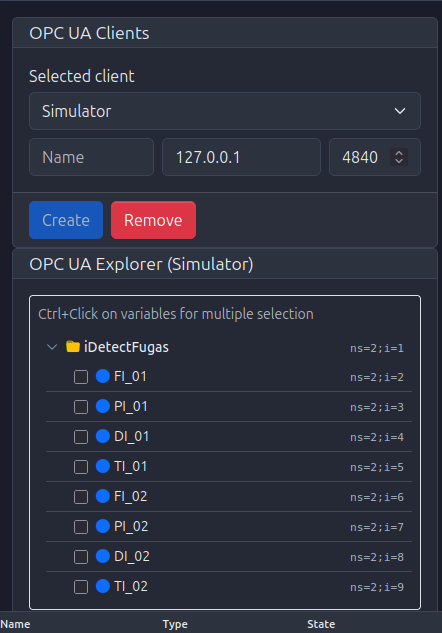

*Figure 3.2: OPC UA namespace tree showing variables like FI_01, PI_01, etc. from the simulator*

### 3.3. CSV Data Format: data_for_tests.csv

The `data_for_tests.csv` file (mounted into the container) provides the raw time‑series used by the simulator:

- Must be located in the **project root** (as referenced in `docker-compose.test.yml`).
- Is mounted to `/app/app/data/data_for_tests.csv` inside the container.
- Must match the `filename` specified in `opcua_server_simulator.yml` (`data_for_tests` → `data_for_tests.csv`).

General format:

- **Separator**: comma (`,`), as specified by `separator: ","`.
- **Header row** (row 0): contains column names that the simulator uses to map data.
- **Data rows**: each row represents one time step.
- Numeric columns are interpreted according to the `variables` section in `opcua_server_simulator.yml`.

Conceptually:

```text
timestamp,FI_01,PI_01,DI_01,TI_01,FI_02,PI_02,DI_02,TI_02
2024-01-01T00:00:00Z, 10.0, 250000, 800, 20, 15.0, 260000, 820, 21
2024-01-01T00:00:01Z, 11.2, 252000, 805, 20.1, 15.5, 262000, 825, 21.1
...
```

> The actual `data_for_tests.csv` in the repository may contain different columns and values, but it follows this pattern: a header line plus numerical data compatible with the variables defined in `opcua_server_simulator.yml`.

If you want to customize the simulation:

1. Edit `opcua_server_simulator.yml` to add/remove variables or change ranges.
2. Adjust `data_for_tests.csv` so that:
   - It contains corresponding columns for your variables.
   - Values fall within the desired ranges.

> **Note:** The `data_for_tests.csv` file follows a standard CSV format with a header row and numeric data columns. You can open it in any spreadsheet application (Excel, LibreOffice Calc, etc.) to view and edit the time-series data.

### 3.4. Starting the full demo stack

From the project root, run:

```bash
docker-compose -f docker-compose.test.yml up -d
```

This will:

- Start PostgreSQL (`db`).
- Start the OPC UA simulator (`opcua_server_simulator`).
- Start PyAutomation (`automation`) using the same image and environment variables described earlier.

Once all three services are healthy:

- Access the HMI at `http://localhost:${AUTOMATION_HMI_PORT:-3000}` (for example `http://localhost:3000` or `http://localhost:5000` depending on your `.env`).
- Configure the **Database connection** in the HMI to point to the `db` service:
  - Host: `db` (inside Docker network) or `localhost:32800` from the host, depending on your setup.
  - Port: `5432`.
  - Database: `app_db`.
  - User / Password: `postgres` / `postgres` (or your custom values).
- Configure an **OPC UA Client** in the HMI to point to the simulator:
  - Endpoint: `opc.tcp://opcua_server_simulator:4840` (inside Docker network) or `opc.tcp://localhost:4840` from the host.

From this point, you have a realistic test environment with:

- A running database.
- A configurable OPC UA simulator serving data from a CSV file.
- PyAutomation HMI ready to define tags, trends, alarms, and real‑time charts based on that data.

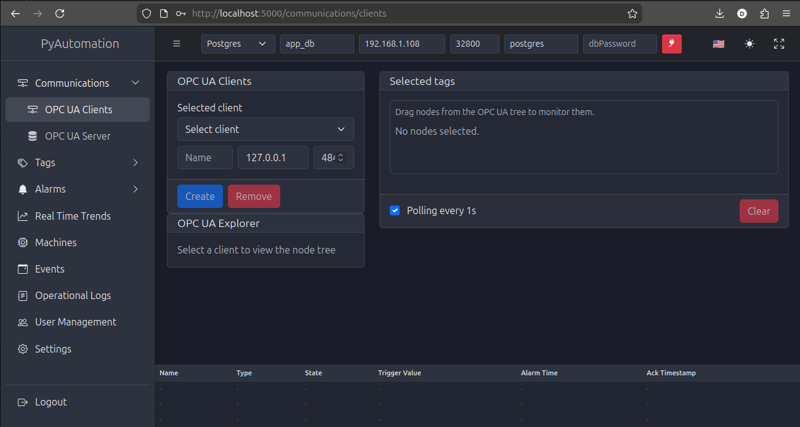

*Figure 34: Main dashboard after successful login, showing the HMI connected to database and ready for configuration*

---

## 4. First Steps in the HMI

Once the containers are running, open the HMI in your browser.

### 4.1. Creating the first user (Signup flow)

User accounts are **created from the Login/Signup screen**.

1. Open the HMI login page (e.g., `http://localhost:8050`).
2. Click on the **Signup** option on the login screen.
3. Fill in the signup form:
   - **Username**
   - **Email**
   - **Password**
   - Optional: **Name** and **Last name**
4. Submit the form. A new user will be created automatically with the **lowest permission level (GUEST / invited user)**.

At this stage, the new user can log in but has **limited permissions**. To promote this user to an operator or admin:

1. Log in using the **superuser** credentials (controlled by `AUTOMATION_SUPERUSER_PASSWORD`).
2. Navigate to **User Management / Users**.
3. Locate the newly created GUEST user.
4. Change the **role** to the appropriate level (e.g., **admin** for the first full‑privilege account).
5. Log out and log back in with the promoted user.

> From this point, you should use admin and operator accounts for daily work, and reserve the superuser only for recovery procedures and role management when no admin is available.

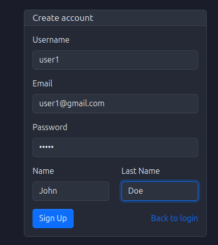

*Figure 2: User signup form for creating new accounts*

### 4.2. User login

- Access the login page at `http://localhost:8050`.
- Enter username/email and password.
- If login fails, check:
  - Container logs.
  - That the user is active and has a valid role assigned.

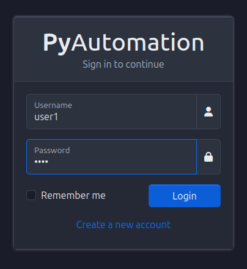

*Figure 3: Login page with username/password fields*

---

## 5. Navbar Basics: Language, Theme, Fullscreen

The top navigation bar (navbar) provides quick access to global UI features:

- **Language switch**: Change the UI language (e.g., English / Spanish).
- **Theme toggle**: Switch between light and dark themes.
- **Fullscreen**: Enter / exit fullscreen mode for control room displays.

These settings are purely visual but essential for a comfortable operator experience.

Steps:

1. Locate the language selector and choose your preferred locale.
2. Toggle the theme icon to switch between light and dark modes.
3. Use the fullscreen button when deploying on wall screens or operator stations.

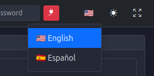

*Figure 4: Navbar with language switch, theme toggle, and fullscreen controls*

---

## 6. Connecting to the Database from the HMI

With PostgreSQL running, connect PyAutomation to the database via the HMI:

1. Open the **Database** section from the navbar.
2. Fill in:
   - **Host** (e.g., `localhost` or `postgres` if using Docker network).
   - **Port** (e.g., `5432`).
   - **Database name** (e.g., `automation_db`).
   - **User** and **Password** (e.g., `automation_user` / `your_password`).
3. Click **Connect**.

On success:

- PyAutomation will create all required tables (tags, alarms, users, events, logs, etc.).
- Initial default data (roles, variables, units) will be inserted.

If connection fails, check:

- That the DB container is running and reachable.
- Credentials and DB name.
- Docker network configuration (if using multiple containers).


*Figure 5: Database configuration form in the navbar*

---

## 7. Defining an OPC UA Client (Field Data Connectivity)

To bring real (or simulated) field data into PyAutomation:

1. Go to the **Communications / OPC UA Clients** section.
2. Create a new OPC UA client:
   - **Name**: A descriptive identifier (e.g., `Plant_Simulator`).
   - **Endpoint URL**: e.g., `opc.tcp://opcua-sim:4840/` or `opc.tcp://localhost:4840/`.
   - **Security mode / policy** as appropriate (for a simulator, often `None`).
3. Save the client and establish the connection.
4. Use the OPC UA browser to:
   - Navigate the node tree.
   - Select variables to monitor.
   - Add them as tags into the system (see next section).


*Figure 6: OPC UA client connections management*


*Figure 7: OPC UA node explorer for browsing the address space*

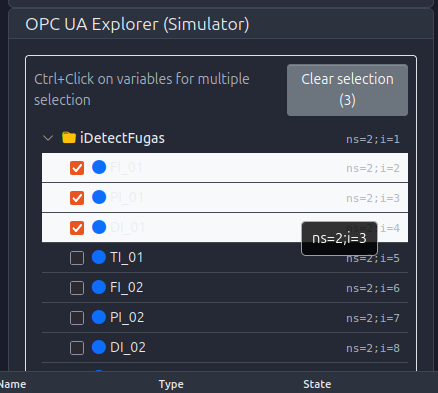

*Figure 8: Multi-selection of OPC UA nodes using Ctrl+Click*

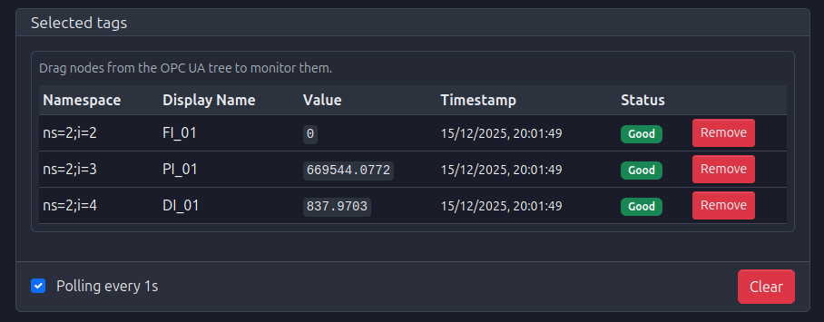

*Figure 9: Selected tags in OPC UA explorer with active polling connection*

---

## 8. Tags: Create, Edit, Delete, Export

Tags are the core data points of PyAutomation.

### 8.1. Creating tags

1. Navigate to the **Tags** section.
2. Click **Create** (or equivalent action).
3. For each tag, define:
   - **Name**: Unique identifier.
   - **Variable / Data type / Unit**: Semantic and type information.
   - **OPC UA address** (if linked to a field variable).
   - **Scan time**, deadband, and other filters as needed.
4. Save and verify that live values appear (if connected to OPC UA).

### 8.2. Editing and deleting tags

- Use the **Edit** action to adjust parameters like units, descriptions, or OPC UA bindings.
- Use the **Delete** action to remove unused tags (be aware of dependent alarms, trends, and loggers).

### 8.3. Exporting / importing tags

- Use the **Export** function to download tag definitions (for backup or replication).
- Use **Import** to load predefined tag sets in bulk.


*Figure 10: Tags definition page (empty state)*


*Figure 11: Create new tag form with basic configuration*


*Figure 12: Tag creation form showing polling and filter configuration options*


*Figure 13: Tags list after creating multiple tags*


*Figure 14: Edit tag form for modifying existing tag parameters*

---

## 9. DataLogger (Historical Data): Filters and Downloads

The DataLogger module stores tag values for long‑term analysis.

1. Open the **Data Logger / Historical Data** section.
2. Configure:
   - Tags to log.
   - Logging period (sample time).
   - Filters (time ranges, tag subsets).
3. Once historical data is available, use the UI to:
   - Filter by date/time window.
   - Select specific tags.
   - Download data as CSV/Excel for offline analysis.

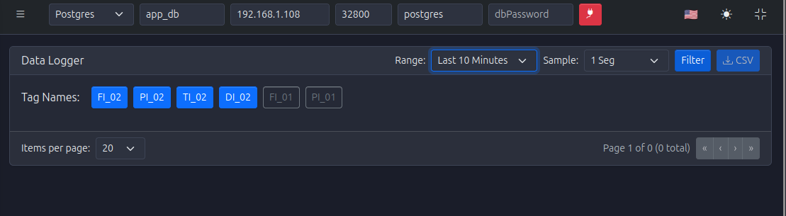

*Figure 15: DataLogger empty state with no historical data*

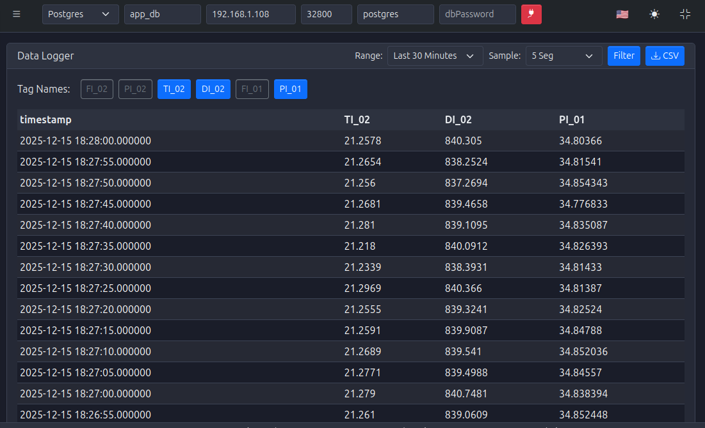

*Figure 16: DataLogger with filters applied (5-second sample time)*

---

## 10. Historical Trends (Trends Module)

Historical trends provide graphical visualization of logged data.

1. Go to the **Trends** section.
2. Select:
   - One or more tags.
   - Time range.
   - Sampling and resampling options (if available).
3. View the plotted trends and adjust:
   - Time window.
   - Zoom, pan, and cursors (if supported).
4. Export underlying data if needed.


*Figure 17: Historical trends chart showing multiple tags over the last hour*

---

## 11. Alarms: Create, Edit, Delete, Actions, Export

The Alarms module manages process conditions and notifications.

### 11.1. Defining alarms

1. Open the **Alarms** section.
2. Create a new alarm:
   - **Tag**: The process variable to monitor.
   - **Condition**: Threshold (e.g., high, high‑high, low, low‑low).
   - **Classification / Priority / Severity**.
   - **Messages** and optional metadata.
3. Save and test by driving the source tag beyond thresholds.

### 11.2. Managing alarms at runtime

- **Acknowledge** alarms.
- **Shelve / suppress** alarms (if supported) for maintenance.
- Use filters to focus on active, unacknowledged, or historical alarms.
- Export alarm tables to CSV/Excel for reports and audits.


*Figure 18: Alarm definition page (empty state)*

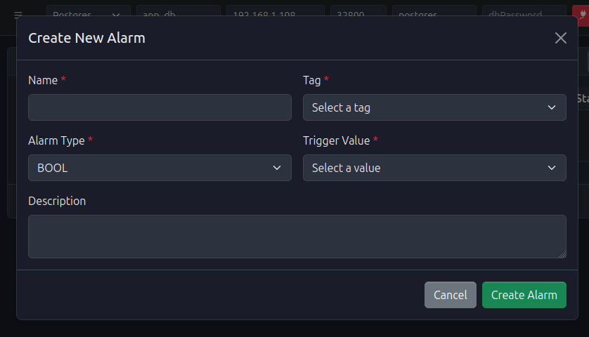

*Figure 19: Create new alarm form with tag selection and threshold configuration*


*Figure 20: Edit alarm form for modifying alarm parameters*


*Figure 21: Alarm history page showing active and historical alarms*

---

## 12. Alarm Summary

The Alarm Summary view aggregates alarm information for quick situational awareness.

Key capabilities:

- Filter by:
  - Time window.
  - Classification / Priority.
  - State (active, acknowledged, cleared).
- Use this view to:
  - Identify recurring issues.
  - Evaluate alarm flood situations.
  - Support root cause analysis.


*Figure 22: Alarm summary view with filters and aggregated alarm information*

---

## 13. Real-Time Trends (HMI Strip Charts)

Real‑time trends (strip charts) are provided by the new HMI module.

### 13.1. Main features

- **Edit / Production modes**:
  - **Edit mode**: Reposition and resize strip charts, configure tags and buffer sizes.
  - **Production mode**: Layout is locked; only visualization is available.
  - Mode switching by double‑clicking anywhere in the RealTimeTrends view.
- **Buffer size**:
  - Each chart has a configurable **buffer size** (number of points kept in memory).
  - Larger buffers show longer histories but require more memory.
- **Tag configuration**:
  - Each chart supports multiple tags.
  - Tags can be grouped by units; up to **two distinct units** per chart (mapped to two Y‑axes).

### 13.2. Configuring real‑time trends

1. Enter **Edit mode** (double‑click in the view).
2. Click **Add Chart** to create a new strip chart.
3. For each chart:
   - Set a descriptive **title**.
   - Use the **Tags** button to:
     - Search tags.
     - Add / remove tags.
     - Adjust **buffer size**.
4. Drag and resize the charts to build your HMI layout.
5. Switch back to **Production mode** (double‑click) to lock the layout.

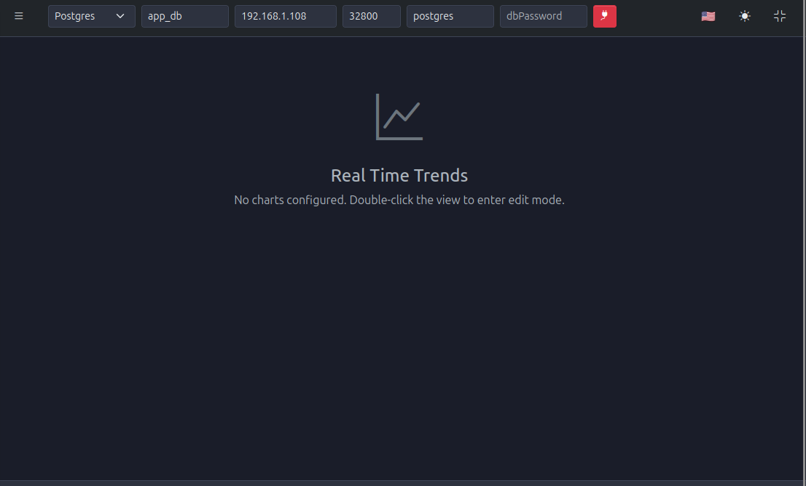

*Figure 23: Real-time trends page (empty state)*

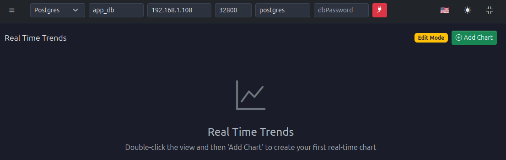

*Figure 24: Real-time trends in edit mode for configuring strip charts*

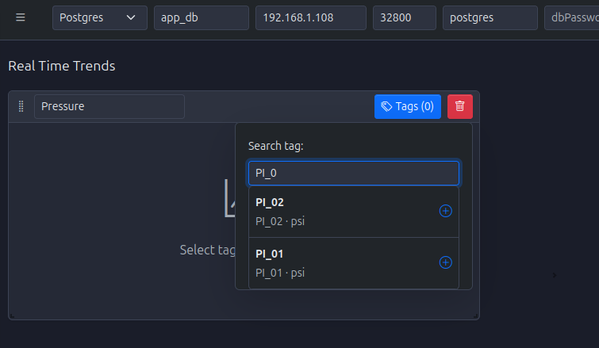

*Figure 25: Searching and selecting tags for strip chart configuration*

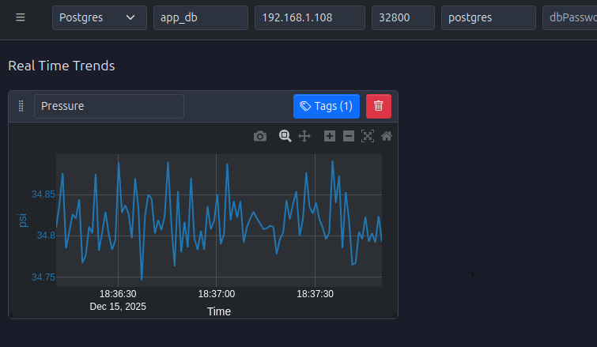

*Figure 26: First strip chart configured with selected tags*

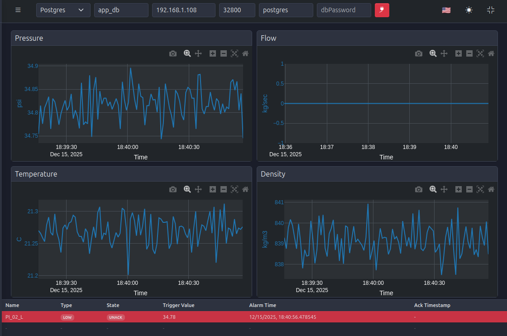

*Figure 27: Real-time trends in production mode with multiple strip charts displaying live data*

---

## 14. Machines: Actions, Configuration, Export

The Machines module (if enabled in your deployment) models equipment or units in your plant.

Typical operations:

- Configure machine metadata (name, description, associated tags).
- View machine status and KPIs.
- Export machine lists and configurations for documentation or replication.

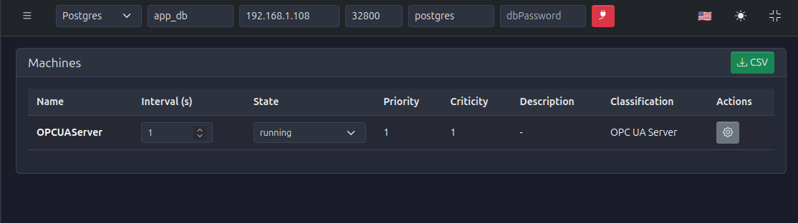

*Figure 28: Machines page showing state machine configurations and status*

---

## 15. Events: Logging, Filters, Comments, Export

PyAutomation logs system and process events to support traceability and diagnostics.

Capabilities:

- **What is logged**:
  - Alarm state changes.
  - User actions (logins, configuration changes).
  - System events (database connection, communication changes).
- **Filters**:
  - Time range, event type, user, severity.
- **Comments**:
  - Operators can attach comments to events for context and hand‑over.
- **Export**:
  - Download event tables to CSV/Excel for audits and incident analysis.

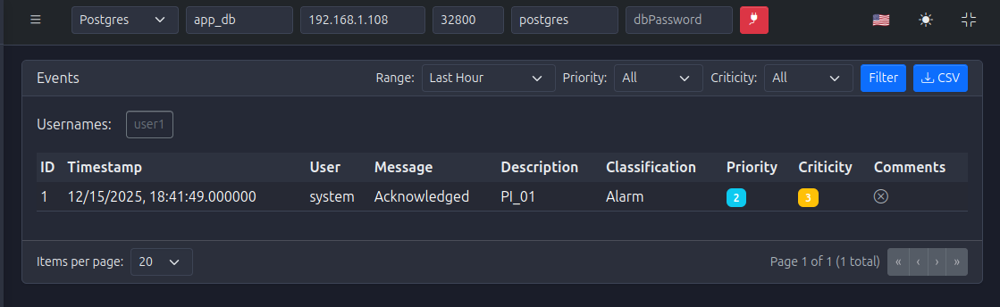

*Figure 29: Events page with filters and event history table*

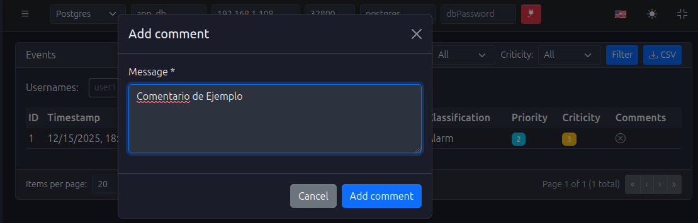

*Figure 30: Adding a comment to an event for context and hand-over*

---

## 16. Operational Logbook (Operational Logs)

The Operational Logbook is used to capture high‑level operational information (beyond raw events and alarms).

Use cases:

- Operator notes during shifts.
- Records of manual interventions.
- Summaries of production issues and resolutions.

Features:

- **Classification** of logs (e.g., maintenance, operations, quality).
+- Advanced **filters** by date, classification, user.
 - **Exports** for monthly / quarterly reporting.

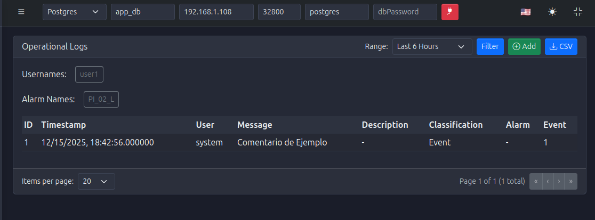

*Figure 31: Operational logbook view with classification filters and log entries*

---

## 17. User Management: Roles, Passwords, Administration

The **Users** module provides robust access control.

### 17.1. Roles and permissions

- Default roles (e.g., admin, operator, viewer) define what each user can do.
- Best practice:
  - Give **admins** full configuration rights.
  - Give **operators** runtime control and acknowledgment permissions.
  - Give **viewers** read‑only access.

### 17.2. Password management

- Admins can:
  - Reset user passwords.
  - Force password changes at next login (if configured).
- Users can:
  - Change their own passwords from the profile or user settings.

### 17.3. Superuser and recovery

- The **superuser** password is controlled by `AUTOMATION_SUPERUSER_PASSWORD` (see section 1.1).
- Use it **only** for:
  - Creating initial admin users.
  - Recovering from a state where no admin can log in.

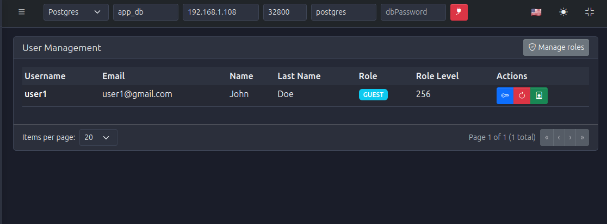

*Figure 32: User management page showing user list, roles, and password management actions*

---

## 18. System Settings: Logger and Configuration Management

The **Settings** module centralizes system‑level configuration.

Key parameters:

- **Logger Period**: Interval at which log records are flushed or rotated.
- **Log Level**: Verbosity (DEBUG, INFO, WARNING, ERROR, CRITICAL).
- **Log Max Bytes**: Maximum size of a single log file before rotation.
- **Log Backup Count**: Number of rotated log files to keep.

Configuration management:

- **Export Configuration**:
  - Download a JSON snapshot of system configuration (tags, alarms, communications, users, etc.).
  - Useful for backups and cloning environments.
- **Import Configuration**:
  - Load a previously exported configuration.
  - Ideal for restoring environments or deploying standardized setups.

Best practices:

- Keep a **versioned archive** of configuration exports.
- Align log levels with environment:
  - `DEBUG` for development.
  - `INFO` or `WARNING` for production.

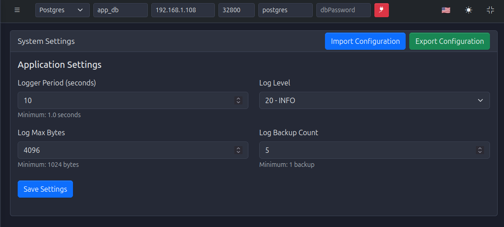

*Figure 33: System settings page with logger parameters and configuration import/export options*

---

## 19. Summary

By following this Quick Start, you should now have:

- PyAutomation (backend + HMI) running in Docker.
- A PostgreSQL database connected and initialized.
- An OPC UA simulator providing test data.
- Users, tags, alarms, trends, and logs configured for a complete end‑to‑end workflow.

From here, you can refine your configuration, connect to real plant equipment, and tailor the HMI to your operations.


