# Creating a Tag

<h2 style="color: #1976d2; font-size: 2.5em; margin-bottom: 0.5em; text-shadow: 2px 2px 4px rgba(0,0,0,0.1);">
  ➕ Create Your First Tag
</h2>

  The creation of a new tag involves defining its identity, physical properties, and communication settings. Follow the steps below to configure a new tag in the PyAutomation dashboard.

## 🚪 Opening the Create Tag Dialog

  To begin creating a new tag:

1. Navigate to the **Tags** module from the main menu
2. Click the **Create Tag** button (green button with plus icon) located in the top-right corner of the Tags Dashboard
3. The "Create New Tag" dialog will open, presenting all configuration options

## Step-by-Step Configuration

### 1. Assign a Name

The **Name** is the unique identifier for the tag within the system.

- **Requirement**: Must be unique across the entire project.
- **Action**: Enter a descriptive name (e.g., `FIT-101`, `Tank_Level`).

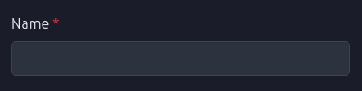

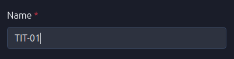

### 2. Variable Type

Select the physical phenomenon that this tag represents. This selection filters the available Engineering Units.

- **Examples**: Pressure, Mass Flow, Temperature, Density.

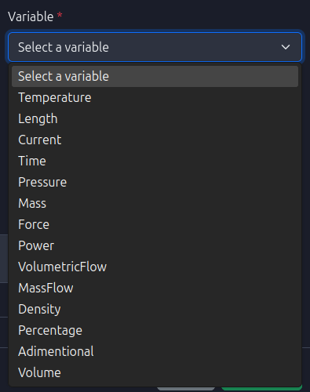

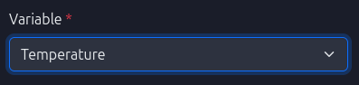

### 3. Engineering Units

Choose the unit of measurement for the tag. The list is populated based on the selected **Variable Type**.

- **Example**: If "Temperature" is selected, options might include `°C`, `°F`, `K`.

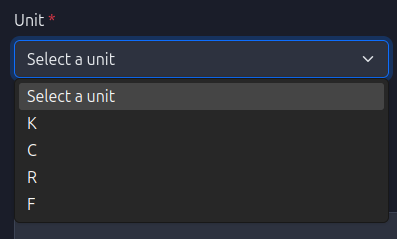

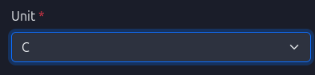

### 4. Data Type

Specify the computer data format for the tag's value.

- **Options**: `Float`, `Integer`, `Boolean`, `String`.

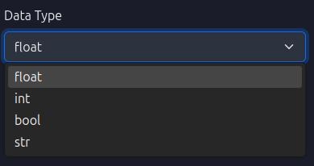

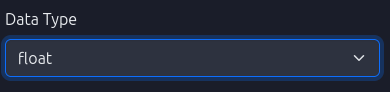

### 5. Description (Optional)

Provide a human-readable description to add context to the tag.

- **Usage**: "Feedwater Inlet Temperature".

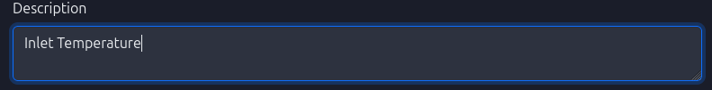

### 6. Display Name (Optional)

Set a friendly name for visualization purposes on dashboards, which can differ from the unique system ID.

### 7. OPC UA Configuration (Optional)

If this tag interacts with an OPC UA server, configure the connection details.

- **OPC UA Client**: Select the configured OPC UA client connection.

  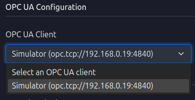

- **Node Namespace**: Select the specific node identifier from the OPC UA server's address space (e.g., `ns=2;i=2`, `FI_02`).

  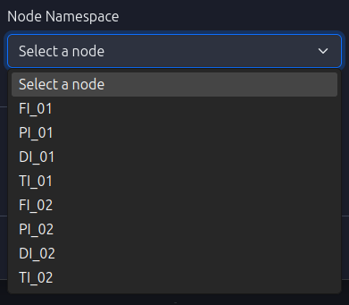

  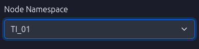

### 8. Scan Time

Define the frequency at which the system reads or updates the tag value (in milliseconds).

- **Usage**: Lower values provide higher resolution but increase system load.

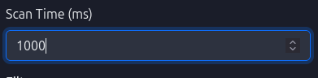

### 9. Deadband

Set a threshold for value changes. Updates are only processed if the value changes by more than this amount.

- **Benefit**: Reduces database noise and network traffic.
- **Note**: The unit matches the **Engineering Unit** selected in Step 3.

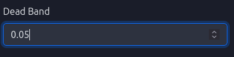

### 🔧 10. Advanced Configuration (Optional)

<h4 style="color: #e65100; font-size: 1.5em; margin-bottom: 1em;">
  ⚙️ Powerful Tools for Data Quality
</h4>

  The Advanced Configuration section provides powerful tools for improving data quality, detecting anomalies, and organizing tags within your industrial system. These features help ensure reliable data collection and early detection of potential issues.

#### 10.1. Data Filtering

Filters are used to smooth noisy sensor readings and improve signal quality before storing values in the database.

##### Gaussian Filter (Kalman Filter)

The **Gaussian Filter** implements an adaptive Kalman Filter algorithm designed to reduce noise in sensor measurements while preserving true signal changes.

**How it works:**
- The filter maintains an internal state that estimates the "true" value based on historical measurements
- It uses an adaptive algorithm that adjusts its sensitivity based on the variance of incoming data
- When the innovation (difference between predicted and measured values) variance exceeds a threshold, the filter becomes more responsive to changes
- When variance is low, the filter applies stronger smoothing to reduce noise

**Configuration Parameters:**
- **Threshold** (default: 100): Controls when the filter switches between adaptive modes. Higher values make the filter more conservative (smoother), lower values make it more responsive to changes
- **R Value** (default: 0.5): Measurement noise parameter. Lower values indicate higher confidence in measurements (less filtering), higher values indicate more noise (more filtering)

**Use Cases:**
- Sensors with high electrical noise
- Mechanical vibrations affecting sensor readings
- Radio frequency interference (RFI) in industrial environments
- Analog-to-digital conversion noise

**Example:** A temperature sensor reading 25.3°C, 25.1°C, 25.4°C, 25.2°C might be filtered to a stable 25.25°C, reducing database storage of minor fluctuations while preserving actual temperature trends.

##### Process Filter

The **Process Filter** is a boolean flag that enables additional process-level filtering. This feature provides a framework for custom filtering logic that can be extended based on specific industrial process requirements.

**Note:** This filter serves as a foundation for process-specific filtering implementations and can be customized for particular use cases.

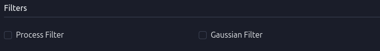

#### 10.2. Anomaly Detection

Anomaly detection features automatically identify unusual patterns in tag data that may indicate sensor failures, communication issues, or process problems. When anomalies are detected, the system can trigger alarms to alert operators.

##### Frozen Data Detection

**Frozen Data Detection** identifies when a sensor appears to be "stuck" or not updating, which typically indicates:
- Sensor failure or disconnection
- Communication loss with the sensor
- Sensor calibration issues
- Mechanical binding or obstruction

**How it works:**
- The system maintains a rolling buffer of recent tag values
- It calculates the standard deviation of values in the buffer
- If the standard deviation is less than 0.001 (indicating virtually no variation), an anomaly alarm is triggered
- The alarm description is set to "Frozen data anomaly"

**Use Cases:**
- Detecting when a flow meter stops responding
- Identifying temperature sensors that have failed
- Monitoring for communication interruptions with remote sensors
- Early warning of sensor maintenance needs

**Example:** If a pressure sensor reads 150.0 psi, 150.0 psi, 150.0 psi, 150.0 psi over several scan cycles, frozen data detection will flag this as anomalous since real process values should show at least minor variations.

##### Outlier Detection

**Outlier Detection** identifies individual data points that deviate significantly from expected values. This feature helps detect:
- Sudden spikes or drops in sensor readings
- Measurement errors
- Transient electrical interference
- Sensor calibration drift

**How it works:**
- The system maintains a buffer of recent measurements
- Statistical analysis is performed on the buffer to establish expected value ranges
- Values that fall outside these ranges are flagged as outliers

**Status:** This feature is currently in active development and will provide configurable thresholds for outlier identification.

##### Out of Range Detection

**Out of Range Detection** monitors whether tag values fall within acceptable operational limits. This helps identify:
- Process excursions beyond safe operating parameters
- Sensor readings that exceed physical limits
- Configuration errors in sensor scaling

**How it works:**
- Similar to outlier detection, this feature uses statistical analysis of historical data
- It can be configured with specific min/max limits for each tag
- Alarms are triggered when values consistently fall outside acceptable ranges

**Status:** This feature is currently in active development and will provide configurable range limits.

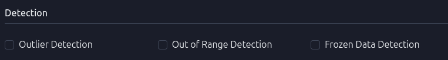

#### 10.3. Additional Information: Segment and Manufacturer

The **Segment** and **Manufacturer** fields provide organizational metadata that helps categorize and manage tags within large industrial systems.

##### Segment

A **Segment** represents a logical grouping of tags that belong to a specific area, system, or process unit within your plant. Segments help organize tags for:
- **Reporting and Analysis**: Group related tags together for trend analysis
- **Maintenance Planning**: Identify all sensors in a particular area that may need maintenance
- **System Architecture**: Map tags to physical locations or process units
- **Access Control**: Apply permissions or visibility rules by segment

**Examples:**
- "Boiler Unit 1", "Distillation Column A", "Cooling Water System"
- "North Wing", "Production Line 2", "Quality Control Lab"

##### Manufacturer

The **Manufacturer** field identifies the company or brand that produced the sensor or device associated with the tag. This information is useful for:
- **Maintenance Records**: Track which manufacturer's equipment needs service
- **Spare Parts Management**: Identify compatible replacement parts
- **Warranty Tracking**: Manage equipment warranties by manufacturer
- **Performance Analysis**: Compare performance across different manufacturers
- **Technical Support**: Contact the correct manufacturer for technical assistance

**Relationship:**
- Each Segment is associated with a Manufacturer
- Multiple Segments can share the same Manufacturer
- This relationship helps organize equipment by both location (segment) and supplier (manufacturer)

**Example Use Case:**
- Segment: "Reactor Vessel 3"
- Manufacturer: "Siemens"
- This indicates that all tags in Reactor Vessel 3 use Siemens equipment, making it easier to coordinate maintenance, order parts, and access technical documentation.

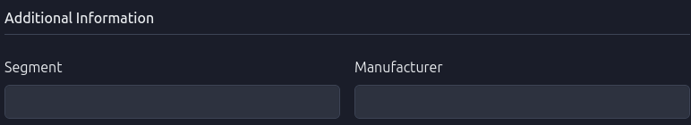

#### Best Practices for Advanced Configuration

1. **Filtering**: Enable Gaussian Filter for sensors known to have noise issues. Start with default parameters and adjust based on observed behavior.

2. **Anomaly Detection**: Enable Frozen Data Detection for critical sensors where communication loss could indicate serious problems.

3. **Organization**: Use consistent naming conventions for Segments (e.g., "Unit-01", "Unit-02") and ensure Manufacturer names match exactly across your system.

4. **Performance**: Be aware that enabling multiple filters and detection algorithms increases computational load. Monitor system performance when enabling these features on many tags simultaneously.

### 11. Finalize Creation

Review all configured fields. Click the **Create Tag** button to save the new tag.

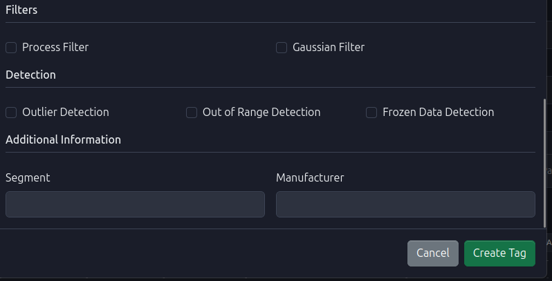

Upon successful creation, the tag will appear in the main Tags Dashboard.

## Exporting Tag List

You can export the current list of tags to a CSV file for external documentation or backup purposes by clicking the **Export CSV** button.

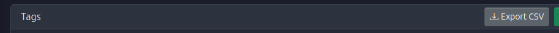

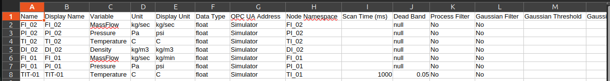
