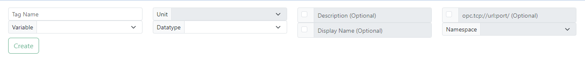
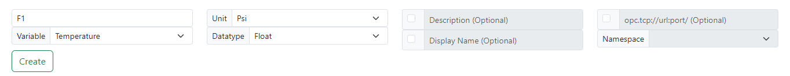
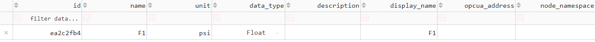

# Create TAG
- In the creation function, you will have the options:
    - Assign a name 
    - Select the variable type (whether it's Pressure, Mass Flow, or Density), 
    - Specify the corresponding units
    - Define the data type of the units 
    - Provide a description (Optional)
    - Set the Display Name (Optional)
    - Configure the OPC (Optional)

Once all the fields are filled in as shown below, proceed to press the "Create" button, and it will be displayed on the dashboard below.

Dashboard

NOTE: The Tag name must be unique and cannot be repeated.

