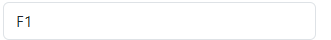
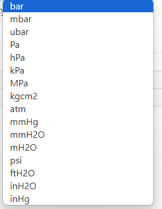
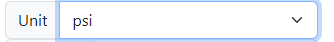
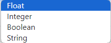
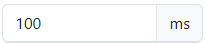
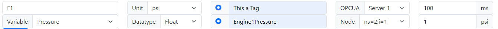
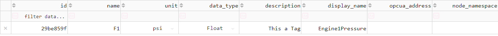
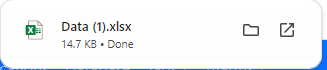

# Creating a Tag

The creation of a new tag involves defining its identity, physical properties, and communication settings. Follow the steps below to configure a new tag in the PyAutomation dashboard.

## Step-by-Step Configuration

### 1. Assign a Name

The **Name** is the unique identifier for the tag within the system.

- **Requirement**: Must be unique across the entire project.
- **Action**: Enter a descriptive name (e.g., `FIT-101`, `Tank_Level`).

### 2. Variable Type

Select the physical phenomenon that this tag represents. This selection filters the available Engineering Units.

- **Examples**: Pressure, Mass Flow, Temperature, Density.

### 3. Engineering Units

Choose the unit of measurement for the tag. The list is populated based on the selected **Variable Type**.

- **Example**: If "Temperature" is selected, options might include `°C`, `°F`, `K`.

### 4. Data Type

Specify the computer data format for the tag's value.

- **Options**: `Float`, `Integer`, `Boolean`, `String`.

### 5. Description (Optional)

Provide a human-readable description to add context to the tag.

- **Usage**: "Feedwater Inlet Temperature".

### 6. Display Name (Optional)

Set a friendly name for visualization purposes on dashboards, which can differ from the unique system ID.

### 7. OPC UA Configuration (Optional)

If this tag interacts with an OPC UA server, configure the connection details.

- **OPC UA Address**: The endpoint URL of the OPC UA server.
  

- **Node ID**: The specific node identifier within the OPC UA address space (e.g., `ns=2;s=Device1.Temperature`).
  

### 8. Scan Time

Define the frequency at which the system reads or updates the tag value (in milliseconds).

- **Usage**: Lower values provide higher resolution but increase system load.

### 9. Deadband

Set a threshold for value changes. Updates are only processed if the value changes by more than this amount.

- **Benefit**: Reduces database noise and network traffic.
- **Note**: The unit matches the **Engineering Unit** selected in Step 3.

### 10. Finalize Creation

Review all configured fields. Click the **Create** button to save the new tag.

Upon successful creation, the tag will appear in the main Tags Dashboard.

## Exporting Tag List

You can export the current list of tags to an Excel file for external documentation or backup purposes by clicking the **Export** button.

