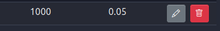
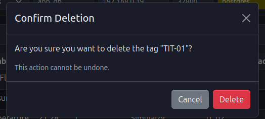
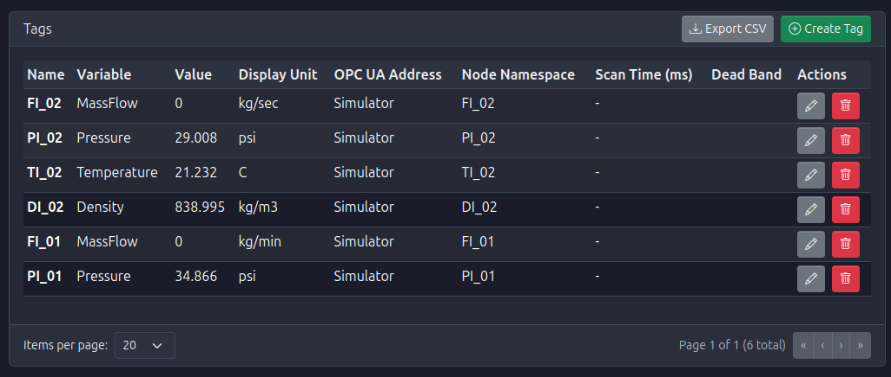

# Deleting a Tag

<h2 style="color: #c62828; font-size: 2.5em; margin-bottom: 0.5em; text-shadow: 2px 2px 4px rgba(0,0,0,0.1);">
  🗑️ Remove Tags from Your System
</h2>

  When a tag is no longer required in the automation system, it can be permanently removed from the configuration.

## Deletion Procedure

1.  **Locate the Tag**: Navigate to the Tags Dashboard and identify the tag to be removed.

2.  **Initiate Deletion**: Click the **trash icon** (🗑️) located in the **Actions** column of the tag's row.

3.  **Confirm Action**: A confirmation modal will appear asking you to verify the deletion. This step is crucial to prevent accidental data loss.

4.  **Finalize**: Click **Yes** or **Confirm** in the confirmation dialog. The tag will be removed from the system and will no longer appear in the dashboard or be available for data logging and alarms.

