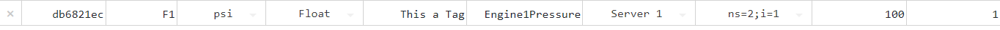

# Deleting a Tag

When a tag is no longer required in the automation system, it can be permanently removed from the configuration.

## Deletion Procedure

1.  **Locate the Tag**: Navigate to the Tags Dashboard and identify the tag to be removed.

    

2.  **Initiate Deletion**: Click the **Red X** icon located at the far left of the tag's row.

    

3.  **Confirm Action**: A confirmation modal will appear asking you to verify the deletion. This step is crucial to prevent accidental data loss.

    

4.  **Finalize**: Click **Yes**. The tag will be removed from the system and will no longer appear in the dashboard or be available for data logging and alarms.

    
