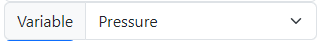
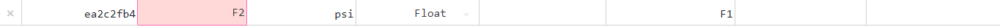
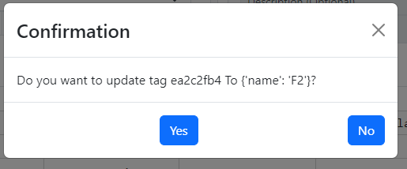
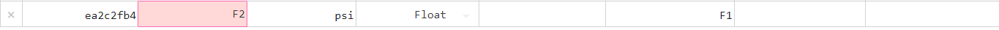

# Update TAG
To update a Tag, go to the Dashboard and locate the Tag you want to update, whether it’s the:

- For example, if we have the Tag F1, we will edit its Tag name. We do double click on the field Tag name and change it

Note: If you attempt to use a Tag name that already exists on the dashboard, the system will prevent the update because the name is already in use.

- Once we have changed the Tag name, press Enter.

- A confirmation window will appear. Click "Yes" to proceed.

- Ready!
