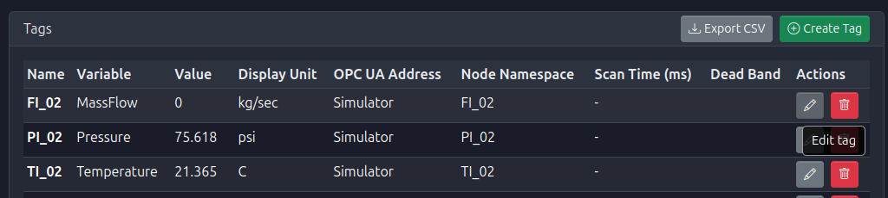
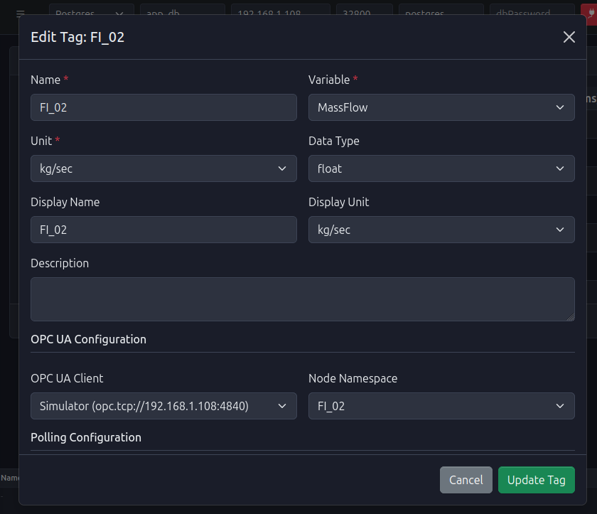
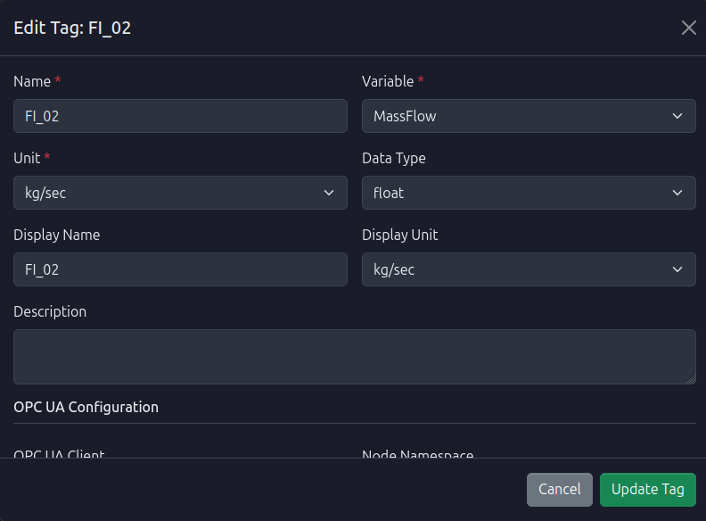
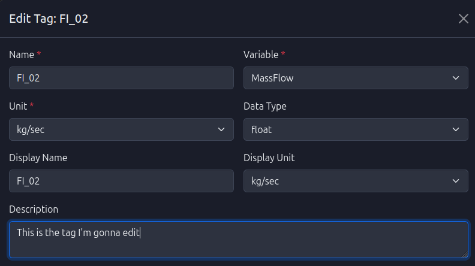
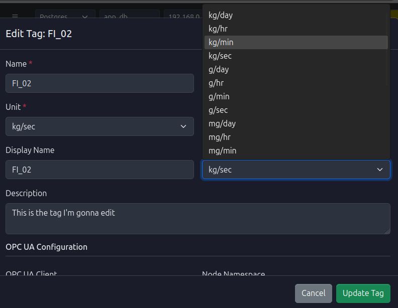
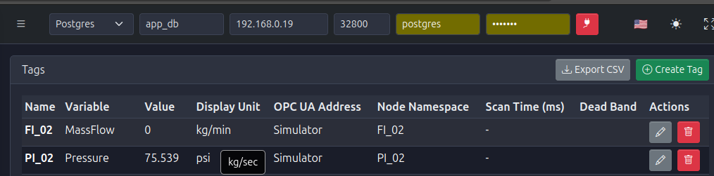

# Updating a Tag

<h2 style="color: #0277bd; font-size: 2.5em; margin-bottom: 0.5em; text-shadow: 2px 2px 4px rgba(0,0,0,0.1);">
  ✏️ Modify Tag Properties
</h2>

  PyAutomation allows for the seamless modification of tag properties through an edit form. This ensures that all tag configurations can be updated in a structured and organized manner.

## Editing Procedure

1.  **Locate the Tag**: Navigate to the Tags Dashboard and find the row corresponding to the tag you wish to modify.

2.  **Open Edit Form**: Click the **edit icon** (✏️) located in the **Actions** column of the tag's row to open the edit form.

3.  **Edit Tag Properties**: The edit form will open, displaying all tag configuration fields. Modify the desired properties:
    *   **Name**: Change the unique identifier (must remain unique)
    *   **Description**: Update the tag description
    *   **Display Name**: Modify the friendly name for visualization
    *   **Scan Time**: Adjust the polling frequency
    *   **Deadband**: Update the change threshold
    *   **OPC UA Configuration**: Modify client or node namespace
    *   **Advanced Configuration**: Update filters, anomaly detection, or segment/manufacturer information
    *   **Note**: All fields can be modified except the tag's unique identifier (ID).

<!-- TODO: Add image EditTagForm_NameField.png - Screenshot showing the Name field in the edit form with a value being modified -->
<!-- TODO: Add image EditTagForm_ScanTimeField.png - Screenshot showing the Scan Time field being edited in the edit form -->
<!-- TODO: Add image EditTagForm_DeadbandField.png - Screenshot showing the Deadband field in the edit form -->
<!-- TODO: Add image EditTagForm_OPCUAConfiguration.png - Screenshot showing the OPC UA Configuration section in the edit form -->
<!-- TODO: Add image EditTagForm_AdvancedConfiguration.png - Screenshot showing the Advanced Configuration section (filters, anomaly detection) in the edit form -->

4.  **Save Changes**: Click the **Save** or **Update** button at the bottom of the form to apply the changes.

<!-- TODO: Add image EditTagForm_SaveButton.png - Screenshot highlighting the Save/Update button at the bottom of the edit form -->
<!-- TODO: Add image EditTagForm_ConfirmationDialog.png - Screenshot of the confirmation dialog (if any) asking to confirm the tag update -->

5.  **Verification**: The dashboard will refresh to reflect the updated tag properties. The modified fields will be displayed with their new values in the Tags Dashboard.

<!-- TODO: Add image EditTag_UpdatedFieldInTable.png - Screenshot showing a specific updated field (e.g., Name, Description, Scan Time) displayed in the Tags Dashboard table after the update -->
<!-- TODO: Add image EditTag_ComparisonBeforeAfter.png - Screenshot showing a side-by-side comparison or highlighting the changed value in the table (optional, if useful) -->
