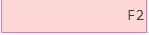
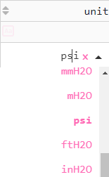
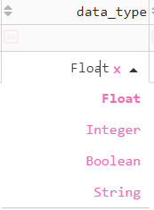

# Updating a Tag

PyAutomation allows for the seamless modification of tag properties directly from the Tags Dashboard. This "inline editing" capability ensures that changes can be made quickly without navigating away from the overview.

## Editing Procedure

1.  **Locate the Tag**: Navigate to the Tags Dashboard and find the row corresponding to the tag you wish to modify.

2.  **Select the Field**: Double-click on the specific cell you want to edit (e.g., **Tag Name**, **Description**, **Scan Time**).

    

3.  **Modify the Value**: Type the new value into the input field.
    *   **Note**: If modifying the **Tag Name**, ensure the new name is unique. The system will reject duplicate names.

4.  **Confirm Changes**: Press `Enter` to submit the change. A confirmation dialog will appear to prevent accidental modifications. Click **Yes** to save.

    

5.  **Verification**: The dashboard will refresh to reflect the updated value.

    

This procedure applies to all editable columns in the Tags Dashboard.

