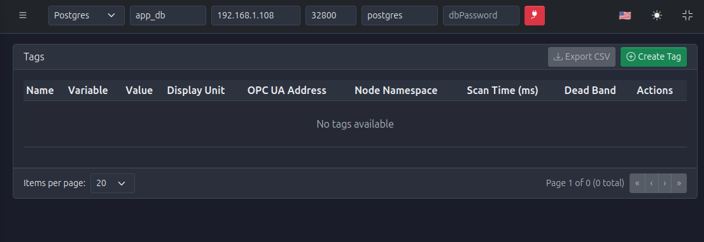
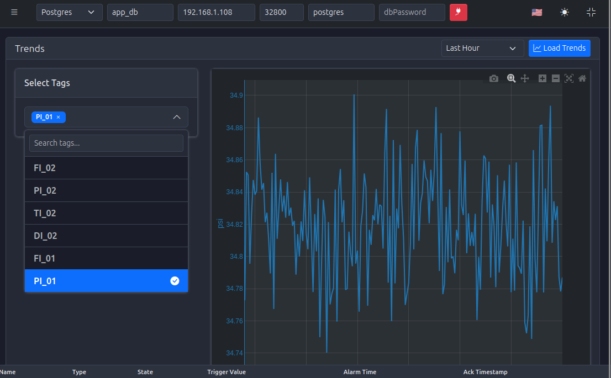
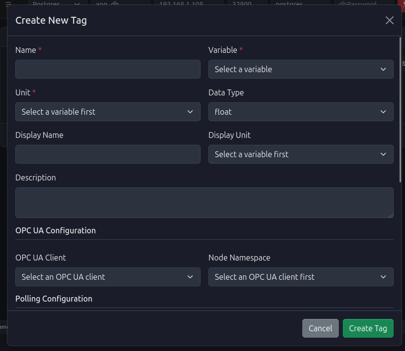
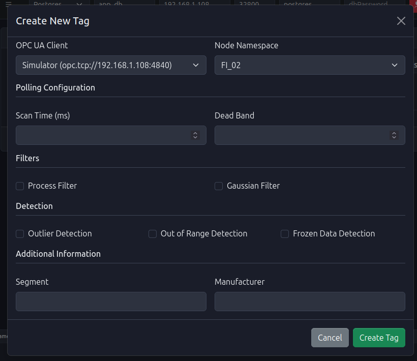

# Tags Module

<h2 style="color: #0d47a1; font-size: 2.5em; margin-bottom: 0.5em; text-shadow: 2px 2px 4px rgba(0,0,0,0.1); font-weight: 700;">
  🏷️ The Central Hub of Your Automation System
</h2>

  The <strong>Tags Module</strong> is the foundational component of PyAutomation, serving as the central hub for defining, managing, and monitoring process variables. A <strong>Tag</strong> is a digital representation that connects real-world physical measurements, control outputs, or calculated values to the automation system, enabling data acquisition, processing, storage, and visualization.

## 📋 What is a Tag?

  A Tag in PyAutomation is a named entity that represents:

*   **Physical Inputs**: Sensor readings from the field (temperature, pressure, flow rate, level, etc.)
*   **Physical Outputs**: Control signals sent to actuators (valves, pumps, motors, etc.)
*   **Calculated Values**: Derived measurements or internal process variables
*   **Status Indicators**: Boolean states representing equipment or process conditions

Each tag contains metadata including its data type, engineering units, source location (OPC UA node), sampling rate, and filtering options. This metadata enables PyAutomation to correctly interpret, process, and display the data throughout the system.

## ⚡ Why Tags are Essential

<h3 style="color: #bf360c; font-size: 1.5em; margin-bottom: 1em; font-weight: 700;">
  🔧 Fundamental Building Blocks
</h3>

  Tags are the fundamental building blocks that enable:

*   **Data Acquisition**: Real-time reading of values from OPC UA servers and other data sources
*   **Data Logging**: Historical storage of tag values in the database for analysis and reporting
*   **Alarm Management**: Definition of alarm conditions based on tag values and thresholds
*   **Visualization**: Display of current values, trends, and dashboards in the user interface
*   **Process Control**: Execution of control logic based on tag states and values
*   **Integration**: Seamless data exchange between the DAQ layer, database, UI, and external systems

## Module Overview

The Tags Module interface consists of a comprehensive management dashboard where you can view, create, modify, and delete tags. The interface provides real-time visibility into tag values, their sources, and configuration parameters.

When you first access the Tags Module, you'll see an empty state indicating no tags have been created yet. This is the starting point for building your tag database.

Once tags are created, the dashboard displays them in a comprehensive table showing all relevant information including current values, units, OPC UA connections, and configuration parameters.

## ✨ Key Features

<h3 style="color: white; font-size: 1.8em; margin-bottom: 1em; text-shadow: 2px 2px 4px rgba(0,0,0,0.3);">
  Discover the Power of Tags
</h3>

### 🎯 Tag Management

<ul style="color: #1a202c; font-size: 1em; line-height: 1.8; margin: 0; padding-left: 1.5em; font-weight: 400;">
<li><strong>Create Tags</strong>: Define new tags with comprehensive configuration options including name, variable type, units, data type, and OPC UA mapping</li>
<li><strong>Update Tags</strong>: Modify tag properties directly from the dashboard using inline editing or edit dialogs</li>
<li><strong>Delete Tags</strong>: Remove tags that are no longer needed from the system</li>
<li><strong>Export Tags</strong>: Export the tag list to CSV format for documentation, backup, or external analysis</li>
</ul>

### 📊 Variable Types and Engineering Units

<ul style="color: #1a202c; font-size: 1em; line-height: 1.8; margin: 0; padding-left: 1.5em; font-weight: 400;">
<li><strong>Variable Types</strong>: Support for various physical phenomena including:
    <ul style="margin-top: 0.5em; margin-bottom: 0.5em;">
    <li>Mass Flow (e.g., kg/sec, kg/min, lb/min)</li>
    <li>Pressure (e.g., psi, bar, Pa, kPa)</li>
    <li>Temperature (e.g., °C, °F, K)</li>
    <li>Density (e.g., kg/m³, lb/ft³)</li>
    <li>Level, Volume, Velocity, and more</li>
    </ul>
</li>
<li><strong>Unit Conversion</strong>: Automatic handling of engineering unit conversions and display formatting</li>
</ul>

### 🔢 Data Type Support

Tags support multiple data types to match the nature of the data source:

<ul style="color: #1a202c; font-size: 1em; line-height: 1.8; margin: 0; padding-left: 1.5em; font-weight: 400;">
<li><strong>Float</strong>: Floating-point numbers for continuous analog measurements (e.g., 29.008, 838.696)</li>
<li><strong>Integer</strong>: Whole numbers for discrete counts or digital values</li>
<li><strong>Boolean</strong>: True/false states for digital inputs, alarms, or status indicators</li>
<li><strong>String</strong>: Text values for descriptive information or alphanumeric identifiers</li>
</ul>

### 🔌 OPC UA Integration

<ul style="color: #1a202c; font-size: 1em; line-height: 1.8; margin: 0; padding-left: 1.5em; font-weight: 400;">
<li><strong>Client Selection</strong>: Associate tags with specific OPC UA client connections</li>
<li><strong>Node Mapping</strong>: Map tags directly to OPC UA nodes using namespace identifiers (e.g., <code>ns=2;i=2</code>)</li>
<li><strong>Automatic Discovery</strong>: Browse and select OPC UA nodes from connected servers</li>
<li><strong>Real-time Updates</strong>: Continuous synchronization of tag values from OPC UA sources</li>
</ul>

### ⚡ Polling and Performance Optimization

<ul style="color: #1a202c; font-size: 1em; line-height: 1.8; margin: 0; padding-left: 1.5em; font-weight: 400;">
<li><strong>Scan Time Configuration</strong>: Define the frequency at which each tag is read from its source (in milliseconds)</li>
<li><strong>Dead Band Filtering</strong>: Configure threshold values to reduce database writes and network traffic by ignoring insignificant changes</li>
<li><strong>Process Filters</strong>: Apply filtering algorithms to smooth data (Process Filter, Gaussian Filter)</li>
<li><strong>Data Quality Detection</strong>: Enable detection of outliers, out-of-range values, and frozen data conditions</li>
</ul>

### 📈 Trending and Visualization

<ul style="color: #1a202c; font-size: 1em; line-height: 1.8; margin: 0; padding-left: 1.5em; font-weight: 400;">
<li><strong>Real-time Trends</strong>: Visualize tag behavior over time with interactive graphs</li>
<li><strong>Historical Analysis</strong>: Access historical data stored in the database for any tag</li>
<li><strong>Multi-tag Comparison</strong>: Display multiple tags on the same graph for correlation analysis</li>
<li><strong>Time Range Selection</strong>: View trends for different time periods (last hour, last 24 hours, custom ranges)</li>
</ul>

## Tags Dashboard Interface

The Tags Dashboard provides a comprehensive view of all configured tags with the following information:

### Table Columns

<ul style="color: #1a202c; font-size: 1em; line-height: 1.8; margin: 0; padding-left: 1.5em; font-weight: 400;">
<li><strong>Name</strong>: The unique identifier of the tag (e.g., <code>FI_01</code>, <code>PI_02</code>, <code>TI_01</code>)</li>
<li><strong>Variable</strong>: The type of physical phenomenon represented (e.g., MassFlow, Pressure, Temperature)</li>
<li><strong>Value</strong>: The current real-time value of the tag</li>
<li><strong>Display Unit</strong>: The engineering unit in which the value is displayed (e.g., kg/sec, psi, °C)</li>
<li><strong>OPC UA Address</strong>: The OPC UA client connection identifier (e.g., "Simulator")</li>
<li><strong>Node Namespace</strong>: The OPC UA node identifier (e.g., <code>FI_02</code>, <code>ns=2;i=2</code>)</li>
<li><strong>Scan Time (ms)</strong>: The polling interval configured for this tag</li>
<li><strong>Dead Band</strong>: The threshold value that must be exceeded before a new value is logged</li>
<li><strong>Actions</strong>: Edit (pencil icon) and Delete (trash icon) buttons for each tag</li>
</ul>

### Dashboard Actions

<ul style="color: #1a202c; font-size: 1em; line-height: 1.8; margin: 0; padding-left: 1.5em; font-weight: 400;">
<li><strong>Create Tag</strong> (Green button with plus icon): Opens the tag creation dialog to define a new tag</li>
<li><strong>Export CSV</strong>: Exports the current tag list to a CSV file for external use</li>
<li><strong>Pagination Controls</strong>: Navigate through multiple pages when many tags are configured</li>
<li><strong>Items per Page</strong>: Adjust the number of tags displayed per page (default: 20)</li>
</ul>

## Tag Creation Process

Creating a tag involves configuring multiple aspects of its definition. The creation dialog is organized into logical sections for clarity:

### Basic Information

The basic configuration includes:

<ul style="color: #1a202c; font-size: 1em; line-height: 1.8; margin: 0; padding-left: 1.5em; font-weight: 400;">
<li><strong>Name</strong> (Required): Unique identifier for the tag within PyAutomation</li>
<li><strong>Variable</strong> (Required): Type of physical phenomenon (MassFlow, Pressure, Temperature, etc.)</li>
<li><strong>Unit</strong> (Required): Engineering unit of measurement (populated based on Variable selection)</li>
<li><strong>Data Type</strong>: Computer representation format (float, integer, boolean, string)</li>
<li><strong>Display Name</strong> (Optional): Friendly name for UI display (can differ from the technical name)</li>
<li><strong>Description</strong> (Optional): Human-readable description providing context and documentation</li>
</ul>

### OPC UA Configuration

<ul style="color: #1a202c; font-size: 1em; line-height: 1.8; margin: 0; padding-left: 1.5em; font-weight: 400;">
<li><strong>OPC UA Client</strong> (Required for OPC UA tags): Select the configured OPC UA client connection</li>
<li><strong>Node Namespace</strong> (Required for OPC UA tags): Select the specific node from the OPC UA server's address space</li>
</ul>

### Advanced Configuration

The advanced configuration section includes:

<ul style="color: #1a202c; font-size: 1em; line-height: 1.8; margin: 0; padding-left: 1.5em; font-weight: 400;">
<li><strong>Polling Configuration</strong>:
    <ul style="margin-top: 0.5em; margin-bottom: 0.5em;">
    <li><strong>Scan Time (ms)</strong>: Frequency of reading the tag value from its source</li>
    <li><strong>Dead Band</strong>: Minimum change threshold required to trigger value updates</li>
    </ul>
</li>
<li><strong>Filters</strong>:
    <ul style="margin-top: 0.5em; margin-bottom: 0.5em;">
    <li><strong>Process Filter</strong>: Apply smoothing to reduce noise in analog signals</li>
    <li><strong>Gaussian Filter</strong>: Apply Gaussian smoothing algorithm for data filtering</li>
    </ul>
</li>
<li><strong>Detection</strong>:
    <ul style="margin-top: 0.5em; margin-bottom: 0.5em;">
    <li><strong>Outlier Detection</strong>: Identify and flag values that deviate significantly from expected ranges</li>
    <li><strong>Out of Range Detection</strong>: Monitor for values outside acceptable limits</li>
    <li><strong>Frozen Data Detection</strong>: Detect when tag values remain unchanged for extended periods</li>
    </ul>
</li>
<li><strong>Additional Information</strong>:
    <ul style="margin-top: 0.5em; margin-bottom: 0.5em;">
    <li><strong>Segment</strong>: Categorize tags by process segment or area</li>
    <li><strong>Manufacturer</strong>: Specify equipment manufacturer information</li>
    </ul>
</li>
</ul>

For detailed step-by-step instructions, see the [Creating a Tag](Create.md) guide.

---

## Tag Management Operations

### Viewing Tags

The Tags Dashboard provides a real-time view of all configured tags, displaying their current values and configuration. Tags are updated continuously based on their configured scan times.

### Updating Tags

Tags can be modified directly from the dashboard using inline editing or through the edit dialog. Most properties can be changed without recreating the tag, allowing for flexible configuration adjustments.

See the <a href="Update.md" style="color: #1976d2; font-weight: 600;">Updating a Tag</a> guide for detailed instructions.

### Deleting Tags

When a tag is no longer needed, it can be permanently removed from the system. Deletion removes the tag configuration and stops data acquisition, but historical data remains in the database for reporting purposes.

See the <a href="Delete.md" style="color: #d32f2f; font-weight: 600;">Deleting a Tag</a> guide for detailed instructions.

### Exporting Tags

The tag list can be exported to CSV format for:

<ul style="color: #1a202c; font-size: 1em; line-height: 1.8; margin: 0; padding-left: 1.5em; font-weight: 400;">
<li>Documentation and specification sheets</li>
<li>Backup purposes</li>
<li>Import into other systems</li>
<li>External analysis and reporting</li>
</ul>

---

## Trending and Visualization

The Trends feature allows you to visualize tag values over time, providing insights into process behavior, identifying anomalies, and verifying system performance.

Key capabilities include:

<ul style="color: #1a202c; font-size: 1em; line-height: 1.8; margin: 0 0 1.5em 0; padding-left: 1.5em; font-weight: 400;">
<li><strong>Tag Selection</strong>: Choose one or multiple tags to display on the same graph</li>
<li><strong>Time Range Selection</strong>: View trends for different time periods (Last Hour, Last 24 Hours, custom ranges)</li>
<li><strong>Interactive Graphs</strong>: Zoom, pan, and navigate through historical data</li>
<li><strong>Export Capabilities</strong>: Capture graphs as images for reports</li>
</ul>

See the <a href="Trends.md" style="color: #c2185b; font-weight: 600;">Trending and Visualization</a> guide for detailed instructions.

## 💡 Best Practices

<h3 style="color: white; font-size: 1.8em; margin-bottom: 1em; text-shadow: 2px 2px 4px rgba(0,0,0,0.3);">
  Industry-Proven Recommendations
</h3>

### 📝 Tag Naming Conventions

<ul style="color: #1a202c; font-size: 1em; line-height: 1.8; margin: 0; padding-left: 1.5em; font-weight: 400;">
<li>Use descriptive, consistent naming conventions (e.g., <code>FI_01</code> for Flow Indicator 01, <code>PI_02</code> for Pressure Indicator 02)</li>
<li>Include prefixes or suffixes to indicate tag type or location</li>
<li>Avoid special characters that may cause issues in expressions or external systems</li>
<li>Keep names concise but meaningful</li>
</ul>

### ⏱️ Scan Time Configuration

<ul style="color: #1a202c; font-size: 1em; line-height: 1.8; margin: 0; padding-left: 1.5em; font-weight: 400;">
<li><strong>High-Frequency Tags</strong>: Use lower scan times (100-500ms) for critical process variables requiring rapid response</li>
<li><strong>Standard Monitoring</strong>: Use moderate scan times (1000-5000ms) for routine process monitoring</li>
<li><strong>Slow-Changing Variables</strong>: Use higher scan times (10000ms+) for variables that change slowly (levels, temperatures in large vessels)</li>
<li>Consider system load when configuring many tags with low scan times</li>
</ul>

### 📉 Dead Band Configuration

<ul style="color: #1a202c; font-size: 1em; line-height: 1.8; margin: 0; padding-left: 1.5em; font-weight: 400;">
<li>Set dead bands based on measurement resolution and process noise</li>
<li>Use smaller dead bands for critical measurements requiring high precision</li>
<li>Use larger dead bands for noisy signals or variables with acceptable tolerance ranges</li>
<li>Match dead band units to the tag's engineering unit</li>
</ul>

### 🔌 OPC UA Configuration

<ul style="color: #1a202c; font-size: 1em; line-height: 1.8; margin: 0; padding-left: 1.5em; font-weight: 400;">
<li>Ensure OPC UA clients are configured and connected before creating tags</li>
<li>Verify node identifiers are correct by browsing the OPC UA server address space</li>
<li>Group related tags from the same OPC UA client for easier management</li>
<li>Test connectivity before deploying tags to production</li>
</ul>

### ✅ Data Quality

<ul style="color: #1a202c; font-size: 1em; line-height: 1.8; margin: 0; padding-left: 1.5em; font-weight: 400;">
<li>Enable appropriate detection features (outlier, out-of-range, frozen data) based on process requirements</li>
<li>Configure filters judiciously to balance noise reduction with response time</li>
<li>Monitor tag quality indicators in alarm conditions</li>
</ul>

---

## Common Use Cases

<h3 style="color: #0d47a1; font-size: 1.5em; margin-bottom: 1em; font-weight: 700;">
  Real-World Applications
</h3>

<h4 style="color: #0d47a1; font-size: 1.2em; margin-bottom: 0.5em; font-weight: 600;">📊 Process Monitoring</h4>

Create tags for all critical process variables to enable real-time monitoring, historical logging, and alarm generation.

<h4 style="color: #0d47a1; font-size: 1.2em; margin-bottom: 0.5em; font-weight: 600;">🔌 Equipment Integration</h4>

Map OPC UA nodes from PLCs, RTUs, or other automation equipment to PyAutomation tags for centralized data collection.

<h4 style="color: #0d47a1; font-size: 1.2em; margin-bottom: 0.5em; font-weight: 600;">💾 Data Logging</h4>

Configure tags with appropriate scan times and dead bands to efficiently log process data to the database for historical analysis.

<h4 style="color: #0d47a1; font-size: 1.2em; margin-bottom: 0.5em; font-weight: 600;">🚨 Alarm Management</h4>

Define tags that will be used as alarm sources, ensuring proper configuration of data types, units, and scan frequencies.

<h4 style="color: #0d47a1; font-size: 1.2em; margin-bottom: 0.5em; font-weight: 600;">📈 Reporting and Analysis</h4>

Export tag lists and use trending capabilities to analyze process performance, identify optimization opportunities, and generate operational reports.

---

## Navigation to Related Modules

Tags integrate with other PyAutomation modules:

<ul style="color: #1a202c; font-size: 1em; line-height: 1.8; margin: 0; padding-left: 1.5em; font-weight: 400;">
<li><strong>Communications (OPC UA Clients)</strong>: Configure OPC UA client connections that tags will use for data acquisition</li>
<li><strong>Alarms</strong>: Create alarms based on tag values and thresholds</li>
<li><strong>Database</strong>: Tag values are automatically logged to the database based on configured parameters</li>
<li><strong>Real Time Trends</strong>: Visualize tag values over time using the trending interface</li>
<li><strong>Machines</strong>: Associate tags with equipment and machine definitions</li>
</ul>

---

## 🚀 Getting Started

<h3 style="color: white; font-size: 1.8em; margin-bottom: 1em; text-shadow: 2px 2px 4px rgba(0,0,0,0.3);">
  Ready to Start Working with Tags?
</h3>

  To begin working with tags:

1.   **Ensure Prerequisites**: 
     *   Database connection is configured (see [Database Configuration](../Database/index.md))
     *   OPC UA clients are configured if using OPC UA tags (see [OPC UA Clients](../Communications/index.md))

2.   **Access the Tags Module**: 
     *   Navigate to **Tags** from the main menu

3.   **Create Your First Tag**: 
     *   Click the **Create Tag** button
     *   Follow the step-by-step guide in [Creating a Tag](Create.md)

4.   **Verify Tag Functionality**: 
     *   Confirm tags are receiving values from their sources
     *   Check that values are updating according to configured scan times
     *   Verify data logging to the database (if configured)

5.   **Explore Advanced Features**: 
     *   Configure polling and filtering options
     *   Set up trending visualization
     *   Create alarms based on tag values

For detailed instructions on specific operations, refer to the following guides:

<ul style="color: #1a202c; font-size: 1em; line-height: 1.8; margin: 0; padding-left: 1.5em; font-weight: 400;">
<li><a href="Create.md" style="color: #1976d2; font-weight: 600;">Creating a Tag</a> - Complete guide to tag creation and configuration</li>
<li><a href="Update.md" style="color: #1976d2; font-weight: 600;">Updating a Tag</a> - How to modify existing tag properties</li>
<li><a href="Delete.md" style="color: #1976d2; font-weight: 600;">Deleting a Tag</a> - Removing tags from the system</li>
<li><a href="Trends.md" style="color: #1976d2; font-weight: 600;">Trending and Visualization</a> - Visualizing tag data over time</li>
</ul>

