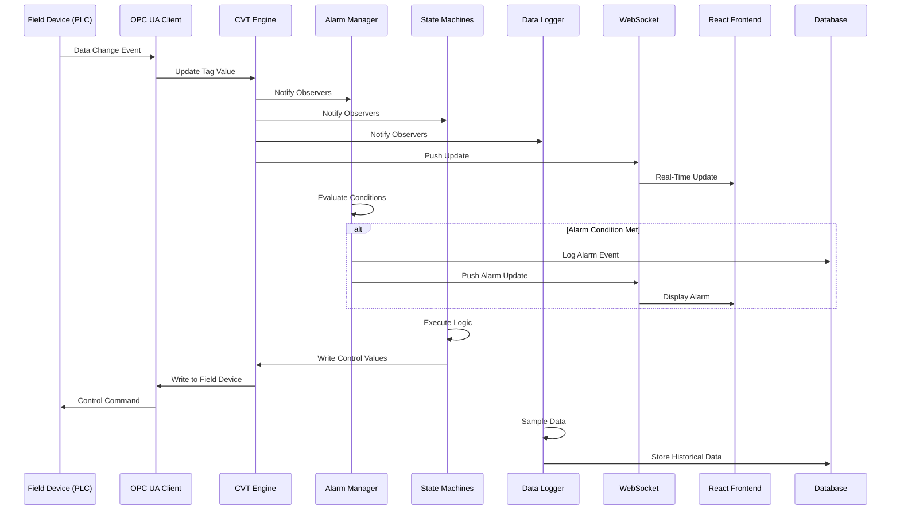
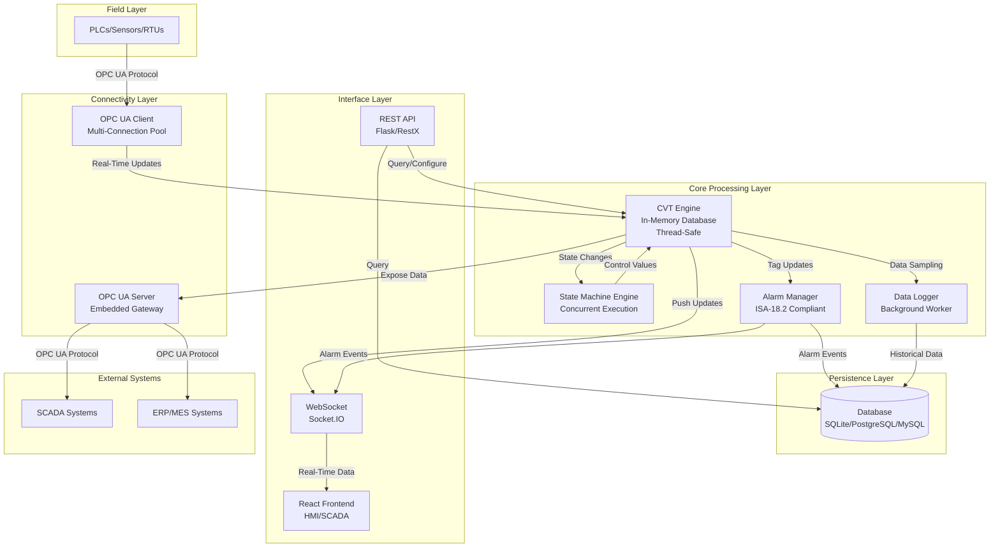

# PyAutomation Architecture

<div align="center" style="background: linear-gradient(135deg, #667eea 0%, #764ba2 100%); border-radius: 15px; padding: 3em 2em; margin: 2em 0; box-shadow: 0 10px 30px rgba(0,0,0,0.2);">

<h2 style="color: white; font-size: 2.5em; margin-bottom: 0.5em; text-shadow: 2px 2px 4px rgba(0,0,0,0.3);">
  Industrial-Grade Architecture for Modern Automation
</h2>

<p style="color: white; font-size: 1.4em; margin-top: 1em; font-weight: 300; text-shadow: 1px 1px 2px rgba(0,0,0,0.3);">
  Transparent. Scalable. Reliable. Open Source.
</p>

</div>

---

## 🏗️ Architecture Philosophy

PyAutomation is built on a **modular, layered architecture** designed for **high concurrency**, **reliability**, and **extensibility** in mission-critical industrial environments. Our architecture follows industry best practices and design patterns that ensure system stability, performance, and maintainability.

### Core Design Principles

*   **Separation of Concerns**: Each component has a single, well-defined responsibility
*   **Thread Safety**: All shared resources are protected with proper synchronization mechanisms
*   **Observer Pattern**: Event-driven architecture for real-time updates
*   **Singleton Pattern**: Centralized management of critical resources
*   **Factory Pattern**: Flexible component creation and configuration
*   **Dependency Injection**: Loose coupling for testability and extensibility

### Why This Architecture?

We've chosen this architecture because:

*   **Industrial Reliability**: Designed to handle mission-critical operations 24/7
*   **Real-Time Performance**: Optimized for low-latency data processing
*   **Scalability**: Can grow from small deployments to enterprise-level systems
*   **Maintainability**: Clear separation makes the codebase easy to understand and extend
*   **Transparency**: Open source means you can inspect, verify, and trust every component

---

## 📐 System Overview


*PyAutomation Core Architecture - A modular, layered design for industrial automation*

PyAutomation follows a **three-tier architecture** with clear boundaries between layers:

```
┌─────────────────────────────────────────────────────────────┐
│                    Presentation Layer                        │
│  React HMI • REST API • WebSocket (Socket.IO)              │
└──────────────────────────┬───────────────────────────────────┘
                          │
┌──────────────────────────▼───────────────────────────────────┐
│                    Application Layer                         │
│  State Machines • Alarm Manager • Data Logger • Engines    │
└──────────────────────────┬───────────────────────────────────┘
                          │
┌──────────────────────────▼───────────────────────────────────┐
│                    Data Layer                                │
│  CVT (In-Memory) • Database • OPC UA Client/Server         │
└─────────────────────────────────────────────────────────────┘
```

---

## 🔧 Core Components

### 1. PyAutomation Core

**The Orchestration Hub**

The central nervous system that coordinates all components and manages the application lifecycle.

**Responsibilities:**
*   **Lifecycle Management**: Initializes and coordinates all singleton instances
*   **Service Synchronization**: Ensures proper startup and shutdown sequences
*   **Dependency Management**: Handles component dependencies and initialization order
*   **Main Application Loop**: Coordinates the overall system execution

**Design Decision**: We use a centralized core to ensure deterministic startup and shutdown, critical for industrial systems where predictable behavior is essential.

**Key Features:**
*   Singleton pattern for critical managers
*   Dependency injection for loose coupling
*   Graceful shutdown handling
*   Health monitoring and diagnostics

---

### 2. State Machine Engine

**The Logic Processing Heart**

PyAutomation's state machine engine enables concurrent execution of multiple finite state machines (FSM), each running in its own thread for true parallelism.

**Architecture Pattern**: **Worker-Engine Pattern**

```
State Machine Worker → State Machine Engine → CVT Engine
     (Thread)              (Thread-Safe)        (Data)
```

**Key Capabilities:**
*   **Concurrent Execution**: Multiple state machines run in parallel without blocking
*   **Thread Safety**: All state machine operations are thread-safe
*   **Configurable Intervals**: Each machine can have its own execution interval
*   **State Persistence**: Machine states are tracked and can be persisted

**Types of State Machines:**

#### DAQ (Data Acquisition)
*   **Purpose**: Polling-based data collection from external devices
*   **Execution**: Runs at configurable intervals (typically 0.1-10 seconds)
*   **Thread Model**: Dedicated thread per OPC UA client connection
*   **Performance**: Optimized for high-frequency data acquisition

#### DAS (Data Acquisition by Subscription)
*   **Purpose**: Event-driven data collection for efficiency
*   **Execution**: Reactive to OPC UA subscription events
*   **Thread Model**: Event-driven, non-blocking
*   **Performance**: Lower CPU usage, ideal for high-frequency tags

#### Process Logic
*   **Purpose**: Custom automation logic (control loops, sequences)
*   **Execution**: User-defined intervals and conditions
*   **Thread Model**: Independent threads for isolation
*   **Flexibility**: Fully customizable for your specific needs

**Design Decision**: We chose state machines over simple loops because they provide:
*   **Predictable Behavior**: Clear state transitions
*   **Error Recovery**: Built-in error states and recovery paths
*   **Maintainability**: Easy to understand and debug
*   **Testability**: States can be tested independently

---

### 3. CVT (Current Value Table)

**The Single Source of Truth**

The CVT is a **high-performance, thread-safe, in-memory database** that serves as the central data repository for all real-time process variables.

**Architecture Pattern**: **Observer Pattern with Thread-Safe Access**

```
┌─────────────────────────────────────────┐
│         CVT Engine (Singleton)         │
│  ┌───────────────────────────────────┐ │
│  │  Thread-Safe Tag Storage          │ │
│  │  - Read/Write Locks               │ │
│  │  - Atomic Operations              │ │
│  └───────────────────────────────────┘ │
│           │         │         │        │
│      Notifies  Notifies  Notifies      │
└───────────┼─────────┼─────────┼────────┘
            │         │         │
    ┌───────▼───┐ ┌──▼──┐ ┌───▼────┐
    │  Alarm    │ │ Data│ │ State  │
    │  Manager  │ │Logger│ │Machine │
    └───────────┘ └──────┘ └────────┘
```

**Key Features:**
*   **Thread-Safe Operations**: Multiple readers and writers can access simultaneously
*   **Observer Pattern**: Components register to receive updates on tag changes
*   **Atomic Updates**: Tag updates are atomic to prevent inconsistent states
*   **High Performance**: In-memory storage for sub-millisecond access times
*   **Type Safety**: Strong typing for all tag values

**Design Decision**: In-memory storage was chosen because:
*   **Real-Time Requirements**: Industrial systems need sub-second response times
*   **High Frequency Updates**: Tags can update hundreds of times per second
*   **Low Latency**: Database writes would introduce unacceptable delays
*   **Scalability**: Can handle thousands of tags with minimal overhead

**Thread Safety Implementation:**
*   **Read-Write Locks**: Multiple concurrent readers, exclusive writers
*   **Atomic Operations**: Tag updates are atomic
*   **Copy-on-Write**: Safe value retrieval without locking readers

---

### 4. Connectivity Layers

**Bridging OT and IT**

PyAutomation provides dual connectivity: **OPC UA Client** for field device communication and **OPC UA Server** for exposing data to external systems.

#### OPC UA Client

**Purpose**: Connect to field devices (PLCs, Sensors, RTUs) and acquire data.

**Architecture:**
*   **Connection Pool**: Manages multiple OPC UA server connections
*   **Subscription Management**: Handles OPC UA subscriptions for event-driven updates
*   **Polling Engine**: Fallback polling mechanism for non-subscription scenarios
*   **Reconnection Logic**: Automatic reconnection with exponential backoff

**Data Acquisition Modes:**

1.  **DAQ (Data Acquisition by Polling)**
    *   Periodic polling at configurable intervals
    *   Suitable for low-frequency tags
    *   Predictable bandwidth usage
    *   Higher latency but simpler implementation

2.  **DAS (Data Acquisition by Subscription)**
    *   Event-driven updates via OPC UA subscriptions
    *   Optimal for high-frequency tags
    *   Lower bandwidth usage
    *   Lower latency, more efficient

**Design Decision**: We support both modes because:
*   **Flexibility**: Different tags have different requirements
*   **Efficiency**: Subscriptions reduce unnecessary network traffic
*   **Compatibility**: Some OPC UA servers don't support subscriptions
*   **Performance**: Choose the best method for each use case

#### OPC UA Server

**Purpose**: Expose PyAutomation's internal data to external systems (SCADA, ERP, MES).

**Architecture:**
*   **Embedded Server**: Runs as a state machine within PyAutomation
*   **Address Space**: Organized into CVT, Alarms, and Engines folders
*   **Access Control**: Configurable read/write permissions per variable
*   **Real-Time Updates**: Continuously publishes current values

**Design Decision**: Embedded server provides:
*   **Standard Protocol**: Industry-standard OPC UA for maximum compatibility
*   **No Additional Infrastructure**: No need for separate gateway servers
*   **Real-Time Access**: Direct access to CVT data
*   **Flexible Integration**: Works with any OPC UA client

---

### 5. Data Persistence & Logging

**Historical Data and Audit Trails**

PyAutomation provides comprehensive data persistence for historical analysis, compliance, and auditing.

#### Data Logger

**Purpose**: Periodically sample data from the CVT and store it in the database.

**Architecture:**
*   **Background Worker**: Runs in a separate thread to avoid blocking
*   **Configurable Sampling**: Adjustable sampling rates per tag
*   **Batch Writes**: Efficient database writes in batches
*   **Deadband Filtering**: Only logs significant changes (configurable threshold)

**Database Support:**
*   **SQLite**: Lightweight, perfect for small deployments
*   **PostgreSQL**: Enterprise-grade, ideal for large-scale systems
*   **MySQL**: Alternative enterprise option

**Design Decision**: Multi-database support because:
*   **Flexibility**: Choose the right database for your needs
*   **Scalability**: PostgreSQL for enterprise, SQLite for development
*   **Migration Path**: Easy to migrate as your needs grow
*   **Standard SQL**: All use standard SQL for portability

#### Alarm Manager

**Purpose**: Monitor tags against defined conditions and manage alarm states.

**Architecture Pattern**: **Observer Pattern with State Machine**

```
Tag Update → CVT → Alarm Manager → State Evaluation → State Transition
                                      │
                                      ├─► Active Alarm
                                      ├─► Acknowledged
                                      ├─► Shelved
                                      └─► Cleared
```

**Compliance**: **ISA-18.2 Standard**

*   **Alarm Types**: BOOL, HIGH, LOW, HIGH-HIGH, LOW-LOW
*   **Alarm States**: Normal, Unacknowledged, Acknowledged, RTN Unacknowledged, Shelved, Suppressed, Out Of Service
*   **State Transitions**: Complete lifecycle management
*   **Alarm History**: Comprehensive audit trail

**Design Decision**: ISA-18.2 compliance ensures:
*   **Industry Standard**: Recognized best practices
*   **Safety**: Proper alarm handling for critical systems
*   **Compliance**: Meets regulatory requirements
*   **Interoperability**: Works with other ISA-18.2 compliant systems

#### Event Logger

**Purpose**: Capture system events and operator actions for audit trails.

**Architecture:**
*   **Event Types**: User actions, system changes, alarm activities
*   **Event Classification**: Alarm, Tag, User, Machine, System
*   **Priority & Criticality**: 5-level classification system
*   **Comments**: Operators can add context to events

---

### 6. Interface & API Layer

**Modern Web Integration**

PyAutomation 2.0.0 features a modern React-based frontend with a robust RESTful API backend.

#### RESTful API (Flask/RestX)

**Purpose**: Configuration, data querying, and system management.

**Architecture:**
*   **RESTful Design**: Standard HTTP methods and status codes
*   **Resource-Based**: Clear resource hierarchy
*   **Authentication**: JWT-based authentication
*   **Authorization**: Role-based access control (RBAC)

**Key Endpoints:**
*   `/api/tags` - Tag management
*   `/api/alarms` - Alarm configuration and management
*   `/api/events` - Event querying and filtering
*   `/api/users` - User management
*   `/api/machines` - State machine monitoring
*   `/api/database` - Database configuration

**Design Decision**: RESTful API because:
*   **Standard Protocol**: Works with any HTTP client
*   **Stateless**: Scalable and cacheable
*   **Language Agnostic**: Can be used from any programming language
*   **Well-Documented**: Clear API documentation

#### WebSocket (Socket.IO)

**Purpose**: Real-time data push to frontend clients.

**Architecture:**
*   **Event-Driven**: Pushes updates only when data changes
*   **Efficient**: Reduces network traffic compared to polling
*   **Scalable**: Handles multiple concurrent clients
*   **Automatic Reconnection**: Client reconnects on connection loss

**Design Decision**: WebSocket for real-time updates because:
*   **Low Latency**: Immediate updates without polling delay
*   **Efficiency**: Only sends data when it changes
*   **User Experience**: Smooth, responsive interface
*   **Bandwidth**: Reduces network load

#### React Frontend (v2.0.0)

**Purpose**: Modern, responsive HMI/SCADA interface.

**Architecture:**
*   **Component-Based**: Reusable React components
*   **State Management**: Redux for global state
*   **Real-Time Updates**: Socket.IO client for live data
*   **Responsive Design**: Works on desktop, tablet, and mobile

**Key Features:**
*   **Real-Time Trends**: Configurable strip charts
*   **Alarm Dashboard**: Live alarm monitoring
*   **Tag Management**: Intuitive tag configuration
*   **User Management**: Role-based access control UI

**Design Decision**: React because:
*   **Modern UX**: Industry-leading user experience
*   **Performance**: Virtual DOM for efficient rendering
*   **Ecosystem**: Rich library ecosystem
*   **Maintainability**: Component-based architecture

---

## 🔄 Data Flow Architecture

Understanding how data flows through PyAutomation is crucial for system design and troubleshooting.

### Real-Time Data Flow



### System Architecture Diagram



---

## 🎯 Design Patterns & Principles

### Architectural Patterns

#### 1. Worker-Engine Pattern

**Purpose**: Separate execution (Workers) from data access (Engines).

```
Worker (Thread) → Engine (Thread-Safe) → Data
```

**Benefits:**
*   **Thread Safety**: Engines serialize access to shared resources
*   **Concurrency**: Workers run in parallel
*   **Testability**: Engines can be tested independently
*   **Maintainability**: Clear separation of concerns

#### 2. Observer Pattern

**Purpose**: Enable event-driven architecture for real-time updates.

```
CVT (Subject) → Notifies → Observers (Alarm Manager, State Machines, Data Logger)
```

**Benefits:**
*   **Loose Coupling**: Observers don't need to know about each other
*   **Real-Time Updates**: Immediate notification of changes
*   **Extensibility**: Easy to add new observers
*   **Performance**: Efficient event propagation

#### 3. Singleton Pattern

**Purpose**: Ensure single instance of critical managers.

**Used For:**
*   CVT Engine
*   Alarm Manager
*   Database Manager
*   OPC UA Client Manager

**Benefits:**
*   **Resource Efficiency**: Single instance prevents duplication
*   **State Consistency**: Shared state across the application
*   **Access Control**: Centralized access point

#### 4. Factory Pattern

**Purpose**: Create state machines and components dynamically.

**Benefits:**
*   **Flexibility**: Create components based on configuration
*   **Extensibility**: Easy to add new component types
*   **Encapsulation**: Hides creation complexity

### SOLID Principles

PyAutomation follows SOLID principles for maintainable, extensible code:

*   **Single Responsibility**: Each class has one reason to change
*   **Open/Closed**: Open for extension, closed for modification
*   **Liskov Substitution**: Derived classes are substitutable for base classes
*   **Interface Segregation**: Clients depend only on interfaces they use
*   **Dependency Inversion**: Depend on abstractions, not concretions

---

## ⚡ Performance & Scalability

### Performance Optimizations

*   **In-Memory CVT**: Sub-millisecond tag access
*   **Batch Database Writes**: Efficient historical data logging
*   **Connection Pooling**: Reuse OPC UA connections
*   **Deadband Filtering**: Only log significant changes
*   **WebSocket Push**: Eliminates polling overhead
*   **Concurrent State Machines**: True parallelism

### Scalability Considerations

*   **Horizontal Scaling**: Stateless API allows load balancing
*   **Database Scaling**: Supports enterprise databases (PostgreSQL)
*   **Tag Capacity**: Handles thousands of tags efficiently
*   **Connection Scaling**: Multiple OPC UA client connections
*   **State Machine Scaling**: Configurable execution intervals

### Resource Management

*   **Memory**: Efficient in-memory storage with configurable limits
*   **CPU**: Configurable state machine intervals for load balancing
*   **Network**: Subscription-based acquisition reduces bandwidth
*   **Database**: Batch writes and connection pooling

---

## 🔒 Security Architecture

### Authentication & Authorization

*   **JWT Authentication**: Secure token-based authentication
*   **Role-Based Access Control (RBAC)**: Admin, Operator, Guest roles
*   **Password Policies**: Configurable password requirements
*   **Session Management**: Secure session handling

### Data Security

*   **Encrypted Connections**: OPC UA supports encrypted connections
*   **Secure API**: HTTPS support for API endpoints
*   **Audit Trails**: Complete logging of user actions
*   **Access Logging**: Track all system access

### Network Security

*   **Firewall Configuration**: Configurable port access
*   **OPC UA Security**: Standard OPC UA security modes
*   **API Rate Limiting**: Protection against abuse
*   **Input Validation**: All inputs are validated and sanitized

---

## 🧪 Testing & Quality Assurance

### Testing Strategy

*   **Unit Tests**: Individual component testing
*   **Integration Tests**: Component interaction testing
*   **System Tests**: End-to-end functionality testing
*   **Performance Tests**: Load and stress testing

### Code Quality

*   **Type Hints**: Python type annotations for clarity
*   **Documentation**: Comprehensive docstrings
*   **Code Reviews**: Peer review process
*   **Static Analysis**: Linting and type checking

---

## 📈 Future Architecture Enhancements

### Planned Improvements

*   **Microservices Architecture**: Optional microservices deployment
*   **Message Queue Integration**: RabbitMQ/Kafka for event streaming
*   **Cloud Deployment**: Kubernetes and cloud-native patterns
*   **Edge Computing**: Lightweight edge deployment options
*   **AI/ML Integration**: Machine learning for predictive maintenance

### Protocol Expansion

*   **Modbus TCP**: Direct Modbus device integration
*   **MQTT**: IoT and cloud connectivity
*   **Additional Protocols**: Based on community needs

---

## 🔍 Deep Dive Resources

Want to learn more about specific components?

*   **[Architecture Components](Developments_Guide/architecture_components.md)**: Detailed explanation of Workers, Engines, and Managers
*   **[State Machines](Developments_Guide/core/state_machines.md)**: How to build custom state machines
*   **[CVT Engine](Developments_Guide/core/cvt.md)**: Current Value Table internals
*   **[Alarm System](Developments_Guide/core/alarms.md)**: Alarm management architecture
*   **[API Reference](Developments_Guide/API/index.md)**: Complete API documentation

---

## 💡 Why This Architecture Matters

<div style="background: #f8f9fa; border-left: 5px solid #667eea; padding: 2em; margin: 2em 0; border-radius: 5px;">

<p style="font-size: 1.2em; line-height: 1.8; color: #2d3748; margin-bottom: 1.5em;">
  Our architecture isn't just about code organization—it's about building a system that you can <strong>trust</strong>, <strong>understand</strong>, and <strong>extend</strong>.
</p>

<div style="display: grid; grid-template-columns: repeat(auto-fit, minmax(250px, 1fr)); gap: 1.5em; margin: 2em 0;">

<div style="background: white; border: 2px solid #667eea; border-radius: 10px; padding: 1.5em; box-shadow: 0 4px 6px rgba(0,0,0,0.1);">
<h4 style="color: #667eea; font-size: 1.2em; margin-bottom: 0.5em;">🛡️ Reliability</h4>
<p style="color: #4a5568; margin: 0;">Industrial systems must run 24/7 without failure</p>
</div>

<div style="background: white; border: 2px solid #667eea; border-radius: 10px; padding: 1.5em; box-shadow: 0 4px 6px rgba(0,0,0,0.1);">
<h4 style="color: #667eea; font-size: 1.2em; margin-bottom: 0.5em;">⚡ Performance</h4>
<p style="color: #4a5568; margin: 0;">Real-time systems need sub-second response times</p>
</div>

<div style="background: white; border: 2px solid #667eea; border-radius: 10px; padding: 1.5em; box-shadow: 0 4px 6px rgba(0,0,0,0.1);">
<h4 style="color: #667eea; font-size: 1.2em; margin-bottom: 0.5em;">🔧 Maintainability</h4>
<p style="color: #4a5568; margin: 0;">Clear architecture makes the system easy to understand and extend</p>
</div>

<div style="background: white; border: 2px solid #667eea; border-radius: 10px; padding: 1.5em; box-shadow: 0 4px 6px rgba(0,0,0,0.1);">
<h4 style="color: #667eea; font-size: 1.2em; margin-bottom: 0.5em;">🔍 Transparency</h4>
<p style="color: #4a5568; margin: 0;">Open source means you can verify every design decision</p>
</div>

<div style="background: white; border: 2px solid #667eea; border-radius: 10px; padding: 1.5em; box-shadow: 0 4px 6px rgba(0,0,0,0.1);">
<h4 style="color: #667eea; font-size: 1.2em; margin-bottom: 0.5em;">📈 Scalability</h4>
<p style="color: #4a5568; margin: 0;">Architecture that grows with your needs</p>
</div>

</div>

<div style="background: linear-gradient(135deg, #667eea 0%, #764ba2 100%); border-radius: 10px; padding: 2em; margin-top: 2em; text-align: center;">

<p style="color: white; font-size: 1.3em; line-height: 1.8; margin: 0; text-shadow: 1px 1px 2px rgba(0,0,0,0.3);">
  <strong>We're transparent about our architecture because we're confident in our design decisions.</strong> Every component, every pattern, every design choice has been made with industrial automation requirements in mind.
</p>

</div>

</div>

---

<div align="center" style="background: linear-gradient(135deg, #f093fb 0%, #f5576c 100%); border-radius: 15px; padding: 3em 2em; margin: 3em 0; box-shadow: 0 15px 35px rgba(0,0,0,0.2);">

<h2 style="color: white; font-size: 2em; margin-bottom: 1.5em; text-shadow: 2px 2px 4px rgba(0,0,0,0.3);">
  Ready to Explore How to Use These Components?
</h2>

<div style="display: flex; flex-direction: column; gap: 1em; align-items: center;">

<a href="Users_Guide/index.md" style="display: inline-block; background: white; color: #667eea; padding: 1em 2em; border-radius: 8px; text-decoration: none; font-weight: bold; font-size: 1.1em; box-shadow: 0 4px 6px rgba(0,0,0,0.2); transition: transform 0.2s;">
  📖 User Guide - Learn how to use PyAutomation
</a>

<a href="Developments_Guide/index.md" style="display: inline-block; background: white; color: #667eea; padding: 1em 2em; border-radius: 8px; text-decoration: none; font-weight: bold; font-size: 1.1em; box-shadow: 0 4px 6px rgba(0,0,0,0.2); transition: transform 0.2s;">
  🔧 Developer Guide - Build custom extensions
</a>

<a href="Developments_Guide/API/index.md" style="display: inline-block; background: white; color: #667eea; padding: 1em 2em; border-radius: 8px; text-decoration: none; font-weight: bold; font-size: 1.1em; box-shadow: 0 4px 6px rgba(0,0,0,0.2); transition: transform 0.2s;">
  📚 API Reference - Complete API documentation
</a>

</div>

</div>
