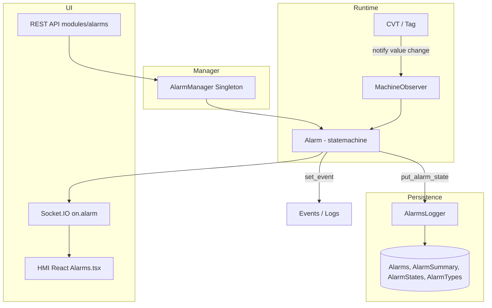

# Auditoría del módulo de alarmas — cumplimiento ISA-18.2

**Proyecto:** PyAutomation (`automation/`)  
**Fecha:** 2026-06-20  
**Alcance:** `automation/alarms/`, `automation/managers/alarms.py`, `automation/logger/alarms.py`, `automation/modules/alarms/`, documentación API y tests asociados  
**Referencia normativa:** ANSI/ISA-18.2-2016 — *Management of Alarm Systems for the Process Industries*

---

## 1. Resumen ejecutivo

PyAutomation implementa un **núcleo de gestión de alarmas alineado parcialmente con ISA-18.2**, centrado en la **máquina de estados de alarmas** (7 estados estándar), la **evaluación en tiempo real** vinculada a tags del CVT, la **persistencia en base de datos**, la **API REST**, la **notificación Socket.IO** y un **HMI React** básico.

La implementación es **sólida como base técnica de SCADA/HMI**, pero **no cumple de forma integral** los requisitos de ISA-18.2 para un sistema de gestión de alarmas industrial “fully approved”. Faltan capacidades de **ciclo de vida completo** (filosofía, racionalización, MOC, monitorización/KPIs), **priorización operativa**, **prevención de inundación**, **acciones normativas completas** (`silence`, `disable`), **parámetros de diseño aplicados en runtime** (deadband, delays) y **cobertura de pruebas** suficiente.

| Dimensión | Valoración |
|---|---|
| Modelo de estados ISA-18.2 | ✅ Alto |
| Transiciones y acciones de operador | ⚠️ Parcial |
| Evaluación de condición de alarma | ⚠️ Parcial |
| Persistencia e historial | ⚠️ Parcial |
| Monitorización y KPIs (ISA-18.2 §10) | ❌ No implementado |
| Ciclo de vida / gobernanza (filosofía, racionalización, MOC) | ❌ Fuera de alcance del código |
| Calidad de código y tests | ⚠️ Baja–media |
| **Veredicto global** | **Parcialmente conforme — no apto para certificación ISA-18.2 completa sin trabajo adicional** |

---

## 2. Alcance y metodología

### 2.1 Componentes analizados

| Capa | Archivos / rutas | Rol |
|---|---|---|
| Dominio | `automation/alarms/__init__.py`, `states.py`, `trigger.py` | Clase `Alarm`, estados, triggers HH/H/L/LL/BOOL |
| Orquestación | `automation/managers/alarms.py` | Singleton `AlarmManager`: CRUD, validación, Socket.IO |
| Persistencia | `automation/logger/alarms.py` | `AlarmsLogger`: tablas, `AlarmSummary`, catálogos |
| API | `automation/modules/alarms/resources/` | Endpoints REST para operador |
| Documentación | `docs/Developments_Guide/API/alarms/index.md` | Declaración de cumplimiento ISA-18.2 |
| Tests | `automation/tests/test_alarms.py` | Cobertura mínima del ciclo ack |

### 2.2 Criterio de evaluación

Se contrastó el código contra los **10 elementos del ciclo de vida** de ISA-18.2:

1. Filosofía de alarmas  
2. Identificación  
3. Racionalización  
4. Diseño detallado  
5. Implementación  
6. Operación  
7. Mantenimiento  
8. Gestión del cambio (MOC)  
9. Monitorización y evaluación  
10. Auditoría y mejora continua  

Además se verificaron los **7 estados normativos**, sus **4 atributos** (condición de proceso, estado de alarma, anunciación, reconocimiento) y las **acciones de operador** documentadas en la norma y en la propia documentación del proyecto.

---

## 3. Arquitectura implementada



### 3.1 Flujo de evaluación

1. Al crear una alarma, `Alarm.attach()` registra un `MachineObserver` sobre el tag asociado.  
2. Cada cambio de valor invoca `Alarm.notify(tag, value, timestamp)`.  
3. `notify()` compara el valor con el setpoint (`TriggerType`) y dispara `abnormal_condition()` o `normal_condition()`.  
4. Las transiciones usan `python-statemachine` con nombres explícitos (`normal_to_unack_alarm`, etc.).  
5. Entradas a estados especiales invocan decoradores `@put_alarm_state` (BD) y `@set_event` (auditoría).  
6. El frontend recibe actualizaciones vía Socket.IO.

### 3.2 Estados modelados (conformes al modelo ISA)

Los siete estados están definidos en `states.py` con mnemónicos estándar:

| Mnemónico | Estado | Implementado |
|---|---|---|
| NORM | Normal | ✅ |
| UNACK | Unacknowledged | ✅ |
| ACKED | Acknowledged | ✅ |
| RTNUN | RTN Unacknowledged | ✅ |
| SHLVD | Shelved | ✅ |
| DSUPR | Suppressed by Design | ✅ |
| OOSRV | Out of Service | ✅ |

Cada estado expone los cuatro atributos ISA mediante `AlarmAttrs`: condición de proceso, estado de alarma, anunciación y reconocimiento.

---

## 4. Matriz de cumplimiento ISA-18.2

| Requisito ISA-18.2 | Estado | Evidencia en código |
|---|---|---|
| **1. Filosofía de alarmas** | ❌ N/A software | No hay módulo de documentación/gestión de filosofía |
| **2. Identificación de alarmas** | ⚠️ Parcial | CRUD vía `AlarmManager.append_alarm`, tipos HH/H/L/LL/BOOL |
| **3. Racionalización** | ❌ | Sin registro de justificación, prioridad de diseño, consecuencias |
| **4. Diseño detallado — estados** | ✅ | `Alarm` + `AlarmState` + diagrama en docs |
| **4. Diseño — deadband / on-off delay** | ❌ Declarado, no aplicado | Parámetros en constructor; `notify()` no los usa |
| **4. Diseño — prioridad de alarma** | ❌ | No existe campo `priority` en modelo de alarma |
| **5. Implementación — evaluación runtime** | ⚠️ Parcial | Observer pattern funcional; sin anti-chatter |
| **5. Implementación — acciones operador** | ⚠️ Parcial | ack, shelve, suppress, OOS; faltan silence/disable |
| **6. Operación — HMI alarm list** | ⚠️ Parcial | HMI + API; sin ISA-101 avanzado |
| **6. Operación — shelving temporal** | ⚠️ Parcial | `shelve()` con expiración UTC; bugs en unshelve |
| **7. Mantenimiento** | ⚠️ Parcial | Persistencia BD; sin herramientas de diagnóstico |
| **8. MOC (Management of Change)** | ⚠️ Parcial | Eventos `@set_event` en cambios; sin workflow MOC |
| **9. Monitorización — KPIs** | ❌ | Sin alarm rate, flood, standing, chattering, top N |
| **9. Monitorización — auditoría completa** | ⚠️ Parcial | Events + AlarmSummary incompleto |
| **10. Pruebas FAT/SAT de alarmas** | ❌ | 3 tests unitarios básicos |

---

## 5. Fortalezas (Pros)

### 5.1 Modelo de estados fiel a ISA-18.2

- Implementación explícita de los **7 estados** con mnemónicos, nombres y atributos documentados.  
- Uso de **`python-statemachine`**, lo que hace las transiciones **declarativas, trazables y extensibles**.  
- Diagrama Mermaid en documentación alineado con el código real.  
- Soporte de **Return-to-Normal Unacknowledged (RTNUN)**, estado frecuentemente omitido en implementaciones simplificadas.

### 5.2 Acciones de operador nucleares implementadas

| Acción | Método | Auditoría `@set_event` | Persistencia estado |
|---|---|---|---|
| Acknowledge | `acknowledge()` | ✅ | ✅ + `AlarmSummary.ack_timestamp` |
| Shelve | `shelve()` | ✅ | ✅ |
| Unshelve | `unshelve()` | ✅ | ⚠️ Bug en re-evaluación |
| Suppress by design | `designed_suppression()` | ✅ | ✅ |
| Unsuppress | `designed_unsuppression()` | ✅ | ✅ |
| Out of service | `remove_from_service()` | ✅ | ✅ |
| Return to service | `return_to_service()` | ✅ | ✅ |

### 5.3 Integración runtime robusta

- Patrón **Observer** sobre tags del CVT: las alarmas reaccionan a cambios de proceso sin polling manual.  
- **Validación de umbrales conflictivos** en `AlarmManager.__check_trigger_values()` (evita HH/H/L/LL incoherentes en el mismo tag).  
- **Notificación en tiempo real** vía Socket.IO (`on.alarm`) para HMI.  
- **Singleton `AlarmManager`** coherente con el resto de la arquitectura PyAutomation.

### 5.4 Persistencia y trazabilidad base

- Tablas `Alarms`, `AlarmSummary`, catálogos `AlarmTypes` / `AlarmStates`.  
- Decorador `@put_alarm_state` sincroniza estado en BD al entrar en estados clave.  
- Integración con **Events** y **Logs** para acciones de usuario (ack, shelve, etc.).  
- API REST modular en `modules/alarms/resources/`.

### 5.5 Tipos de alarma industriales estándar

- Triggers **HH, H, L, LL, BOOL** con evaluación clara en `notify()`.  
- Serialización JSON completa (`serialize()`) incluyendo setpoint, timestamps y acciones disponibles.

### 5.6 Documentación técnica existente

- Guía de desarrollo en `docs/Developments_Guide/API/alarms/index.md` con referencia explícita a ISA-18.2.  
- Lista honesta de **funcionalidades pendientes** en la propia documentación (prioridad, correlación, KPIs, etc.).

---

## 6. Debilidades y brechas (Contras)

### 6.1 Ciclo de vida ISA-18.2 incompleto

ISA-18.2 no es solo una máquina de estados: exige un **programa de gestión de alarmas** completo. El módulo cubre principalmente **implementación y operación básica**, pero no:

- **Filosofía de alarmas** documentada y enforced.  
- **Racionalización** (justificación, prioridad, operador esperado, tiempo de respuesta).  
- **Monitorización continua** con KPIs (standing alarms, alarm rate, flood periods, chattering index).  
- **Procedimientos de respuesta** vinculados a cada alarma.  
- **Herramientas de prueba** (simulación, FAT/SAT automatizado).

### 6.2 Parámetros de diseño no aplicados en runtime

El constructor de `Alarm` acepta:

```python
alarm_deadband, alarm_on_delay, alarm_off_delay
```

Estos valores se almacenan pero **`notify()` los ignora por completo**. Esto contradice:

- Recomendaciones ISA-18.2 sobre **anti-chatter** (deadband).  
- Filtrado de **condiciones transitorias** (on/off delay).  
- La propia documentación del proyecto (“Implement Deadbands”, “Use Delays Appropriately”).

**Impacto:** alarmas ruidosas, posible **alarm flooding** y falsos positivos en variaciones rápidas del PV.

### 6.3 Acciones normativas declaradas pero no implementadas

En `states.py`, el mapa `ACTIONS` incluye:

- **`silence`** — listado para Unacknowledged; **sin método ni transición**.  
- **`disable`** — listado en varios estados; **sin implementación**.

La documentación API también menciona **Disable** como acción en estado Normal. El operador no puede ejecutarlas vía `get_operator_actions()` ni REST.

### 6.4 Priorización ausente en el modelo de alarma

ISA-18.2 exige **prioridades de alarma** (p. ej. Emergency, High, Medium, Low, Diagnostic) como parte del diseño y la operación. En PyAutomation:

- `priority` aparece en eventos de auditoría (`@set_event(priority=2)`) como valor **fijo**, no por alarma.  
- No hay campo de prioridad en `Alarms` ni en `Alarm.serialize()`.  
- El HMI no puede filtrar/ordenar por criticidad real de la alarma.

### 6.5 Prevención de inundación y correlación

No implementado:

- **Alarm flood suppression** (supresión temporal automática ante tasas altas).  
- **First-out annunciation**.  
- **Agrupación / correlación** de alarmas relacionadas.  
- **Dynamic suppression** basada en estado de planta u otras alarmas.

Estos son requisitos/recomendaciones centrales de ISA-18.2 para operabilidad en planta.

### 6.6 Historial `AlarmSummary` incompleto

- `put_record_on_alarm_summary()` se invoca principalmente en **activación** (`on_enter_unack_alarm`) y **acknowledge**.  
- Transiciones a **Shelved, Suppressed, Out of Service** no generan registros de historial equivalentes.  
- Dificulta reconstruir la **línea de tiempo completa** exigida para auditorías y KPIs.

### 6.7 `get_operator_actions()` incorrecto en estado Shelved

Para `current_state == "shelved"`, el método cae en el `else` genérico y ofrece Shelve / Suppress / OOS en lugar de la acción normativa **`reset`** (documentada en `ACTIONS["Shelved"]`).

### 6.8 Calidad de código — bugs identificados

| Bug | Ubicación | Severidad |
|---|---|---|
| `unshelve()` llama `self.update(current_value)` — **método inexistente** | `alarms/__init__.py:378` | 🔴 Alta — fallo en unshelve manual o por expiración |
| `get_alarm_by_tag()` compara `tag == alarm.tag` (objeto vs string) | `managers/alarms.py:329` | 🔴 Alta — siempre vacío |
| `get_tag_alarms()` usa `_alarm.tag_alarm` — **atributo inexistente** | `managers/alarms.py:391` | 🔴 Alta — AttributeError |
| `Alarm.put()` asigna `self._name`, `self._tag` en lugar de propiedades reales | `alarms/__init__.py:479-484` | 🟠 Media — update silencioso incorrecto |
| Cola `_tag_queue` y `execute()` aparentemente **sin consumidor** | `managers/alarms.py` | 🟡 Baja — código muerto |

### 6.9 Cobertura de tests insuficiente

`automation/tests/test_alarms.py` contiene **3 tests** que cubren:

- Creación en estado Normal.  
- Ciclo UNACK → ACK → Normal (vía atributo `state` y vía `current_state`).

**No se prueban:** shelve/unshelve, suppress, OOS, RTNUN, BOOL, deadband, delays, API REST, persistencia, Socket.IO, ni regresión de bugs anteriores.

### 6.10 HMI y ISA-101

El HMI React (`hmi/src/pages/Alarms.tsx`) ofrece listado básico. Para cumplimiento operativo ISA-18.2 + ISA-101 se esperaría:

- Codificación por prioridad y estado.  
- Resumen de alarmas activas vs total.  
- Indicadores de flood / rate.  
- Acceso rápido a procedimiento de respuesta.  
- Consistencia de acciones disponibles con la máquina de estados.

---

## 7. Evaluación por capa

### 7.1 Capa de dominio (`automation/alarms/`)

| Aspecto | Nota |
|---|---|
| Modelo de estados | 9/10 |
| Transiciones | 8/10 |
| Evaluación de trigger | 6/10 (sin deadband/delay) |
| Acciones operador | 6/10 (incompletas + bugs) |
| Extensibilidad | 8/10 |

### 7.2 Capa de gestión (`managers/alarms.py`)

| Aspecto | Nota |
|---|---|
| CRUD y validación | 7/10 |
| Consultas auxiliares | 4/10 (bugs en getters) |
| Integración Socket.IO | 7/10 |
| Código muerto | 5/10 |

### 7.3 Capa de persistencia (`logger/alarms.py`)

| Aspecto | Nota |
|---|---|
| Esquema BD | 7/10 |
| Historial de eventos | 5/10 |
| Catálogos ISA | 8/10 |

### 7.4 Capa API / HMI

| Aspecto | Nota |
|---|---|
| REST endpoints | 7/10 |
| Tiempo real | 7/10 |
| Experiencia operador ISA | 5/10 |

---

## 8. Comparativa: documentación vs realidad

La documentación en `docs/Developments_Guide/API/alarms/index.md` declara cumplimiento ISA-18.2 y lista explícitamente gaps. La auditoría **confirma** esa autoevaluación:

| Feature documentada como pendiente | Confirmado en código |
|---|---|
| Alarm Priority Management | ✅ Ausente en modelo |
| Alarm Grouping and Correlation | ✅ Ausente |
| Dynamic Alarm Suppression | ✅ Solo suppress-by-design estático |
| Alarm Response Procedures | ✅ Ausente |
| Monitoring Dashboard / KPIs | ✅ Ausente |
| Audit Trail completo | ✅ Parcial |
| Testing and Validation tools | ✅ Ausente |

La documentación es **más precisa que una afirmación genérica de “cumple ISA-18.2”**, pero el mensaje comercial debería acotarse a: *“implementa el modelo de estados ISA-18.2”*, no *“sistema de gestión de alarmas certificable ISA-18.2”*.

---

## 9. Roadmap recomendado hacia aprobación completa

Priorizado por impacto en conformidad normativa:

### Fase 1 — Correcciones críticas (bloqueantes)

1. **Corregir `unshelve()`**: reemplazar `self.update()` por `self.notify()` o re-evaluación explícita con deadband/delay.  
2. **Corregir `get_alarm_by_tag()`**: comparar `tag == alarm.tag.name`.  
3. **Corregir `get_tag_alarms()`**: usar `alarm.tag` o `alarm.tag.name`.  
4. **Corregir `Alarm.put()`**: actualizar propiedades `@property` reales y persistir vía logger.  
5. **Corregir `get_operator_actions()`** para estado `shelved` → `{"Reset": "reset"}` o unshelve explícito.

### Fase 2 — Diseño detallado (ISA §4)

6. **Implementar deadband, on_delay, off_delay** en `notify()` con timers por alarma.  
7. **Añadir campo `priority`** a `Alarms` (enum ISA) y propagar a HMI/API.  
8. **Implementar `silence` y `disable`** con semántica ISA-18.2 o eliminarlos de docs/ACTIONS.  
9. **Completar `AlarmSummary`** para todas las transiciones de estado.

### Fase 3 — Operación y monitorización (ISA §6, §9)

10. **KPIs mínimos**: alarm rate/min, standing alarms, top 10, % tiempo en flood.  
11. **Dashboard de monitorización** (puede ser vista HMI + endpoints agregados).  
12. **Alarm flood suppression** configurable.  
13. **First-out** y/o correlación básica por tag/equipo.

### Fase 4 — Gobernanza (ISA §1–3, §8)

14. **Módulo de racionalización**: formulario con justificación, prioridad, operador, consecuencias.  
15. **Workflow MOC** para cambios de setpoint/tipo/prioridad.  
16. **Enlaces a procedimientos** de respuesta (SOP) por alarma.  
17. **Suite de pruebas** FAT: simulador de PV, casos de borde, regresión de estados.

### Fase 5 — Validación formal

18. **Matriz de trazabilidad** requisito ISA → test → evidencia.  
19. **Revisión HMI** contra ISA-101 (prioridad visual, navegación, carga cognitiva).  
20. **Auditoría externa** o assessment según checklist ISA-18.2 TR104.00.xx.

---

## 10. Conclusión

### Veredicto

PyAutomation posee una **implementación técnicamente madura del núcleo de estados ISA-18.2**, superior a muchos SCADA mínimos que solo distinguen “activo/inactivo”. La arquitectura (Observer + statemachine + persistencia + tiempo real) es **adecuada como plataforma** para evolucionar hacia cumplimiento pleno.

Sin embargo, **no debe considerarse “fully approved” según ISA-18.2** en su estado actual porque:

1. Faltan **mecanismos anti-ruido** (deadband/delays) pese a estar modelados.  
2. Faltan **priorización, KPIs y flood management**.  
3. Hay **acciones documentadas sin implementar** y **bugs en rutas operativas** (unshelve, consultas por tag).  
4. El **historial y la trazabilidad** no cubren el ciclo completo.  
5. No existe **programa de racionalización/MOC/monitorización** que la norma exige a nivel de sistema de gestión.

### Calificación resumida

| Categoría | % estimado de cumplimiento ISA-18.2 |
|---|---|
| Modelo de estados y transiciones | ~85% |
| Diseño detallado (parámetros, prioridad) | ~30% |
| Operación (acciones, HMI) | ~55% |
| Monitorización y KPIs | ~5% |
| Ciclo de vida / gobernanza | ~10% |
| **Global ponderado** | **~35–40%** |

### Recomendación final

**Aprobar para uso interno / demo / SCADA básico** con conocimiento de limitaciones.  
**No aprobar para planta regulada o auditoría ISA-18.2 formal** hasta completar al menos Fases 1–3 del roadmap y documentar filosofía + racionalización fuera del código.

---

## 11. Referencias

- ANSI/ISA-18.2-2016 — Management of Alarm Systems for the Process Industries  
- ISA-TR18.2.3 — Basic Alarm Design  
- ISA-TR18.2.4 — Enhanced and Advanced Alarm Methods  
- ISA-101 — Human Machine Interfaces for Process Automation Systems  
- Documentación interna: [`docs/Developments_Guide/API/alarms/index.md`](Developments_Guide/API/alarms/index.md)  
- Auditoría industrial previa: [`docs/resumen-auditoria-industrial-pyautomation.md`](resumen-auditoria-industrial-pyautomation.md) §5.4

---

*Documento generado por auditoría estática de código. No sustituye un assessment formal en planta (FAT/SAT, entrevistas con operadores, revisión de filosofía de alarmas del sitio).*
