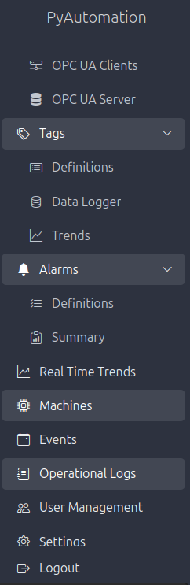
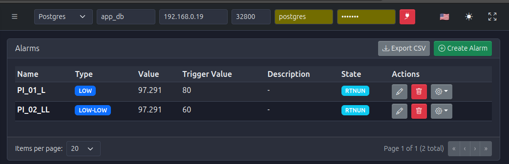

# PyAutomation 2.0.0

  <h2 style="color: #6366f1; font-size: 2.5em; margin-bottom: 0.5em;">
    Industrial Automation Meets Modern Web Technology
  </h2>
  

    Empowering Industry 4.0 with Python, React, and Open Standards
  

*Figure 1: PyAutomation 2.0.0 - Modern React-based Human Machine Interface (HMI)*

---

## 🚀 Welcome to PyAutomation 2.0.0

**PyAutomation** is a comprehensive, enterprise-grade Python framework designed for Industrial IoT (IIoT) and Automation projects. Version 2.0.0 represents a **major milestone** in our commitment to excellence, introducing a revolutionary **modern React-based web interface** that combines powerful industrial automation capabilities with an exceptional user experience.

### Our Commitment to Excellence

At PyAutomation, we are committed to delivering:

*   **World-Class User Experience**: Modern, intuitive interfaces built with cutting-edge web technologies
*   **Industrial-Grade Reliability**: Robust architecture designed for mission-critical applications
*   **Standards Compliance**: Adherence to industry standards (ISA-18.2, OPC UA) for seamless integration
*   **Continuous Innovation**: Regular updates and feature enhancements based on user feedback
*   **Open Architecture**: Extensible framework that grows with your needs

---

## What is PyAutomation?

PyAutomation serves as the **bridge between Operational Technology (OT) and Information Technology (IT)**, enabling seamless integration of industrial systems with modern web applications and data analytics platforms.

### Core Philosophy

*   **Connect**: Integrate with industrial hardware (PLCs, Sensors, RTUs) via standard protocols
*   **Process**: Real-time data processing using efficient state machines and in-memory databases
*   **Store**: Comprehensive historical data logging for analysis, compliance, and trending
*   **Visualize**: Modern web-based visualization with real-time updates
*   **Monitor**: Enterprise-grade alarm management and event tracking
*   **Control**: Secure user management and role-based access control

*Figure 2: PyAutomation's modular architecture provides comprehensive industrial automation capabilities*

---

## What You Can Do with PyAutomation 2.0.0

### 🔍 **Sistema de Monitoreo (Monitoring System)**

Comprehensive real-time monitoring of all your industrial processes with intuitive dashboards and live data visualization.

**Key Features:**
*   Real-time tag value monitoring
*   Multi-connection OPC UA client support
*   Visual process overview dashboards
*   Live status indicators
*   Customizable monitoring views

*Figure 3: Comprehensive tag monitoring and management interface*

---

### 📊 **Tendencias en Tiempo Real (Real-Time Trends)**

Advanced strip chart visualization for live process monitoring with configurable dashboards and multiple chart support.

**Key Features:**
*   Multiple configurable strip charts
*   Drag-and-drop dashboard customization
*   Multiple tags per chart with dual Y-axes
*   Configurable buffer sizes
*   Edit and Production modes
*   Persistent layout saving

*Figure 4: Real-time strip charts displaying live process data with multiple variables*

---

### 🚨 **Gestión de Alarmas (Alarm Management)**

Enterprise-grade alarm management system following ISA-18.2 standards, ensuring operational safety and compliance.

**Key Features:**
*   Multiple alarm types (BOOL, HIGH, LOW, HIGH-HIGH, LOW-LOW)
*   Complete state lifecycle management
*   Alarm acknowledgment and shelving
*   Comprehensive alarm history
*   Export capabilities for compliance reporting
*   Real-time alarm status updates

*Figure 5: Advanced alarm management dashboard with real-time status monitoring*

---

### 💾 **DataLogging (Historical Data Logging)**

Comprehensive historical data logging for trend analysis, compliance, and process optimization.

**Key Features:**
*   Multi-database support (PostgreSQL, MySQL, SQLite)
*   Configurable sampling rates
*   Flexible data filtering and export
*   Long-term data retention
*   Trend analysis capabilities

*Figure 6: Historical data logging with flexible filtering and analysis tools*

---

### 👥 **Gestión de Usuarios (User Management)**

Robust user management with role-based access control (RBAC) for secure system operation.

**Key Features:**
*   Role-based access control (Admin, Operator, Guest)
*   Secure password management
*   User administration and auditing
*   Permission-based view access
*   Complete audit trail

*Figure 7: User management interface with role-based access control*

---

## 🎯 Key Capabilities & Architecture

### Technical Excellence

*   **Concurrency**: Run multiple control loops and monitoring tasks in parallel without blocking
*   **State Machine Framework**: Define complex logic using finite state machines for sequential control
*   **Real-Time Data**: Current Value Table (CVT) ensures latest data is always available
*   **Extensible Architecture**: Modular design allows easy integration of new drivers and loggers
*   **Modern Web Stack**: React-based frontend with RESTful API backend
*   **OPC UA Integration**: Native support for OPC UA client and server functionality

### Performance & Scalability

*   **High Performance**: Optimized for real-time data processing
*   **Scalable**: From small deployments to enterprise-level systems
*   **Efficient**: Low resource footprint with intelligent caching
*   **Reliable**: Robust error handling and recovery mechanisms

---

## 🔮 Coming Soon

### Próximas Funcionalidades (Upcoming Features)

We are continuously working to enhance PyAutomation. In upcoming releases, you can expect:

#### **Acceso Configurable a Diagramas SCADA**
*   Customizable SCADA diagram access
*   Visual process flow diagrams
*   Interactive process visualization
*   Custom diagram creation tools

#### **Control de Acceso a Vistas Basados en Roles**
*   Role-based view access control
*   Customizable dashboard permissions
*   User-specific view configurations
*   Enhanced security and access management

---

## 🚧 Future Releases

### Additional Industrial Protocols

We are committed to expanding protocol support to meet diverse industrial needs:

*   **Modbus TCP**: Direct integration with Modbus-enabled devices
*   **MQTT**: IoT and cloud connectivity support
*   **Additional Protocols**: Continuous expansion based on industry needs

### Continuous Improvement

Our roadmap includes:

*   Enhanced visualization capabilities
*   Advanced analytics and reporting
*   Cloud integration features
*   Mobile application support
*   Machine learning integration
*   Advanced security features

---

## 🏆 Why Choose PyAutomation 2.0.0?

### Modern Technology Stack

*   **React-Based Interface**: Fast, responsive, and intuitive user experience
*   **Python Backend**: Powerful, flexible, and easy to extend
*   **Open Standards**: OPC UA, ISA-18.2 compliance
*   **Docker Ready**: Easy deployment and scaling

### Enterprise Features

*   **Comprehensive Monitoring**: Real-time and historical data visualization
*   **Alarm Management**: Industry-standard alarm handling
*   **User Management**: Secure, role-based access control
*   **Data Logging**: Reliable historical data storage
*   **Event Tracking**: Complete audit trails

### Developer Friendly

*   **Well-Documented**: Extensive documentation and examples
*   **Modular Architecture**: Easy to extend and customize
*   **API Access**: RESTful API for integration
*   **Open Source**: Community-driven development

---

## 💥 The Open Source Revolution: Enterprise Power, Zero Cost

<h2 style="color: white; font-size: 2.5em; margin-bottom: 0.5em; text-shadow: 2px 2px 4px rgba(0,0,0,0.3);">
  🚀 Industrial Automation Power in Your Hands
</h2>

<h3 style="color: white; font-size: 1.8em; margin-top: 1em; margin-bottom: 1.5em; font-weight: 300;">
  FREE. FOREVER. POWERFUL.
</h3>

### The Traditional SCADA Problem

Traditional industrial SCADA systems come with a **massive price tag**:

*   **Proprietary Licensing**: Expensive per-seat or per-tag licensing models
*   **Vendor Lock-In**: Difficult to migrate or customize
*   **High Initial Costs**: Six-figure investments for enterprise deployments
*   **Ongoing Fees**: Annual maintenance and support contracts
*   **Limited Flexibility**: Rigid architectures that resist change

**Result**: Many organizations are locked out of enterprise-grade industrial automation due to cost barriers.

### The PyAutomation Solution

<h3 style="color: white; font-size: 1.8em; margin-bottom: 1em;">
  💎 Enterprise-Grade Features. Zero Cost. Open Source.
</h3>

  <strong>PyAutomation delivers the same industrial automation power as traditional SCADA systems</strong>—monitoring, alarm management, data logging, real-time trends, and more—<strong>completely FREE</strong>.

#### Why Open Source Wins

*   **💰 Zero Licensing Costs**: No per-seat, per-tag, or annual fees
*   **🔓 Complete Freedom**: Full source code access for customization
*   **🌍 Community-Driven**: Continuous improvement through global collaboration
*   **⚡ Rapid Innovation**: Faster feature development than proprietary systems
*   **🔧 Full Control**: Modify, extend, and adapt to your exact needs
*   **📈 Scalable**: From small projects to enterprise deployments—no cost increase

#### Competing with the Giants

  <strong>We're a startup, but we're not small in ambition.</strong>

  Through the power of <strong>Open Source</strong>, PyAutomation competes directly with established SCADA vendors. Our commitment to open standards, modern technology, and community collaboration allows us to deliver <strong>enterprise-grade industrial automation</strong> that rivals—and often exceeds—proprietary solutions costing hundreds of thousands of dollars.

  <strong>You get the same power. You get the same reliability. You get the same features.</strong>

  But you pay $0. Forever.

### What This Means for You

<h4 style="color: #667eea; font-size: 1.3em; margin-bottom: 0.5em;">🏭 Small Businesses</h4>

Access enterprise-grade automation without breaking the budget

<h4 style="color: #667eea; font-size: 1.3em; margin-bottom: 0.5em;">🏢 Enterprises</h4>

Deploy across multiple sites without licensing constraints

<h4 style="color: #667eea; font-size: 1.3em; margin-bottom: 0.5em;">🎓 Educational</h4>

Teach industrial automation without expensive software licenses

<h4 style="color: #667eea; font-size: 1.3em; margin-bottom: 0.5em;">🔬 Research</h4>

Customize and extend for research projects without restrictions

### The Bottom Line

<h2 style="color: white; font-size: 2.2em; margin-bottom: 1em; text-shadow: 2px 2px 4px rgba(0,0,0,0.3);">
  Industrial Automation Should Be Accessible to Everyone
</h2>

  Not just for companies with million-dollar budgets.

  PyAutomation proves that <strong>world-class industrial automation</strong> can be <strong>free, open, and powerful</strong>.

  Start today. Pay nothing. Get everything.

---

## 📚 Getting Started

### For Operators and Engineers

1.   **Quick Start**: 
     *   Follow our [Quick Start Guide](Users_Guide/QuickStart.md) to get up and running with Docker
     *   Set up your first database connection
     *   Configure OPC UA clients

2.   **User Guide**: 
     *   Explore the comprehensive [User Guide](Users_Guide/index.md)
     *   Learn about Tags, Alarms, Database management, and more
     *   Master real-time trends and monitoring

3.   **Best Practices**: 
     *   Review recommended practices for each module
     *   Understand security considerations
     *   Optimize performance settings

### For Developers

1.   **Architecture**: 
     *   Study the [Architecture Overview](architecture.md) to understand system design
     *   Review [Core Concepts](Developments_Guide/core/index.md) for fundamental understanding

2.   **API Reference**: 
     *   Explore the [API Documentation](Developments_Guide/API/index.md)
     *   Learn about state machines, CVT, alarms, and more
     *   Understand extension points

3.   **Development Guide**: 
     *   Review the [Developer's Guide](Developments_Guide/index.md)
     *   Learn about industrial standards and best practices
     *   Understand testing and deployment strategies

---

## 🌟 Our Vision

PyAutomation 2.0.0 represents our commitment to **excellence in industrial automation**. We believe that modern industrial systems should combine:

*   **Reliability** of traditional SCADA systems
*   **Flexibility** of modern web technologies
*   **Openness** of standard protocols
*   **Usability** of consumer applications

We are dedicated to continuously improving PyAutomation, listening to our community, and delivering features that matter to industrial automation professionals worldwide.

---

## 🤝 Join the Community

PyAutomation is more than software—it's a community of professionals committed to advancing industrial automation. Whether you're an operator, engineer, or developer, we welcome you to:

*   Explore our comprehensive documentation
*   Share your feedback and suggestions
*   Contribute to the project
*   Help shape the future of PyAutomation

---

  <h2 style="color: white; margin-bottom: 1em;">
    Ready to Transform Your Industrial Automation?
  </h2>
  

    Start your journey with PyAutomation 2.0.0 today
  

  

    Experience the power of modern industrial automation with a world-class user interface
  

---

**Welcome to PyAutomation 2.0.0 - Where Industrial Excellence Meets Modern Innovation!**
