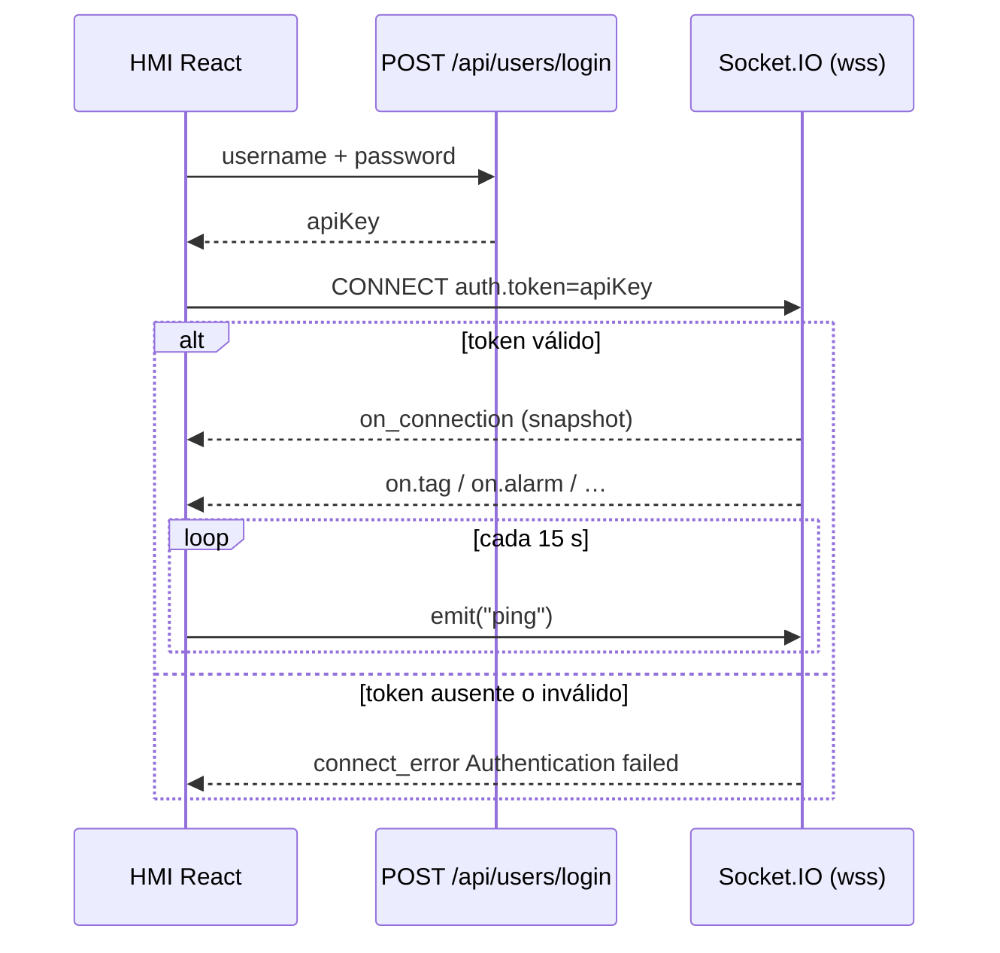

# Cliente HMI Socket.IO (React) contra PyAutomationIO

Guía para un HMI React (navegador, Electron o Node) que debe recibir `on.tag` en tiempo real y **mantener viva** la sesión con el backend PyAutomationIO.

Referencias de código:

| Pieza | Ruta |
|---|---|
| Receta mínima verificada | `snippets/on-tag-wss/on-tag-listener.ts` |
| HMI embebida (referencia) | `hmi/src/services/socket.ts` |
| Hook React de la HMI | `hmi/src/hooks/useSocket.ts` |
| Gate de autenticación | `automation/utils/hmi_socket_audit.py` (`attempt_hmi_socket_connect`) |
| Servidor Socket.IO | `automation/core.py` (`define_socketio`) |
| Consola iDetectFugas (estado actual) | `gitlab/intelcon/iDetectFugas-console/src/services/socket.ts` |

Dependencia: `socket.io-client` **^4.7** (mismo major que la HMI). El servidor usa Engine.IO v4 + Flask-SocketIO (`async_mode=gevent`).

---

## 1. Contrato que el backend exige

El handshake **no** usa `X-API-KEY`. Ese header solo vale para REST (`/api/...`).

Socket.IO exige el token en el paquete de autenticación del cliente:

```ts
auth: { token: apiKey, reconnect: false }
```

Flujo:

1. `POST {origen}/api/users/login` con `{ username, password }`.
2. El cuerpo trae `apiKey` (token de sesión).
3. `io(origenHttps, { auth: (cb) => cb({ token: apiKey, reconnect }) })`.
4. El servidor llama `attempt_hmi_socket_connect`. Sin token válido lanza `ConnectionRefusedError("Authentication failed")`.
5. Si el auth pasa, emite **solo a ese `sid`** el snapshot `on_connection` (tags, alarms, machines, últimos eventos).
6. A partir de ahí fluye `on.tag`, `on.alarm`, `on.machine`, `on.event`, `on.log`.

URL Socket.IO = **origen HTTPS del backend**, no `/api`. Ejemplo: `https://192.168.1.80:8050`. El cliente escala solo a `wss://…/socket.io/`.



---

## 2. Puntos clave para que la conexión viva

### 2.1 Autenticación en cada handshake (no un objeto estático ciego)

Usar **callback** de `auth`, igual que la HMI. Así cada reconnect relee el token actual y marca `reconnect: true` si ya hubo un `disconnect` en esta sesión.

```ts
auth: (cb) => {
  cb({ token: getApiKey(), reconnect: alreadyHadDisconnect });
}
```

Si el token cambia (nuevo login), hay que `socket.auth = …` y `socket.disconnect()` + `socket.connect()`. No crear un segundo `io()`.

`connect_error` con mensaje `Authentication failed` → sesión inválida o sustituida. Cerrar sesión local y volver al login. No reintentar en bucle con el mismo token muerto.

### 2.2 Transportes

```ts
transports: ["websocket", "polling"]
```

Igual que `hmi/src/services/socket.ts`. **No** usar solo `websocket` + `upgrade: false`: si el upgrade WSS falla, el cliente se queda en `connect_error websocket error` para siempre. El polling es el fallback del Engine.IO.

### 2.3 Reconexión del transporte (Engine.IO)

El servidor configura `ping_interval=15` s y `ping_timeout=30` s. Un peer muerto se detecta en ≤ 45 s.

En el cliente:

```ts
reconnection: true
reconnectionAttempts: Infinity
reconnectionDelay: 500
reconnectionDelayMax: 5000
timeout: 15000
```

Esto mantiene el **socket TCP/WSS**. No sustituye el heartbeat de aplicación del punto siguiente.

### 2.4 Heartbeat de aplicación (`emit("ping")`)

Independiente del ping Engine.IO. La HMI emite `ping` cada **15 s** mientras `socket.connected`. El servidor actualiza `hmi_sessions.last_heartbeat`. Un worker borra sesiones huérfanas (~2 min sin heartbeat).

Sin este `ping`, el transporte puede seguir arriba y aun así la fila de sesión caduca; la consola de planta deja de contar el cliente como HMI vivo.

```ts
setInterval(() => {
  if (socket.connected) socket.emit("ping");
}, 15_000);
```

Arrancar el intervalo en `connect`; pararlo en `disconnect`.

### 2.5 Un solo cliente Socket.IO (singleton)

- Un `io()` por ventana / proceso.
- Si el socket existe pero está caído: `socket.connect()`, no un `io()` nuevo.
- `connectSocket()` de la consola hoy hace lo contrario: si `socket` existe y `!connected`, crea otro cliente **sin** `disconnect()` del anterior. Tras flapping de red quedan N websockets y N handlers `on.tag`.

### 2.6 Suscribirse antes de `connect()`

`on_connection` se emite **una vez** justo después del auth. Si el hook React se suscribe tarde, pierde el snapshot.

Patrón HMI: registrar `onConnectionSnapshot` y `on.tag` **antes** de `socket.connect()`.

### 2.7 TLS: navegador vs Node vs Electron

| Runtime | Qué hace el certificado de laboratorio |
|---|---|
| HMI embebida (Chromium) | El operador acepta el cert una vez. `rejectUnauthorized` no aplica. |
| Electron (`iDetectFugas-console/electron/main.js`) | `app.on('certificate-error')` → `callback(true)`. El renderer Chromium confía el cert. |
| Node (`on-tag-listener.ts`) | `engine.io-client` **fuerza** `rejectUnauthorized: true`. `NODE_TLS_REJECT_UNAUTHORIZED=0` basta para `fetch` (login) pero **no** para el WebSocket. Hay que pasar `rejectUnauthorized: false`. |

Un React que corre **en el renderer** (Expo web / Electron) no necesita `rejectUnauthorized`. Un cliente Node o un test `tsx` sí.

### 2.8 Origen HTTP real en Electron

Cargar la UI con `file://` manda `Origin: null` y rompe el handshake. La consola ya sirve el build en `http://127.0.0.1:<puerto>` (`electron/main.js`). Mantener ese patrón.

---

## 3. Receta React (mínima y correcta)

Tras un login exitoso, un único servicio (no un `io()` por componente):

```tsx
import { io, Socket } from "socket.io-client";

const HEARTBEAT_MS = 15_000;

export function createHmiSocket(opts: {
  origin: string;           // https://host:8050  (sin /api)
  getToken: () => string | null;
}): Socket {
  let wasDisconnected = false;
  let heartbeat: ReturnType<typeof setInterval> | null = null;

  const socket = io(opts.origin, {
    autoConnect: false,
    transports: ["websocket", "polling"],
    reconnection: true,
    reconnectionAttempts: Infinity,
    reconnectionDelay: 500,
    reconnectionDelayMax: 5000,
    timeout: 15000,
    auth: (cb) => {
      const token = opts.getToken();
      if (!token) {
        cb({});
        return;
      }
      cb({ token, reconnect: wasDisconnected });
    },
  });

  socket.on("connect", () => {
    wasDisconnected = false;
    heartbeat = setInterval(() => {
      if (socket.connected) socket.emit("ping");
    }, HEARTBEAT_MS);
  });

  socket.on("disconnect", () => {
    wasDisconnected = true;
    if (heartbeat) {
      clearInterval(heartbeat);
      heartbeat = null;
    }
  });

  socket.on("connect_error", (err) => {
    if (String(err.message).includes("Authentication failed")) {
      // token inválido / sesión sustituida → logout
    }
  });

  return socket;
}

// En el árbol autenticado:
//   socket.on("on_connection", hydrateStore);
//   socket.on("on.tag", bufferTag);
//   socket.connect();
// En logout:
//   socket.removeAllListeners();
//   socket.disconnect();
```

REST paralelo: header `X-API-KEY: <apiKey>` (como ya hace `iDetectFugas-console/src/api/client.ts`). Eso **no** autentica el socket.

Eventos de aplicación (nombres exactos):

| Evento | Cuándo |
|---|---|
| `on_connection` | Una vez por handshake OK. Snapshot inicial. |
| `on.tag` | Cada muestra de tag. |
| `on.alarm` | Cambio de alarma. |
| `on.machine` | Estado de máquina. |
| `on.event` / `on.log` | Auditoría. |
| `ping` (emit cliente) | Heartbeat de sesión HMI. |

La HMI embebida además **bufferiza** `on.tag` 250 ms antes de despachar a Redux, para no re-renderizar a 1 Hz × N tags. Un HMI de planta debería hacer lo mismo.

---

## 4. Por qué no funciona hoy en iDetectFugas-console

La consola **sí** hace login REST y guarda `apiKey` (`src/api/auth.ts` + `setApiKey`). El socket **nunca** manda ese token.

### 4.1 Causa que impide conectar (bloqueante)

`src/services/socket.ts` abre el cliente así:

```ts
socket = io(baseUrl, {
  transports: ['websocket', 'polling'],
  reconnection: true,
  reconnectionAttempts: Infinity,
  reconnectionDelay: 1000,
  reconnectionDelayMax: 5000,
});
```

Falta `auth: { token, reconnect }`.

El backend es fail-closed (`resolve_connect_user` → `missing_token` → `CONNECTION_REJECTED`). El renderer verá `connect_error` con `Authentication failed` (o un bucle de reconnects). REST puede ir bien; el tiempo real no.

`App.tsx` llama `connectSocket()` **después** del login, cuando el `apiKey` ya está en memoria. El dato existe; no se usa en el handshake.

Tampoco se reinyecta el token en reconnect. Aunque se añadiera `auth` estático en el primer `io()`, un refresh de sesión dejaría el objeto viejo.

### 4.2 Diferencias frente a la HMI embebida / snippet

| Requisito | HMI embebida / snippet | iDetectFugas-console hoy | Efecto |
|---|---|---|---|
| `auth.token` = `apiKey` del login | Sí (`auth` callback) | No | El servidor rechaza el CONNECT |
| `auth.reconnect` | Sí, tras un `disconnect` | No | Auditoría HMI incorrecta; no es el rechazo |
| `emit("ping")` 15 s | Sí | No | Sesión `hmi_sessions` caduca (~2 min) si alguna vez conectara |
| Singleton: reusar `socket.connect()` | Sí | Crea otro `io()` si `!socket.connected` | Fuga de websockets tras cortes de red |
| Listeners `on.tag` únicos | Fan-out en un servicio | `useTagStore` puede apilar `on` al cambiar de instancia | N handlers por tag |
| Suscribir `on_connection` antes de connect | Sí | `useSocketEvent` sale si `getSocket()` es null | Puede perder el snapshot |
| TLS lab | Navegador / `rejectUnauthorized: false` en Node | Electron acepta cert; renderer OK | No es la causa del rechazo actual |
| `X-API-KEY` en REST | Sí | Sí | Login y listados REST funcionan; el socket no |

### 4.3 Qué hay que cambiar en la consola (orden)

1. **Obligatorio.** En `connectSocket()`, pasar `auth` callback que lea `getApiKey()` y `reconnect`.
2. **Obligatorio.** Si no hay token, no llamar `io()` / `connect()`.
3. Tratar `Authentication failed` como logout.
4. `emit("ping")` cada 15 s con el socket up.
5. Si `socket` ya existe: actualizar `auth` y `connect()`, nunca un segundo cliente sin destruir el anterior (`removeAllListeners` + `disconnect`).
6. En logout: `removeAllListeners`, `disconnect`, reset del tag store (`listenerAttached = false`).
7. Registrar `on_connection` / `on.tag` en el singleton **antes** de `connect()`, no en un `useEffect` que depende de `getSocket()` ya creado.

El TLS de Electron y el servidor local `http://127.0.0.1` ya están bien para este backend. No hace falta copiar `rejectUnauthorized` al renderer.

---

## 5. Cómo comprobar

Snippet Node (laboratorio, cert autofirmado):

```bash
cd snippets/on-tag-wss
npm install
npm run dev
```

Éxito:

```
[login] ok user=…
[socket] connected sid=… transport=websocket
[on_connection] tags=…
[on.tag] { "name": "…", "value": … }
```

En la consola, con el auth todavía ausente, el log `[Socket] Connection error:` debería coincidir con `Authentication failed`. Tras el parche, el mismo log debe desaparecer y llegar `on_connection`.

En el edge, eventos de auditoría:

- `HMI client connected` / `HMI client reconnected`
- `HMI client connection rejected` con `reason=missing_token` (estado actual de la consola)

---

## 6. Anti-patrones

- Mandar el token solo en `extraHeaders` / `X-API-KEY` y esperar que Socket.IO lo lea. El gate usa `auth.token`.
- `transports: ["websocket"]` sin polling.
- Confiar en `NODE_TLS_REJECT_UNAUTHORIZED=0` para WSS en Node.
- Un `io()` por pantalla React.
- Suscribir `on_connection` después de `connect()`.
- Reintentar forever con un token que el servidor ya marcó `SESSION_SUPERSEDED`.
