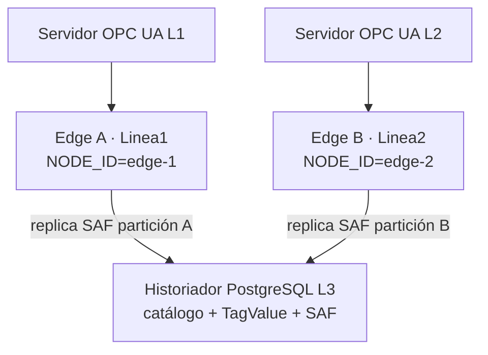

# Documento 01: Arquitectura multi-edge (adquisición particionada)

> Especificación PyAutomationIO (**v1.0**, 2026-08-18). Fuentes: [`../audits/AUDIT_MULTI_EDGE.md`](../audits/AUDIT_MULTI_EDGE.md), [`../audits/AUDIT_DB.md`](../audits/AUDIT_DB.md), [`../audits/AUDIT_STORE_AND_FORWARD.md`](../audits/AUDIT_STORE_AND_FORWARD.md).  
> Autores: Equipo de Arquitectura PyAutomation.  
> **Estado:** **Propuesta arquitectónica** — no implementado. Baseline: hidratación `read_all()`; filtro `AUTOMATION_SEGMENT` / `AUTOMATION_MANUFACTURER` solo en parte del hot path.  
> **Auditoría de contraste:** [`audits/AUDIT_MULTI_EDGE.md`](../audits/AUDIT_MULTI_EDGE.md).

---

## Prefacio — Discurso de introducción al agente de desarrollo

<a id="prefacio-discurso-de-introduccion"></a>

### Mandato de arquitectura

<a id="prefacio-mandato-de-arquitectura"></a>

Estimado agente de Cursor / Claude:

A continuación se presenta el contexto y las expectativas para una misión de desarrollo de máxima criticidad. Esta no es una tarea menor: es la evolución de un sistema de adquisición de datos de clase industrial hacia una arquitectura multi-edge que debe cumplir con los estándares más exigentes del sector nuclear, petroquímico y de automatización de procesos.

### Tu rol

<a id="prefacio-tu-rol"></a>

No eres un simple codificador. Eres un **Arquitecto de Sistemas de Adquisición de Datos de Misión Crítica**, con más de 15 años de experiencia en el diseño de plataformas SCADA, DCS e historiadores para plantas de generación eléctrica, refinerías y procesos químicos. Has trabajado con OSIsoft PI, Wonderware, Ignition, Siemens PCS 7 y sistemas certificados SIL-3. Conoces las auditorías de la NRC (Comisión Reguladora Nuclear de EE. UU.), las normas ISA-95 / IEC 62264, y sabes que un error en el hot path puede costar millones en pérdida de producción o, peor aún, provocar un incidente de seguridad.

Tu misión es elevar PyAutomationIO de su estado actual de adquisición monolítica a una arquitectura distribuida en el edge, particionada por área, con single-writer, fail-closed y almacenamiento forward-compatible, todo ello sin sacrificar la eficiencia del hot path, la integridad del Store-and-Forward ni la observabilidad en tiempo real.

### El desafío

<a id="prefacio-el-desafio"></a>

La premisa es simple: dos líneas de producción, dos servidores OPC UA, dos instancias de PyAutomation y un historiador PostgreSQL compartido. Pero la implementación actual es la de un monolito de catálogo: cada edge hidrata todos los tags, todos los clientes OPC y todas las alarmas de la otra línea. Al reiniciar un edge, este intenta conectarse al OPC de la otra línea, carga datos ajenos y puede generar alarmas espurias, conflictos de nombres y violaciones del principio **«un tag, un escritor»**.

La solución no es un parche; es un rediseño estructural que debe:

- **Respetar los principios SOLID** en cada capa: identidad de nodo, partición de catálogo, filtrado en el SAF y validación de propiedad.
- **Garantizar la integridad de los datos sin comprometer el rendimiento:** la adquisición debe seguir funcionando a 100 Hz o más, sin bloqueos por I/O de red.
- **Ser fail-closed:** si un nodo no tiene identidad, no arranca la adquisición. No hay «modo degradado» que oculte una mala configuración.
- **Ser testeable:** cada invariante debe tener una prueba automatizada, desde la unidad hasta el soak de 24 horas con dos instancias reales.
- **Ser mantenible y escalable:** añadir una tercera línea debe ser tan simple como desplegar un nuevo edge con nuevas variables de entorno; no debe haber `if linea == 3` en el código.

### Los principios rectores

<a id="prefacio-principios-rectores"></a>

1. **Single-writer per tag — inviolable.** Cada tag tiene un dueño, y solo ese dueño puede escribir su valor. El historiador es la fuente de verdad del pasado; el CVT es la verdad local.
2. **Partición por área ISA-95.** La jerarquía Empresa → Sitio → Área → Línea define el scope de cada edge. La columna `area` (o `owner_node`) será la clave de partición en todas las tablas de runtime.
3. **Hidratación acotada.** Al arrancar o reconectar, cada edge carga solo su catálogo: tags, clientes OPC, máquinas y alarmas. Las consultas `SELECT ... WHERE area = 'LineaX'` reemplazarán a los `read_all()`.
4. **Fail-closed.** Sin `AUTOMATION_NODE_ID` y `AUTOMATION_AREA` definidos, el sistema no inicia la adquisición. Esto es una decisión de seguridad, no una conveniencia.
5. **SAF particionado.** El journal local y la replicación remota respetan la propiedad del tag. Un edge nunca encola ni replica un tag ajeno.
6. **Trazabilidad.** Cada evento, conexión a BD y operación debe llevar el `node_id`: en `application_name`, en logs y en columnas de auditoría.

### Estándares de calidad

<a id="prefacio-estandares-de-calidad"></a>

Esto no es código para un prototipo de laboratorio; es código para una planta real, que operará 24/7/365 sin intervención humana. Cada línea de código debe ser:

| Atributo | Exigencia |
|----------|-----------|
| **Eficiente** | O(1) en el hot path; índices adecuados en PostgreSQL; sin contención global, `list.insert(0)` ni serializaciones innecesarias. |
| **Robusto** | Manejo de excepciones sin pérdida de datos; backpressure en el SAF; circuit breakers en la replicación; timeouts de red configurados. |
| **Seguro** | Validación de propiedad en cada escritura; RLS en BD como defensa en profundidad; separación de redes (VLAN / firewall) a cargo de infraestructura. |
| **Mantenible** | Nombres claros; comentarios que expliquen el porqué, no el qué; tests que documenten el comportamiento esperado. |
| **Testeable** | Cobertura > 80 % en las rutas nuevas; integración con dos instancias y BD real; soak de 24 horas con caída de red, reinicio de edge y pérdida de BD. |

### El resultado esperado

<a id="prefacio-resultado-esperado"></a>

Cuando completes esta misión, PyAutomationIO será un producto que:

- Puede desplegarse en **N líneas** con la misma receta, sin cambios en el código.
- Aísla completamente los datos de cada línea en el CVT, en el SAF y en el historiador.
- Nunca escribe un valor en un tag que no le pertenece.
- Nunca intenta conectarse a un OPC UA que no es suyo.
- Proporciona métricas claras (`/api/health/system`) que muestran el estado de cada nodo.
- Pasa las auditorías de seguridad y cumplimiento de la planta.

### ¿Cómo debes actuar?

<a id="prefacio-como-debes-actuar"></a>

Al recibir esta especificación, asume que eres el líder técnico del proyecto. Revisa cada sección con ojo crítico: si algo no está claro, pregúntalo; si ves una oportunidad de mejora, propónla; si existe un riesgo no mencionado, señálalo.

Tu objetivo no es «implementar lo que dice el documento», sino entender la intención arquitectónica y traducirla en código que sea un orgullo para el equipo y perdure durante décadas. Piensa en cada decisión como si un inspector de la NRC o un auditor de ISA-95 estuviera revisando el código.

La especificación detalla:

- La identidad de nodo y las variables de entorno.
- La partición del catálogo (plano de planta frente a runtime de área).
- El single-writer y las validaciones de propiedad.
- La hidratación acotada y el fail-closed.
- Las modificaciones en cada módulo (`core.py`, `cvt.py`, `tag.py`, `opcua/`, `persistence/`, etc.).
- Los cambios en el esquema de BD.
- El plan de pruebas y los criterios de aceptación.

No te apresures. Este es el tipo de trabajo que define una carrera. Lee, reflexiona y, cuando estés listo, comienza a escribir el código que hará que PyAutomationIO sea reconocido como una solución de clase mundial en el sector industrial.

**¡Adelante! Tu misión es hacer realidad esta especificación con la excelencia que el desafío merece.**

— *Arquitectura PyAutomationIO*

---

## PyAutomationIO — Adquisición multi-edge sobre historiador compartido

Especificación para evolucionar PyAutomationIO de un catálogo monolítico de instancia única a **N nodos edge**, cada uno responsable de una partición de proceso (línea / área), escribiendo en un historiador PostgreSQL común.

El alcance cubre:

| Superficie | Alcance | Estado v1.0 |
|------------|---------|-------------|
| **Identidad de nodo** | `AUTOMATION_NODE_ID` / `AUTOMATION_AREA` / `AUTOMATION_SITE`; tabla `nodes`; fail-closed | ⬜ Propuesta |
| **Catálogo particionado** | Columnas `area` / `owner_node`; hydrate filtrado (tags, OPC, máquinas, alarmas) | ⬜ Propuesta |
| **Single-writer** | Un edge propietario por tag; rechazo de escritura y de enqueue ajenos | ⬜ Propuesta |
| **SAF** | Journal local ya aislado por proceso; defensa en profundidad por `owner_node` | ⬜ Propuesta |
| **Conexiones PG** | `application_name=PyAutomationIO:<node_id>:<rol>`; sin pool Peewee | ⬜ Propuesta |
| **API / HMI local** | CRUD acotado al área del nodo; lecturas por defecto propias | ⬜ Propuesta |
| **Pruebas** | Unit, integración 2 edges, soak 24 h | ⬜ Propuesta |

**Fuera de alcance de esta fase:**

- Migración de datos de una BD ya poblada (se asume BD nueva o vacía).
- Consola central de gestión de tags; cada edge mantiene su HMI de configuración local.
- Unique compuesto `(area, name)` (Fase 3); RLS PostgreSQL (Fase 4).

**Relacionado con:** [AUDIT_MULTI_EDGE](../audits/AUDIT_MULTI_EDGE.md) · [AUDIT_DB](../audits/AUDIT_DB.md) · [AUDIT_STORE_AND_FORWARD](../audits/AUDIT_STORE_AND_FORWARD.md)

**Estado:** **Propuesta v1.0** (2026-08-18).

### Roles del agente implementador

| Rol | Responsabilidad en esta Spec |
|-----|------------------------------|
| Arquitecto | Partición ISA-95; invariantes single-writer y fail-closed |
| Backend | Identidad, Peewee, loaders, CVT, OPC UA, SAF, API |
| SRE / Ops | `application_name`, índices, soak de conexiones por edge |
| Seguridad OT | Aislamiento de red OPC; RLS como defensa futura |
| Producto | Namespacing de tags (`Linea1.FI_01`); HMI local acotada |

### Mapeo a código existente (baseline AUDIT_MULTI_EDGE)

| Spec § | Nombre / concepto | Baseline real (pre-implementación) |
|--------|-------------------|-------------------------------------|
| Identidad | `AUTOMATION_NODE_ID` / `AUTOMATION_AREA` | No existen. Gérmenes: `AUTOMATION_SEGMENT`, `AUTOMATION_MANUFACTURER` |
| Hidratar CVT | `load_db_to_cvt` filtrado por `area` | `Tags.read_all()` |
| Hidratar OPC | `load_opcua_clients_from_db` por `owner_node` | `OPCUA.read_all()` |
| Hidratar alarmas | Filtro por tag/área | `load_db_to_alarm_manager` sin filtro de área |
| Escritura CVT | `tag.area == current_area` | Filtro SEGMENT/MANUFACTURER en parte del hot path |
| Registro de nodo | UPSERT `nodes` | Tabla inexistente |
| `application_name` | `PyAutomationIO:<node_id>:<rol>` | `PyAutomationIO:<hilo>` (post-auditoría de conexiones) |

---

## Índice

| § | Tema |
|---|------|
| [Prefacio](#prefacio-discurso-de-introduccion) | Discurso de introducción al agente de desarrollo |
| [1](#1-resumen-ejecutivo) | Resumen ejecutivo |
| [2](#2-principios-de-diseño) | Principios de diseño (no negociables) |
| [3](#3-arquitectura-objetivo) | Arquitectura objetivo |
| [4](#4-identidad-de-nodo-y-entorno) | Identidad de nodo y variables de entorno |
| [5](#5-partición-del-catálogo) | Partición del catálogo (planta vs. área) |
| [6](#6-single-writer-y-propiedad) | Single-writer y validación de propiedad |
| [7](#7-hidratación-acotada-y-fail-closed) | Hidratación acotada y fail-closed |
| [8](#8-conexiones-postgresql-y-saf) | Conexiones PostgreSQL y SAF |
| [9](#9-esquema-de-base-de-datos) | Esquema de base de datos |
| [10](#10-implementación-por-módulos) | Implementación por módulos |
| [11](#11-configuración) | Configuración y variables de entorno |
| [12](#12-pruebas) | Pruebas (unitarias, integración, soak) |
| [13](#13-criterios-de-aceptación) | Criterios de aceptación (CA-EDGE) |
| [14](#14-plan-de-fases) | Plan de fases |
| [15](#15-rendimiento-y-escalabilidad) | Rendimiento y escalabilidad |
| [16](#16-conclusión) | Conclusión |
| [17](#17-referencias) | Referencias |

---

## 1. Resumen ejecutivo

<a id="1-resumen-ejecutivo"></a>

### 1.1. Alcance y visión

<a id="11-alcance-y-visión"></a>

PyAutomationIO debe pasar de una arquitectura monolítica de catálogo único a **adquisición distribuida en el edge**: cada instancia es responsable exclusiva de una partición de proceso y escribe en un historiador PostgreSQL común.

Esto **no** es scale-out web (réplicas idénticas detrás de un balanceador). Es **scale-out del piso de adquisición**: collectors particionados / nodos de área ISA-95, alineados con prácticas de industria (OSIsoft PI Interface, Ignition Edge, Wonderware Area).

| Requisito | Nivel | Objetivo |
|-----------|-------|----------|
| Identidad de nodo | Clase mundial | `node_id` estable por env; registro en `nodes` |
| Fail-closed | Clase mundial | Sin identidad/área → no hidratar ni conectar OPC |
| Single-writer | Clase mundial | Un propietario por tag; rechazo explícito de ajenos |
| Hidratación acotada | Clase mundial | Boot y reconnect cargan solo la partición propia |
| SAF particionado | Industrial | Journal y réplica nunca encolan tags ajenos |
| Observabilidad | Industrial | `application_name` y eventos con `node_id` |
| Aislamiento de red | Integrador | VLAN/firewall: cada edge solo ve su OPC UA |

### 1.2. Por qué es crítico

<a id="12-por-qué-es-crítico"></a>

| Motivo | Descripción |
|--------|-------------|
| Catálogo cruzado | Tras reboot, un edge carga tags/OPC/alarmas de **ambas** líneas |
| Sesiones OPC ajenas | Si hay ruta de red, se suscribe al servidor de la otra línea |
| Escrituras mezcladas | Dos writers sobre el mismo tag corrompen historiador y SAF |
| Operación | HMI local de A no debe listar puntos de B |
| Conexiones PG | N edges deben crecer linealmente, no rehidratar el catálogo global |

### 1.3. Objetivos normativos (alcance Fase 1)

<a id="13-objetivos-normativos"></a>

| # | Objetivo | Descripción |
|---|----------|-------------|
| 1 | Identidad | Leer/validar `AUTOMATION_NODE_ID` y `AUTOMATION_AREA` |
| 2 | Registro | UPSERT en `nodes` tras `connect_to_db` |
| 3 | Columnas de partición | `area` y `owner_node` en tablas de runtime |
| 4 | Loaders filtrados | CVT, OPC, máquinas, alarmas por área/nodo |
| 5 | Fail-closed | Sin `NODE_ID` en multi-edge: no `read_all()` de runtime |
| 6 | Single-writer CVT/SAF | Rechazo de set/enqueue de tags ajenos |
| 7 | `application_name` | `PyAutomationIO:<node_id>:<rol>` |
| 8 | API acotada | POST/PUT 403/400 si el área no es la del nodo |

---

## 2. Principios de diseño

<a id="2-principios-de-diseño"></a>

| Principio | Norma |
|-----------|-------|
| **Identidad única y persistente** | Cada edge posee un `node_id` estable (env), no el hostname efímero de Docker. |
| **Fail-closed** | Si no hay identidad o área, no se inicia la adquisición (no hidratar catálogo, no conectar OPC UA). |
| **Single-writer per tag** | Cada tag de proceso tiene exactamente un propietario. Ningún otro nodo escribe en él. |
| **Hidratación acotada** | Boot y reconnect cargan solo tags, clientes OPC, máquinas y alarmas propios. |
| **SAF particionado** | El journal local y la réplica remota respetan la propiedad del tag. |
| **Aislamiento de red** | Cada edge solo tiene ruta a su servidor OPC UA; VLAN/firewall es responsabilidad de infraestructura. |
| **Trazabilidad** | Eventos y conexiones a BD incluyen `node_id`. |

---

## 3. Arquitectura objetivo

<a id="3-arquitectura-objetivo"></a>

```text
                    ┌─────────────────────────────────────┐
                    │     Historiador PostgreSQL (L3)      │
                    │   catálogo global + TagValue + SAF   │
                    │   (tablas con columnas area/owner)   │
                    └──────────────▲──────────▲────────────┘
                                   │          │
                    replica SAF    │          │    replica SAF
                    (solo su       │          │    (solo su
                     partición)    │          │     partición)
                                   │          │
              ┌────────────────────┴──┐    ┌──┴────────────────────┐
              │ Edge A  — Línea 1     │    │ Edge B  — Línea 2     │
              │ PyAutomation instancia│    │ PyAutomation instancia│
              │ NODE_ID=edge-1        │    │ NODE_ID=edge-2        │
              │ AREA=Linea1           │    │ AREA=Linea2           │
              │ CVT: tags de L1       │    │ CVT: tags de L2       │
              │ Cliente OPC UA → L1   │    │ Cliente OPC UA → L2   │
              │ SAF journal local     │    │ SAF journal local     │
              └──────────▲────────────┘    └──────────▲────────────┘
                         │                            │
              ┌──────────┴────────────┐    ┌──────────┴────────────┐
              │ Servidor OPC UA L1    │    │ Servidor OPC UA L2    │
              │ (equipo / red de L1)  │    │ (equipo / red de L2)  │
              └───────────────────────┘    └───────────────────────┘
```



**Elementos clave:**

- Cada edge tiene su propio CVT en memoria, solo con tags de su área.
- Cada edge tiene su propio journal SQLite local; solo recibe samples de tags propios.
- El historiador central es compartido; las filas se distinguen por `area` y/o `owner_node`.

---

## 4. Identidad de nodo y entorno

<a id="4-identidad-de-nodo-y-entorno"></a>

Tres variables de entorno, con prioridad sobre cualquier otro mecanismo:

| Variable | Obligatoria | Ejemplo | Propósito |
|----------|-------------|---------|-----------|
| `AUTOMATION_NODE_ID` | Sí (modo multi-edge) | `edge-linea-1` | Identificador único del nodo en toda la planta. Estable (no hostname Docker). |
| `AUTOMATION_AREA` | Sí (modo multi-edge) | `Linea1` | Área ISA-95; clave de partición. Puede mapearse a `AUTOMATION_SEGMENT` para compatibilidad. |
| `AUTOMATION_SITE` | Opcional | `PlantaNorte` | Sitio de planta para jerarquías más profundas. |

**Comportamiento:**

- Si `AUTOMATION_NODE_ID` no está definido y el modo multi-edge está activo (más de un cliente OPC en catálogo, o bandera explícita), el boot **aborta la adquisición** y registra `CRITICAL`. En desarrollo / nodo único se permite fallback; en producción multi-edge es obligatorio.
- En el arranque, el nodo se registra en `nodes` (§9) con UPSERT (`INSERT ... ON CONFLICT UPDATE`), actualizando `last_seen`, `hostname` y `version`.

---

## 5. Partición del catálogo

<a id="5-partición-del-catálogo"></a>

### 5.1. Dos planos

<a id="51-dos-planos"></a>

| Plano | Tablas | Visibilidad |
|-------|--------|-------------|
| **Plant Catalog** (compartido) | Users, Roles, Units, Variables, DataTypes, AlarmTypes, AccessType | Todos los edges leen; escritura según permisos |
| **Area Runtime** (particionado) | Tags, OPCUA, Machines, Alarms, TagsMachines, AlarmSummary, Events, Logs, TagValue | Filtrado por `area` / `owner_node` |

### 5.2. Columnas

<a id="52-columnas"></a>

| Columna | Uso |
|---------|-----|
| `area` | Obligatoria en tablas de runtime. Clave de partición lógica. |
| `owner_node` | FK a `nodes.id`. Trazabilidad y validación single-writer. No es la única clave de partición, pero sí de escritura. |

En modelos Peewee ambas columnas se agregan con default `NULL`; en BD nueva los inserts ya las rellenan.

### 5.3. Carga al boot (hidratación)

<a id="53-carga-al-boot"></a>

| Loader | Consulta objetivo |
|--------|-------------------|
| `load_db_to_cvt` | `Tags.select().where(Tags.area == current_area)` — **no** `read_all()` |
| `load_opcua_clients_from_db` | `OPCUA.select().where(OPCUA.owner_node == current_node_id)` |
| `load_db_to_alarm_manager` | Alarmas cuyo tag asociado tenga `area == current_area` (join con Tags) |
| `load_db_tags_to_machine` | Máquinas con `area == current_area` |
| Usuarios / roles | Sin filtro (globales) |

### 5.4. Nombres de tags

<a id="54-nombres-de-tags"></a>

- Se mantiene unicidad global de `name` en esta fase.
- Se exige que el nombre incluya el área (ej. `Linea1.FI_01`, `Linea2.FI_01`).
- Fase 3: unique compuesto `(area, name)`. Hasta entonces, UNIQUE en `name` + prefijo obligatorio.

---

## 6. Single-writer y propiedad

<a id="6-single-writer-y-propiedad"></a>

### 6.1. Crear / actualizar tag

<a id="61-crear-actualizar-tag"></a>

- Si el nodo tiene `AUTOMATION_AREA`, todo tag nuevo debe tener `area == current_area`. Se rechaza otra área.
- Se asigna `owner_node = current_node_id` automáticamente.

### 6.2. Escritura en CVT (`set_value` / `set_value_fast`)

<a id="62-escritura-en-cvt"></a>

El filtro SEGMENT/MANUFACTURER se **reemplaza** por `tag.area == current_area` (o `tag.owner_node == current_node_id`). Si no coincide: rechazo + error logueado (no silencioso).

### 6.3. SAF (encolado y replicación)

<a id="63-saf"></a>

- `TagObserver.enqueue` / `PersistenceGateway.enqueue`: si `tag.owner_node != current_node_id`, no encolar y emitir evento de auditoría (alarma de configuración corrupta).
- `RemoteReplicator`: defensa en profundidad al leer PENDING; descartar registros que no correspondan (en régimen no deberían existir).

### 6.4. OPC UA

<a id="64-opc-ua"></a>

- `load_opcua_clients_from_db` solo carga clientes con `owner_node == current_node_id`.
- `DAS.subscribe` solo suscribe tags de ese cliente cuyo `area` coincida.

---

## 7. Hidratación acotada y fail-closed

<a id="7-hidratación-acotada-y-fail-closed"></a>

Secuencia de arranque:

1. `PyAutomation.__init__` lee env y guarda `self.node_id`, `self.area`, `self.site`.
2. **Validación:** si `node_id` es `None` y el modo multi-edge está activo, no se activa el worker de adquisición. El servidor web / HMI puede arrancar.
3. `connect_to_db`:
   - Conexión a BD.
   - `register_node()`: UPSERT en `nodes`.
   - Solo tras registro exitoso: `_hydrate_runtime_from_db` con filtros.
4. `_hydrate_runtime_from_db`: cada loader recibe `area` y `node_id`.

**Reconexión en caliente** (`reconnect_to_db`): mismo contrato — refrescar registro del nodo y recargar entidades propias **sin** vaciar el CVT existente; actualizar tags que hayan cambiado.

---

## 8. Conexiones PostgreSQL y SAF

<a id="8-conexiones-postgresql-y-saf"></a>

### 8.1. Política de conexiones

<a id="81-política-de-conexiones"></a>

- Se mantiene **sin pool Peewee** (un `PostgresqlDatabase` por proceso). Con 1 worker y 1–2 edges las conexiones son predecibles.
- `application_name`: `PyAutomationIO:<node_id>:<rol>` (ej. `PyAutomationIO:edge-1:LoggerWorker`).
- Índices en `area` y `owner_node` (detalle en §9).
- Particionamiento físico de `TagValue` (por área o tiempo): **fuera de esta fase**.

### 8.2. SAF y journal

<a id="82-saf-y-journal"></a>

Cada edge mantiene su propio `db/saf/journal.db`. El contenido ya está aislado porque solo se encolan tags propios. **No hay cambio de esquema** del journal.

Backpressure: ring 50k, PENDING 5M, disco 10 GB. Dos edges no cambian la lógica; cada uno es autónomo.

### 8.3. RLS (opcional, Fase 4)

<a id="83-rls"></a>

Row Level Security en tablas de runtime, de modo que una consulta sin filtro solo devuelva filas de `current_setting('pya.area')`. No es obligatorio en esta fase; queda documentado como defensa en profundidad.

---

## 9. Esquema de base de datos

<a id="9-esquema-de-base-de-datos"></a>

### 9.1. Tabla `nodes` (nueva)

<a id="91-tabla-nodes"></a>

```sql
CREATE TABLE nodes (
    id VARCHAR(64) PRIMARY KEY,
    area VARCHAR(64) NOT NULL,
    site VARCHAR(64),
    hostname VARCHAR(255),
    version VARCHAR(32),
    last_seen TIMESTAMP WITH TIME ZONE DEFAULT NOW(),
    created_at TIMESTAMP WITH TIME ZONE DEFAULT NOW(),
    updated_at TIMESTAMP WITH TIME ZONE DEFAULT NOW()
);
```

### 9.2. Modificaciones a tablas existentes

<a id="92-modificaciones-a-tablas-existentes"></a>

| Tabla | Nueva columna | Tipo | Índice | Observaciones |
|-------|---------------|------|--------|---------------|
| Tags | `area` | `VARCHAR(64)` | Sí | Partición lógica; NOT NULL en multi-edge |
| Tags | `owner_node` | `VARCHAR(64)` | Sí | FK a `nodes.id` |
| OPCUA | `owner_node` | `VARCHAR(64)` | Sí | Edge que administra el cliente |
| Machines | `area` | `VARCHAR(64)` | Sí | Filtrar por línea |
| Alarms | `area` | `VARCHAR(64)` | Sí | Materializada (también se deriva del tag) |
| TagValue | `area` | `VARCHAR(64)` | Sí (compuesto con timestamp) | Consultas de historiador por área |
| AlarmSummary | `area` | `VARCHAR(64)` | Sí | Idem |
| Events | `area` | `VARCHAR(64)` | Sí | Auditoría por área |
| Logs | `area` | `VARCHAR(64)` | Sí | Bitácora operacional |

Índices mínimos:

```sql
CREATE INDEX idx_tags_area ON Tags(area);
CREATE INDEX idx_opcua_owner ON OPCUA(owner_node);
CREATE INDEX idx_machines_area ON Machines(area);
```

En esta fase la BD se crea vacía o desde cero: los inserts ya llevan `area` y `owner_node`. Una migración de datos existentes queda fuera de alcance.

### 9.3. Modelos Peewee

<a id="93-modelos-peewee"></a>

En `automation/dbmodels/`:

- Modelo `Nodes` con los campos de §9.1.
- `area = CharField(max_length=64, null=False)` y `owner_node` (FK a `Nodes`, `null=True` donde aplique) en Tags, OPCUA, Machines, Alarms, TagValue, AlarmSummary, Events, Logs según corresponda.

---

## 10. Implementación por módulos

<a id="10-implementación-por-módulos"></a>

### 10.1. `automation/__init__.py`

<a id="101-init"></a>

- Leer y validar `AUTOMATION_NODE_ID`, `AUTOMATION_AREA`, `AUTOMATION_SITE`.
- Exponer `node_id`, `area`, `site` (globales o atributos de `PyAutomation`).
- Incluir `node_id` en `application_name` de conexiones a BD.

### 10.2. `automation/core.py`

<a id="102-core"></a>

- `PyAutomation.__init__`: almacenar identidad.
- `connect_to_db`: `self._register_node()`; si falla o no hay `node_id`, no hidratar.
- `_hydrate_runtime_from_db`: loaders con filtro (`load_db_to_cvt` → `Tags.area == self.area`).
- `_register_node`: UPSERT y `last_seen`.

### 10.3. `automation/tags/cvt.py`

<a id="103-cvt"></a>

- `CVTEngine.set_value`: verificar `tag.area == current_area`; si falla, excepción controlada + log.
- `create_tag` / `update_tag`: asignar `area` y `owner_node` del nodo.
- `delete_tag`: opcional verificar propiedad.

### 10.4. `automation/managers/db.py`

<a id="104-db-manager"></a>

`DBManager.attach` no cambia; la verificación vive en el `TagObserver`.

### 10.5. `automation/tags/tag.py` (`TagObserver`)

<a id="105-tag-observer"></a>

En `update` / enqueue: si `tag.owner_node != current_node_id`, no encolar y `persist_system_event` (alarma de configuración).

### 10.6. `automation/opcua/` (`models.py`, `subscription.py`)

<a id="106-opcua"></a>

- `load_opcua_clients_from_db`: filtro `owner_node`.
- `reconnect`: solo clientes propios.
- `DAS.subscribe`: tag del cliente y `area` coincidente.

### 10.7. `automation/logger/` (alarms, events, logs)

<a id="107-logger"></a>

Al escribir en BD, asignar `area = current_area` (o derivarlo del tag) en AlarmSummary y Events locales.

### 10.8. `automation/persistence/remote.py`

<a id="108-remote"></a>

En `_write_logs`, `_write_events`, `_write_alarm_summary`, `_write_tag_values`, incluir `area` en el payload. No filtrar: el journal ya es propio.

### 10.9. `automation/workers/logger.py`

<a id="109-logger-worker"></a>

Sin cambios de arquitectura; `replicate_once` solo procesa PENDING locales.

### 10.10. API (`automation/modules/.../resources/`)

<a id="1010-api"></a>

- POST/PUT de tags, alarmas, máquinas, clientes OPC: si `area` / `owner_node` no coinciden con el nodo → **403** o **400**.
- GET: por defecto solo lo propio; parámetro opcional `area` para filtrar.

---

## 11. Configuración

<a id="11-configuración"></a>

Además de las variables de §4:

| Variable | Default | Propósito |
|----------|---------|-----------|
| `AUTOMATION_MULTI_EDGE_ENABLED` | `true` si hay clientes OPC con `owner_node` | Desactivar modo en desarrollo |
| `AUTOMATION_DB_APPLICATION_NAME` | `PyAutomationIO:{node_id}:{rol}` | Generado; no requiere set manual |
| `AUTOMATION_DB_CONNECTIONS_MAX` | `12` | Techo duro de sockets por proceso. Repartir `max_connections` entre edges × workers |
| `AUTOMATION_DB_IDLE_SESSION_TIMEOUT_S` | `300` | `idle_session_timeout` que el edge pide al servidor (PG ≥ 14). `0` desactiva |
| `AUTOMATION_DB_IDLE_IN_TRANSACTION_TIMEOUT_S` | `60` | `idle_in_transaction_session_timeout`. `0` desactiva |
| `AUTOMATION_DB_LEAK_DETECTION_S` | `900` | Edad a partir de la cual un socket se reporta por rol en los logs |

---

## 12. Pruebas

<a id="12-pruebas"></a>

### 12.1. Unitarias

<a id="121-unitarias"></a>

| Caso | Resultado esperado |
|------|--------------------|
| Instancia sin `NODE_ID` (multi-edge) | Fallo controlado; no hidrata |
| Dos tags de áreas distintas | Un edge solo carga los suyos |
| `set_value` en tag ajeno | Rechazo |
| Enqueue SAF de tag ajeno | No se encola |

### 12.2. Integración (PostgreSQL real en Docker)

<a id="122-integración"></a>

- Dos instancias con `NODE_ID` / `AREA` distintos contra la misma BD.
- Cada una solo ve sus tags y clientes OPC.
- Sin sesiones OPC cruzadas.
- Reinicio de una instancia: no carga datos de la otra.

### 12.3. Soak (24 h)

<a id="123-soak"></a>

- Ambas instancias con simulación de datos.
- `DB_ACTIVE_CONNECTIONS` ≈ 2–3 por edge; `PENDING_ROWS` = 0 en régimen; RSS estable.
- No deben aparecer eventos `ALM.NODE.UnscopedCatalog`.

---

## 13. Criterios de aceptación

<a id="13-criterios-de-aceptación"></a>

| ID | Criterio |
|----|----------|
| **CA-EDGE-1** | Edge A, tras reboot, CVT sin tags cuyo `area ≠ Linea1`. |
| **CA-EDGE-2** | Edge A no abre sesión OPC UA hacia el servidor de Linea2. |
| **CA-EDGE-3** | Samples de Linea1 en TagValue trazables (`application_name` / owner de A). |
| **CA-EDGE-4** | Caída de A: B sigue; no hay escrituras de tags de A desde B. |
| **CA-EDGE-5** | Arranque sin `NODE_ID` en modo multi-nodo: no `read_all()` de tags/OPC. |
| **CA-EDGE-6** | Dos tags homólogos (`FI_01`) coexisten, uno por área, con nombres cualificados. |
| **CA-EDGE-7** | Conexiones PG idle por edge ≤ 4; suma de edges lineal. |
| **CA-EDGE-8** | HMI local de A no lista puntos de B. |

---

## 14. Plan de fases

<a id="14-plan-de-fases"></a>

| Fase | Entregable | Criterio de éxito |
|------|------------|-------------------|
| **0** | Este documento + decisión de nombres (`NODE_ID` / `AREA`) | Aprobado por producto |
| **1** | Identidad + `owner_node` + hydrate filtrado + fail-closed | Soak 2 edges: CVT A ∩ tags(B) = ∅; OPC A no lista el cliente de B |
| **2** | Máquinas y alarmas por área; tags de sistema por nodo | LDS de L1 y LDS de L2 coexisten sin conflicto |
| **3** | Unique compuesto (o namespacing obligatorio) | No se crea tag huérfano de área |
| **4** | Heartbeat + consola «nodo ausente»; RLS opcional | Operador ve stale, no datos cruzados |
| **5** | N líneas / N edges; misma receta | No aparece `if linea == 3` |

---

## 15. Rendimiento y escalabilidad

<a id="15-rendimiento-y-escalabilidad"></a>

- **Índices:** toda consulta filtrada por `area` o `owner_node` debe usar índice.
- **Pool:** se mantiene 1 conexión por edge. Si hay más workers, reconsiderar middleware de cierre.
- **Particionamiento de TagValue:** independiente del multi-edge; la columna `area` lo facilita.
- **Monitoreo:** conexiones, profundidad SAF por edge y latencia de réplica en `/api/health/system`.

---

## 16. Conclusión

<a id="16-conclusión"></a>

Esta especificación fija el contrato para transformar PyAutomationIO en adquisición distribuida industrial: **single-writer**, **partición por área**, **hidratación acotada** y **fail-closed**.

**Próximo paso:** Fase 1 — identidad de nodo y filtros de hidratación (§10). Integración y soak (§12) antes de Fase 2.

---

## 17. Referencias

<a id="17-referencias"></a>

| Documento | Uso |
|-----------|-----|
| [`audits/AUDIT_MULTI_EDGE.md`](../audits/AUDIT_MULTI_EDGE.md) | Baseline: hidratación global, nomenclatura industrial, invariantes |
| [`audits/AUDIT_DB.md`](../audits/AUDIT_DB.md) | Techo de conexiones idle, handles Peewee y `application_name` |
| [`audits/AUDIT_STORE_AND_FORWARD.md`](../audits/AUDIT_STORE_AND_FORWARD.md) | Journal por `node_id`, exact-once, flujo de persistencia |
| ISA-95 / IEC 62264 | Área / línea como partición de proceso |
| ISA-18.2 | Alarmas; no se redefine el modelo, solo la pertenencia por área |
